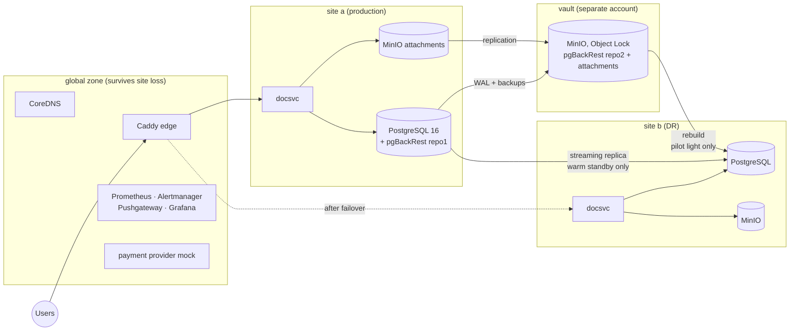

# disavery

[](https://github.com/oplosy/disavery/tree/drill-history)
[](https://github.com/oplosy/disavery/actions/workflows/ci.yml)
[](https://github.com/oplosy/disavery/actions/workflows/drills.yml)

**A disaster-recovery lab for PostgreSQL that proves recovery instead of
assuming it.** Most backup setups stop at "a backup file exists". disavery
breaks a realistic service on purpose — site loss, a dropped table, a bad
migration, ransomware, lost secrets — recovers it with executable runbooks,
and measures from the outside how much data was lost (RPO) and how long the
service was down (RTO), against declared targets. Every night, in CI.

- Backups to two repositories, one of them immutable (S3 Object Lock, compliance mode).
- Two DR tiers side by side — **pilot light** and **warm standby** — with a
  measured RTO, RPO and cost comparison.
- Seven drill scenarios, from a random restore test to failback without losing
  a write made in the DR site.
- Alerting, Grafana dashboards, and a drill history published by CI.

## Results

Measured, not configured: medians of three runs at 1 GB
([how](docs/scaling.md)); targets and cost from the [BIA](docs/bia.md).

| DR tier | RPO target | RPO measured | RTO target | RTO measured | Always-on DR nodes | Est. cost / month |
|---|---|---|---|---|---|---|
| Pilot light | 60 s | 19 s | 15 min | 3 min 0 s | 0 | $0 |
| Warm standby | 5 s | 0.3 s | 2 min | 1 min 0 s | 3 | $72 |

- **Data size:** pilot light's RTO grows 6–10 s per GB (4 min 15 s at 10 GB),
  because it restores at recovery time; warm standby stays at one minute
  ([study](docs/scaling.md)).
- **Failback** (S7) brings site a back with no acknowledged write lost and a
  user-visible outage of 5–10 s on both tiers.
- **Ransomware** (S4): the vault refused every destructive request made with
  the stolen production key ([sample report](reports/samples/s4-ransomware/report.md)).

Sample reports: [restore test](reports/samples/s6-restore-test/report.md) ·
[site loss, warm standby](reports/samples/s1-site-loss-warm-standby/report.md) ·
[failback, pilot light](reports/samples/s7-failback-pilot-light/report.md) ·
[tier comparison](reports/samples/tier-comparison.md).

## Architecture



Every box is a systemd + SSH Debian container, created by Terraform and
configured by Ansible, as if it were a VM
([ADR 0001](docs/adr/0001-systemd-containers-as-nodes.md)). Site b is absent in
pilot light (built from the vault when disaster strikes) and a streaming
replica with the app stopped in warm standby. Restores for the restore test
(S6) and the dropped table (S2) go to an isolated node; rewinds and rebuilds
of site a (S3, S4) come from the vault too. Secrets are SOPS/age-encrypted;
the age key is escrowed separately, so losing it is a drill (S5), not the end.

## How a drill works

```
preflight ─► inject ─► detect ─► decide ─► recover ─► verify ─► report
```

1. **Preflight** refuses to start unless the lab is healthy: fresh backups, WAL
   archiving on schedule, a minute of steady canary writes, no firing alerts.
   A failed drill therefore always means a failed recovery.
2. The **runbook** ([`runbooks/`](runbooks), [reference](docs/runbooks.md))
   injects the incident, waits for the alert, records the decision, and
   recovers with ordinary tools: pgBackRest, Ansible, Terraform, `mc`.
3. **Measured from the outside:** a canary journals one acknowledged write per
   second and a prober checks the public endpoint every 500 ms, so RPO is the
   acknowledged writes that are gone and RTO is when the service answered
   again.
4. **Verification** goes beyond "the restore exited 0": exact point-in-time
   content, `pg_amcheck`, business rules, every document's attachment, a payment
   callback through the new site.
5. The **report** (`reports/<run>/report.md` + `report.json`) shows target vs.
   actual, the RTO phases, a timeline and every check; results go to Prometheus
   and `history.jsonl`.

| Scenario | What happens | Tiers |
|---|---|---|
| S1 site loss | site a crashes; site b takes over (rebuilt from the vault, or a promoted replica) | pilot light, warm standby |
| S2 dropped table | `DROP TABLE documents`; the table is copied back from an isolated point-in-time restore | — |
| S3 bad migration | a wrong `UPDATE` and deleted attachments; database and object store rewound together | — |
| S4 ransomware | the vault is attacked with the production writer's key, production encrypted; site a rebuilt from the vault | — |
| S5 secret loss | site a and the age key are lost; the key comes back from escrow before the failover | — |
| S6 restore test | a random backup restored to a random point in time on an isolated node and verified | — |
| S7 failback | site a comes back without losing a write made in the DR site | pilot light, warm standby |

## What the drills found

Each of these was found by a drill failing, and fixed:

- an RPO that silently grew after crash restarts ([ADR 0005](docs/adr/0005-checkpoint-after-start.md));
- backups an attacker can hide with the production key, although not delete ([ADR 0006](docs/adr/0006-vault-identities-and-delete-markers.md));
- a wiped object store that claimed to hold every attachment, because MinIO proxies reads to its replication target ([ADR 0007](docs/adr/0007-list-replicated-stores.md));
- a point-in-time rewind that only worked until the first failover ([ADR 0008](docs/adr/0008-point-in-time-restores-from-the-vault.md));
- a vault that gained one more version of every attachment each time a site store was refilled from it ([ADR 0010](docs/adr/0010-copy-attachments-back-as-replicas.md));
- a warm-standby failback that gave up on a large database while it was still catching up ([ADR 0011](docs/adr/0011-recovery-time-by-data-size.md)).

## Quick start

Requirements: Docker (Docker Desktop with WSL2 on Windows), GNU make, and
Go 1.26 for the tests. The lab needs about 2 GB of RAM and 25 GB of Docker
disk; everything else (Terraform, Ansible, SOPS, psql) runs in a pinned toolbox
container.

```bash
make up      # build images, generate secrets, create and configure the lab (idempotent)
make smoke   # end-to-end check: TLS, upload, webhook, WAL archive, backups, immutability
make down    # remove the lab containers (keeps secrets)
make destroy # remove everything, including secrets and the escrow volume
```

The first `make up` builds MinIO from source, since MinIO no longer publishes
community builds ([ADR 0003](docs/adr/0003-minio-built-from-source.md)); later
runs take about 3 minutes and change nothing.

### Run drills

```bash
make drill SCENARIO=s6-restore-test
make drill SCENARIO=s1-site-loss TIER=pilot-light ARGS=--yes   # destructive scenarios need --yes
make drill SCENARIO=s7-failback TIER=pilot-light
make drill SCENARIO=s2-drop-table ARGS=--yes                    # likewise s3-bad-migration, s4-ransomware, s5-secret-loss
docker compose exec toolbox build/disavery env reset --tier warm-standby   # switch the lab to the other tier

docker compose exec toolbox build/disavery report trend     # history of all drills
docker compose exec toolbox build/disavery report tiers     # pilot light vs. warm standby
docker compose exec toolbox build/disavery report scaling   # recovery time by data size
```

S2–S5 start from the pilot-light baseline; S5 ends in site b, so follow it with
`s7-failback --tier pilot-light`.

## Monitoring

Grafana at http://localhost:3000 (read-only, no login): backup health,
replication and drill history. Prometheus at http://localhost:9090.

| Alert | Fires when |
|---|---|
| `PostgresPrimaryDown` | the primary does not answer (site-loss drills wait for it to measure detection) |
| `BackupTooOld` | a repository has no new backup for 2 h |
| `WalArchiveLagHigh` / `RpoBreachRisk` | the newest archived WAL is older than 45 s / 50 s (pilot light's RPO target is 60 s) |
| `ReplicationLagHigh` | the warm standby replays more than 5 s behind |
| `RestoreTestStale` | no restore test has passed for 48 h |

The thresholds are the drills' own preflight limits ([BIA](docs/bia.md#alerts)),
so the lab warns about exactly what would stop a drill.

## Continuous drills

The [`drills`](.github/workflows/drills.yml) workflow brings the lab up on a
GitHub runner with a ~500 MB database, runs the restore test plus one rotating
scenario every night and the whole catalog every Sunday, and publishes the
history, trend tables and the badge above to the
[`drill-history`](https://github.com/oplosy/disavery/tree/drill-history)
branch, so `main` stays free of bot commits
([ADR 0009](docs/adr/0009-drill-evidence-pushgateway-and-history-branch.md)).
Pull requests run unit and integration tests, linters, `terraform validate`,
alert-rule tests and runbook validation ([`ci`](.github/workflows/ci.yml)).

## Documentation

| Document | What it covers |
|---|---|
| [Design spec](docs/superpowers/specs/2026-10-07-disavery-dr-design.md) | Goals, architecture, scenarios, measurement, CI; amended as the plans found things |
| [Business impact analysis](docs/bia.md) | Targets per tier and scenario, preflight limits, alerts, cost ([`bia.yaml`](docs/bia.yaml) is what the CLI reads) |
| [Runbook reference](docs/runbooks.md) | The YAML format: steps, checks, templates, results |
| [Recovery time by data size](docs/scaling.md) | The 1 / 5 / 10 GB study: method, results, findings |
| [Plans](docs/superpowers/plans) | One implementation plan per milestone, each with how it was verified |

Architecture decision records:

| ADR | Decision |
|---|---|
| [0001](docs/adr/0001-systemd-containers-as-nodes.md) | Systemd containers as lab "machines" |
| [0002](docs/adr/0002-global-zone-survives-site-loss.md) | The global zone survives site loss |
| [0003](docs/adr/0003-minio-built-from-source.md) | Build a pinned MinIO release from source |
| [0004](docs/adr/0004-lock-replicas-with-a-sweeper.md) | Lock replicated vault objects with a sweeper |
| [0005](docs/adr/0005-checkpoint-after-start.md) | Checkpoint right after PostgreSQL starts |
| [0006](docs/adr/0006-vault-identities-and-delete-markers.md) | Vault identities and the delete-marker blast radius |
| [0007](docs/adr/0007-list-replicated-stores.md) | Judge a replicated store by listing it |
| [0008](docs/adr/0008-point-in-time-restores-from-the-vault.md) | Point-in-time restores come from the vault |
| [0009](docs/adr/0009-drill-evidence-pushgateway-and-history-branch.md) | Drill evidence in the Pushgateway and on a history branch |
| [0010](docs/adr/0010-copy-attachments-back-as-replicas.md) | Copy attachments back as replicas |
| [0011](docs/adr/0011-recovery-time-by-data-size.md) | Recovery time by data size |

## Repository layout

```
cmd/            disavery (drill CLI), docsvc (the protected service), webhookmock
internal/       drill engine: runbook, executor, canary, prober, verify, report, ...
runbooks/       one YAML runbook per scenario
infra/          Terraform (containers, networks) and Ansible (roles, playbooks)
images/         node, MinIO and toolbox images
scripts/        secrets, smoke test, drill programmes, history publishing
docs/           spec, BIA, runbook reference, ADRs, plans, the data-size study
reports/samples sample drill reports
```

## Development

```bash
make test-short   # unit tests
make test         # unit + integration tests (testcontainers, needs Docker)
make test-alerts  # Prometheus alert rules (promtool); from Git Bash: MSYS_NO_PATHCONV=1 make test-alerts
make lint         # golangci-lint and runbook validation
```

## Scope and limits

- **A local lab.** Sites are Docker networks on one machine, so absolute
  timings are this machine's; the comparisons and the method carry over. A
  cloud profile reusing the same Terraform and Ansible is a follow-up.
- **Failover is runbook-driven, on purpose:** no Patroni or automatic failover
  manager; the decision to declare a disaster is a recorded step.
- **Not covered yet** (spec §14): a cloud profile, fencing and DNS TTL
  experiments, logical backups for cross-version restores, and MinIO and node
  metrics.
