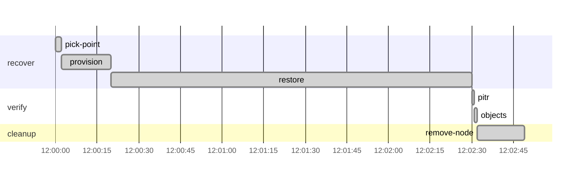
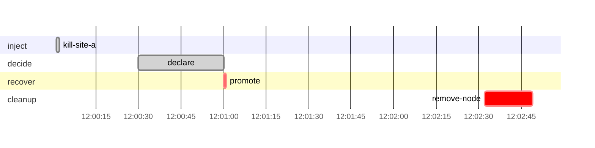

# M2 — Drill CLI Core and the Random Restore Test (S6) Implementation Plan

> **For agentic workers:** REQUIRED SUB-SKILL: Use superpowers:subagent-driven-development (recommended) or superpowers:executing-plans to implement this plan task-by-task. Steps use checkbox (`- [ ]`) syntax for tracking.

**Goal:** `make drill SCENARIO=s6-restore-test` restores a random backup set from the immutable vault to a random point in time on an isolated node, proves the restore is exact (canary journal) and consistent (`pg_amcheck`, business rules, attachments), measures how long it took, and writes `report.md`/`report.json` with evidence.

**Architecture:** A Go CLI (`disavery`) runs inside the toolbox. YAML runbooks are parsed and linted (`internal/runbook`) and executed phase by phase by a lab-agnostic executor (`internal/executor`) through pluggable step runners. Built-in verifiers (`internal/verify`) judge the result; a canary service (persistent journal) and a drill-scoped prober measure data loss and availability from the outside; `internal/report` renders the evidence. `internal/drill` wires it together with a safety lock, preflight and result classification; `drill.LabEnv` is the real lab (SSH, lab DNS, lab CA, SOPS secrets).

**Tech Stack:** Go 1.26 (stdlib `flag`, `text/template`; new: `gopkg.in/yaml.v3`, `golang.org/x/net/dns/dnsmessage`), pgBackRest restore, Terraform (restore node), Ansible (restore role), testcontainers-go, Mermaid (report timeline).

**Spec:** `docs/superpowers/specs/2026-10-07-disavery-dr-design.md` (§6 measurement, §7 runbooks, §8 evidence, §9 safety, §11 testing; S6 in §5).

## Roadmap (this is plan 2 of 5)

| Plan | Milestone | Status |
|---|---|---|
| 1 | Environment + docsvc + backups to both repos | **shipped** (PR #2) |
| **2** | **`disavery` CLI core (runbook, executor, canary, prober, verify, report), `docs/bia.yaml`, S6 (this plan)** | **written** |
| 3 | Site-b (warm + pilot light), Prometheus/Alertmanager core alerts (`wait_alert`), S1 on both tiers, S7, tier comparison table | later |
| 4 | S2–S5 | later |
| 5 | Remaining alerts + Grafana + Pushgateway, nightly/weekly CI drills, `drill-history` branch + badge, ADRs, README polish | later |

## How this plan was verified

Every file in this plan was written and run on a local prototype branch before
the plan was written (2026-10-07): `go vet`, `go test -race ./...` (unit and
testcontainers integration), `golangci-lint` (0 issues), `ansible-lint`,
`terraform validate`, `make up` twice (second run: Terraform `No changes.`,
Ansible `changed=0` on every host), `make smoke` (`SMOKE PASS`) and two real
S6 drills against the lab, both `PASS` at different random targets (recovery
time about 1 minute, production availability 100 % during the drill).

## Decisions and spec clarifications

Decided with the user while planning:

1. **New dependencies:** `gopkg.in/yaml.v3` (runbooks, BIA, inventory) and `golang.org/x/net/dns/dnsmessage` (TTL-honouring resolver, spec §6). No CLI framework: stdlib `flag`.
2. **The canary is a long-running service** (compose service `canary`, journal in volume `disavery-state`), not drill-scoped. S6 restores to a random point in the past, and only a persistent journal can say which writes must and must not be in that restore. It also makes spec §9's preflight item "canary writing" meaningful.
3. **S6 restores from repo2 (the vault) only.** It is the copy a disaster relies on; restoring repo1 (db-a's local disk) from an isolated node would need a pgBackRest repo host over SSH.

Clarifications of the spec — raise if you disagree:

4. **Clock.** Spec §6 says "a single monotonic clock on the host running the CLI". Journals outlive processes and monotonic readings are process-local, so measurements use the **wall clock of the toolbox host** (the canary and the CLI run there). All lab containers share the Docker VM kernel clock, so no cross-machine skew exists in the lab. Durations inside one drill (phases, steps) still use Go's monotonic readings.
5. **RTO start of recovery.** Spec: "first moment after the incident followed by 5 consecutive successes − incident time". Implemented from the **first failed probe after the incident**, so probes that still succeed while an injection takes effect do not count as recovery; if no probe fails, RTO is 0.
6. **S6's RTO** is `recovery_time`: start of `recover` to end of `verify`, judged against `restore_test.max_duration` in `docs/bia.yaml`.
7. **Restore node isolation.** The node `restore` sits on the WAN (it must reach the vault), serves nothing (PostgreSQL listens on localhost) and never archives (`archive_mode = off` plus `--archive-mode=off`). It reads repo2 with the production writer's credentials; a read-only vault user belongs to S4's privilege separation (plan 4).
8. **Deferred:** `wait_alert` and the preflight item "no firing alerts" need Alertmanager (plan 3); pushing results to Pushgateway is plan 5. Lint rejects `wait_alert` until then.
9. **Extra subcommands** beyond spec §3's list: `canary run` (the service), `restore-point` (S6's random choice, captured by the runbook) and `verify` runs production checks.

## Global Constraints

Everything in plan 1's Global Constraints still holds. Additions:

- New fixed addresses on `disavery-wan`: canary service `172.31.0.3`, restore node `172.31.0.50` (Terraform `local.ip.restore`).
- Volume `disavery-state` mounted at `/state` in the toolbox and the canary; journal at `/state/canary/journal.jsonl` (JSON lines `{seq, sent, acked}`).
- Reports: `reports/<UTC yyyymmddThhmmssZ>-<scenario>[-<tier>]/` with `report.json` (`schema_version: 1`), `report.md`, `steps/<id>.log`, `prober.jsonl`; `reports/history.jsonl`. Everything under `reports/` except `reports/samples/` is git-ignored.
- Exit codes: `PASS` 0, `MISSED_TARGET` 2, `FAILED` 3, `ERROR` 4 (also usage and tool errors).
- Built-in runbook variables: `scenario`, `tier`, `env`, `run_id`, `report_dir`, `seed`, `db_host`. Check names: `amcheck`, `business-rules`, `db-object-consistency`, `pitr`, `canary`, `prober`.
- The CLI only runs inside the toolbox (`/work`, `/secrets`, `/escrow`, `/state`); unit tests run anywhere (`go test -short ./...`).
- `make up` stays idempotent: the role split in Task 13 must keep `changed=0` on a second run.

## Review Focus

1. **A restore that is not exact must fail.** Restoring past or short of the target, or losing an acknowledged write, fails `pitr`; one-sided evidence is not a pass. Pinned in Tasks 3 and 6.
2. **Cleanup always runs** — after an aborting step, a check failure, Ctrl-C or the global timeout — and a cancelled drill is `ERROR`, not `FAILED`. Pinned in Tasks 7 and 10.
3. **A restored cluster never writes to the production repositories** (`archive_mode = off` and `--archive-mode=off`). Pinned in Task 13 (Step 5).
4. **Destructive runbooks are locked:** `inject` needs `--yes` or `CI=true`, and the Terraform workspace and every node's `disavery.env` label must match `--env`. A refused drill writes nothing and runs nothing. Pinned in Task 10.
5. **Canary sequence numbers are never reused**, even if the journal is lost (`NextSeq`), so a write acknowledged now cannot be confused with an old row. Pinned in Task 3.
6. **Untrusted inputs:** runbook ids cannot traverse paths, unknown YAML keys are errors, templates fail on missing keys, conditions fail on unknown variables. Pinned in Task 2.

---

### Task 1: Dependencies, BIA and duration parsing

**Files:**
- Create: `internal/yamltime/yamltime.go`, `docs/bia.yaml`, `docs/bia.md`, `internal/bia/bia.go`
- Test: `internal/yamltime/yamltime_test.go`, `internal/bia/bia_test.go`
- Modify: `go.mod`, `go.sum`

**Interfaces:**
- Consumes: nothing.
- Produces: `yamltime.Duration` (YAML `"30s"`; `D()`, `String()`); `bia.Load(path) (*bia.BIA, error)`; `(*BIA).TierNames() []string`, `Targets(tier) (bia.Targets{RPO, RTO time.Duration}, error)`; fields `RestoreTest.{MaxDuration, PITRTolerance}`, `Preflight.{MaxBackupAge, MaxArchiveAge, MaxCanarySilence}`.

- [ ] **Step 1: Create the branch and add the YAML dependency**

Prerequisite: this plan is merged into `main`.

```bash
git switch main && git pull && git switch -c feat/m2-cli-core
go get gopkg.in/yaml.v3
```

- [ ] **Step 2: Write the failing tests**

`internal/yamltime/yamltime_test.go`:
```go
package yamltime_test

import (
	"testing"
	"time"

	"gopkg.in/yaml.v3"

	"github.com/oplosy/disavery/internal/yamltime"
)

func TestUnmarshal(t *testing.T) {
	tests := []struct {
		in      string
		want    time.Duration
		wantErr bool
	}{
		{"d: 30s", 30 * time.Second, false},
		{"d: 1m30s", 90 * time.Second, false},
		{"d: 0s", 0, false},
		{"d: -5s", 0, true},
		{"d: 30", 0, true},
		{"d: [1s]", 0, true},
	}
	for _, tc := range tests {
		t.Run(tc.in, func(t *testing.T) {
			var v struct {
				D yamltime.Duration `yaml:"d"`
			}
			err := yaml.Unmarshal([]byte(tc.in), &v)
			if (err != nil) != tc.wantErr {
				t.Fatalf("err = %v, wantErr %v", err, tc.wantErr)
			}
			if err == nil && v.D.D() != tc.want {
				t.Fatalf("got %s, want %s", v.D, tc.want)
			}
		})
	}
}
```

`internal/bia/bia_test.go`:
```go
package bia_test

import (
	"os"
	"path/filepath"
	"slices"
	"strings"
	"testing"
	"time"

	"github.com/oplosy/disavery/internal/bia"
)

func TestLoadRepositoryFile(t *testing.T) {
	b, err := bia.Load("../../docs/bia.yaml")
	if err != nil {
		t.Fatalf("load: %v", err)
	}
	if !slices.Equal(b.TierNames(), []string{"pilot-light", "warm-standby"}) {
		t.Fatalf("tiers %v", b.TierNames())
	}
	warm, err := b.Targets("warm-standby")
	if err != nil || warm.RPO != 5*time.Second || warm.RTO != 2*time.Minute {
		t.Fatalf("warm-standby targets %+v, %v", warm, err)
	}
	if _, err := b.Targets("cold"); err == nil {
		t.Fatal("want error for unknown tier")
	}
}

const valid = `
tiers:
  t1: {rpo: 1s, rto: 1m}
restore_test: {max_duration: 10m, pitr_tolerance: 1s}
preflight: {max_backup_age: 1h, max_archive_age: 1m, max_canary_silence: 5s}
`

func TestLoadErrors(t *testing.T) {
	tests := []struct {
		name, content, want string
	}{
		{"unknown key", valid + "extra: 1\n", "field extra not found"},
		{"no tiers", strings.Replace(valid, "t1: {rpo: 1s, rto: 1m}", "{}", 1), "at least one tier"},
		{"zero rto", strings.Replace(valid, "rto: 1m", "rto: 0s", 1), "tiers.t1: rpo and rto must be positive"},
		{"missing restore test", strings.Replace(valid, "max_duration: 10m, ", "", 1), "restore_test.max_duration must be positive"},
	}
	for _, tc := range tests {
		t.Run(tc.name, func(t *testing.T) {
			path := filepath.Join(t.TempDir(), "bia.yaml")
			if err := os.WriteFile(path, []byte(tc.content), 0o644); err != nil {
				t.Fatal(err)
			}
			_, err := bia.Load(path)
			if err == nil || !strings.Contains(err.Error(), tc.want) {
				t.Fatalf("want error containing %q, got %v", tc.want, err)
			}
		})
	}
}
```

- [ ] **Step 3: Run the tests to verify they fail**

Run: `go test ./internal/yamltime/ ./internal/bia/`
Expected: FAIL — packages do not exist.

- [ ] **Step 4: Implement**

`internal/yamltime/yamltime.go`:
```go
// Package yamltime reads Go duration strings ("30s", "15m") from YAML.
package yamltime

import (
	"fmt"
	"time"

	"gopkg.in/yaml.v3"
)

// Duration is a time.Duration written as a Go duration string in YAML.
type Duration time.Duration

// UnmarshalYAML parses a non-negative duration string.
func (d *Duration) UnmarshalYAML(n *yaml.Node) error {
	if n.Kind != yaml.ScalarNode {
		return fmt.Errorf("line %d: duration must be a string such as \"30s\"", n.Line)
	}
	v, err := time.ParseDuration(n.Value)
	if err != nil {
		return fmt.Errorf("line %d: %w", n.Line, err)
	}
	if v < 0 {
		return fmt.Errorf("line %d: duration %q must not be negative", n.Line, n.Value)
	}
	*d = Duration(v)
	return nil
}

// D returns the value as a time.Duration.
func (d Duration) D() time.Duration { return time.Duration(d) }

func (d Duration) String() string { return time.Duration(d).String() }
```

`internal/bia/bia.go`:
```go
// Package bia loads the business impact analysis: recovery targets per DR tier
// and the thresholds drills are judged against (docs/bia.yaml).
package bia

import (
	"errors"
	"fmt"
	"os"
	"slices"
	"time"

	"gopkg.in/yaml.v3"

	"github.com/oplosy/disavery/internal/yamltime"
)

// Targets are the recovery objectives of one DR tier.
type Targets struct {
	RPO time.Duration
	RTO time.Duration
}

// Tier is one DR tier as declared in bia.yaml.
type Tier struct {
	RPO       yamltime.Duration `yaml:"rpo"`
	RTO       yamltime.Duration `yaml:"rto"`
	Mechanism string            `yaml:"mechanism"`
}

// BIA is the parsed bia.yaml.
type BIA struct {
	Service        string          `yaml:"service"`
	Classification string          `yaml:"classification"`
	Tiers          map[string]Tier `yaml:"tiers"`
	RestoreTest    struct {
		MaxDuration   yamltime.Duration `yaml:"max_duration"`
		PITRTolerance yamltime.Duration `yaml:"pitr_tolerance"`
	} `yaml:"restore_test"`
	Preflight struct {
		MaxBackupAge     yamltime.Duration `yaml:"max_backup_age"`
		MaxArchiveAge    yamltime.Duration `yaml:"max_archive_age"`
		MaxCanarySilence yamltime.Duration `yaml:"max_canary_silence"`
	} `yaml:"preflight"`
}

// Load reads and validates a bia.yaml file. Unknown keys are errors.
func Load(path string) (*BIA, error) {
	f, err := os.Open(path)
	if err != nil {
		return nil, err
	}
	defer f.Close()
	dec := yaml.NewDecoder(f)
	dec.KnownFields(true)
	var b BIA
	if err := dec.Decode(&b); err != nil {
		return nil, fmt.Errorf("%s: %w", path, err)
	}
	if err := b.validate(); err != nil {
		return nil, fmt.Errorf("%s: %w", path, err)
	}
	return &b, nil
}

func (b *BIA) validate() error {
	var errs []error
	if len(b.Tiers) == 0 {
		errs = append(errs, errors.New("tiers: at least one tier is required"))
	}
	for name, t := range b.Tiers {
		if t.RPO <= 0 || t.RTO <= 0 {
			errs = append(errs, fmt.Errorf("tiers.%s: rpo and rto must be positive", name))
		}
	}
	positive := []struct {
		name string
		v    yamltime.Duration
	}{
		{"restore_test.max_duration", b.RestoreTest.MaxDuration},
		{"preflight.max_backup_age", b.Preflight.MaxBackupAge},
		{"preflight.max_archive_age", b.Preflight.MaxArchiveAge},
		{"preflight.max_canary_silence", b.Preflight.MaxCanarySilence},
	}
	for _, p := range positive {
		if p.v <= 0 {
			errs = append(errs, fmt.Errorf("%s must be positive", p.name))
		}
	}
	return errors.Join(errs...)
}

// TierNames returns the declared tiers in sorted order.
func (b *BIA) TierNames() []string {
	names := make([]string, 0, len(b.Tiers))
	for n := range b.Tiers {
		names = append(names, n)
	}
	slices.Sort(names)
	return names
}

// Targets returns the objectives of a tier.
func (b *BIA) Targets(tier string) (Targets, error) {
	t, ok := b.Tiers[tier]
	if !ok {
		return Targets{}, fmt.Errorf("unknown tier %q", tier)
	}
	return Targets{RPO: t.RPO.D(), RTO: t.RTO.D()}, nil
}
```

`docs/bia.yaml`:
```yaml
# Business impact analysis for docsvc, read by the disavery CLI.
# The reasoning behind every number is in docs/bia.md.
service: docsvc
classification: tier-1

tiers:
  pilot-light:
    rpo: 60s
    rto: 15m
    mechanism: pgBackRest async WAL archive (archive_timeout 30s); site-b built from scratch
  warm-standby:
    rpo: 5s
    rto: 2m
    mechanism: async streaming replica; site-b always running

# S6, the random restore test: restore plus verification must finish within
# max_duration; pitr_tolerance is the window around the PITR target in which
# an in-flight write may legitimately land on either side.
restore_test:
  max_duration: 15m
  pitr_tolerance: 1s

# Preflight refuses to start a drill unless the environment is healthy.
preflight:
  max_backup_age: 2h       # incremental backups run hourly
  max_archive_age: 90s     # archive_timeout is 30s and the canary writes every second
  max_canary_silence: 10s
```

`docs/bia.md`:
```markdown
# Business impact analysis: docsvc

`docsvc` stores customer documents and their payment status. It is classified
**Tier-1**: an outage stops document intake and payment confirmation, and a lost
document is a lost customer record. The numbers below live in
[`bia.yaml`](bia.yaml), which the `disavery` CLI reads; this page explains them.

## Recovery targets per DR tier

| DR tier | Target RPO | Target RTO | Mechanism |
|---|---|---|---|
| Pilot light | ≤ 60 s | ≤ 15 min | pgBackRest async WAL archive (`archive_timeout = 30s`); site-b is built from scratch |
| Warm standby | ≤ 5 s | ≤ 2 min | Async streaming replica; site-b always running |

- **RPO** is bounded by how often WAL leaves the primary. With archiving only,
  a segment is shipped at least every 30 s (`archive_timeout`), so up to about
  30 s of commits plus shipping time can be lost; 60 s leaves headroom. A
  streaming replica receives WAL continuously, so seconds are realistic.
- **RTO** for pilot light is dominated by provisioning and restoring site-b;
  for warm standby by detection, the decision and promotion.

Actual RPO and RTO are measured from the outside by every drill (spec §6):
the canary writer journals each write the application acknowledged, and the
prober records availability every 500 ms through the public endpoint.

### RTO phases

Reports break RTO into **detect** (alert fires) → **decide** (disaster declared;
a fixed, configurable delay in drills) → **recover** → **verify**. The decide
phase is real in production and deliberately not optimised away in drills.

## Random restore test (S6)

A backup that has never been restored is a hope, not a backup. Every S6 run
picks a random backup set from the immutable vault and a random point in time
the WAL archive can reach, restores it to an isolated node and proves it:

| Threshold | Value | Why |
|---|---|---|
| `restore_test.max_duration` | 15 min | Restore plus verification must fit the pilot-light RTO; a slower restore means pilot light cannot meet its target |
| `restore_test.pitr_tolerance` | 1 s | Writes in flight within this window of the target may land on either side and are not judged |

The restore is **exact** when every canary write acknowledged before the
target is present and none sent after it is. It is **consistent** when
`pg_amcheck` finds no corruption, business rules hold, document counts match
production at the target, and every document's attachment exists in the vault.

## Preflight thresholds

Drills refuse to start unless the environment is healthy, so a failed drill
always means a failed recovery, not a broken lab.

| Threshold | Value | Why |
|---|---|---|
| `preflight.max_backup_age` | 2 h | Incremental backups run hourly to both repositories |
| `preflight.max_archive_age` | 90 s | `archive_timeout` is 30 s and the canary writes every second, so a segment ships at least every 30 s |
| `preflight.max_canary_silence` | 10 s | The canary writes every second; silence means the measurement would be blind |

## Retention

| What | Policy |
|---|---|
| Full backups | Daily, 7 kept in repo1 (local), 14 in repo2 (vault) |
| Incremental backups | Hourly, both repositories |
| PITR window | 7 days (repo1) |
| Vault Object Lock | Compliance mode, 14 days; noncurrent versions expire one day after the lock lapses |

All values are configuration and may be shortened in the drill environment.

## Cost

The tier comparison (pilot light vs. warm standby: always-on resources and an
estimated monthly cloud price) is added with site-b in milestone 3.
```

- [ ] **Step 5: Run the tests to verify they pass**

Run: `go mod tidy && go test ./internal/yamltime/ ./internal/bia/ -v`
Expected: PASS — 3 tests (and their subtests).

- [ ] **Step 6: Commit**

```bash
git add go.mod go.sum internal/yamltime internal/bia docs/bia.yaml docs/bia.md
git commit -m "feat: add BIA targets and YAML duration parsing"
```

---

### Task 2: Runbook schema, conditions, templates and lint

**Files:**
- Create: `internal/runbook/runbook.go`, `internal/runbook/expr.go`, `internal/runbook/render.go`, `internal/runbook/lint.go`
- Test: `internal/runbook/runbook_test.go`

**Interfaces:**
- Consumes: `yamltime.Duration` (Task 1).
- Produces: `runbook.Runbook{ID, Description, Tiers, Vars, Phases []Phase{Name, Steps}, Cleanup []Step, Path}`; `runbook.Step` (common fields `ID, When, Timeout, Retries, OnFailure, Capture`; kinds `Run, SSH *SSH{Host, Cmd}, WaitHTTP *WaitHTTP{URL, Status, Interval}, WaitAlert, Sleep, Manual, AutoAfter, Check, With`); `(Step).Kind()`, `(Step).Rendered(data) (Step, error)`; `Kind*` constants; `PhaseNames`; `BuiltinVars`; `Load`, `LoadDir`, `Find(dir, id)`; `(*Runbook).HasPhase`; `ParseExpr(src) (*Expr, error)`, `(*Expr).Eval(map[string]string) (bool, error)`, `Idents()`; `Render(text, data)`; `Lint(rb, runbook.Known{Tiers, Checks}) error`.

- [ ] **Step 1: Write the failing tests**

`internal/runbook/runbook_test.go`:
```go
package runbook_test

import (
	"os"
	"path/filepath"
	"strings"
	"testing"
	"time"

	"github.com/oplosy/disavery/internal/runbook"
)

var known = runbook.Known{
	Tiers:  []string{"pilot-light", "warm-standby"},
	Checks: []string{"amcheck", "pitr"},
}

const validRunbook = `
id: sample
description: A sample drill.
tiers: [pilot-light, warm-standby]
vars: { delay: 30s }
phases:
  - name: inject
    steps:
      - { id: kill, run: "echo kill {{.tier}}" }
  - name: decide
    steps:
      - { id: declare, manual: "Declare disaster?", auto_after: 30s }
  - name: recover
    steps:
      - { id: provision, when: "tier == 'pilot-light'", run: "echo build", timeout: 5m, retries: 1 }
      - { id: promote, when: "tier == 'warm-standby'", ssh: { host: db-b, cmd: "pg_ctl promote" } }
      - { id: pick, run: "echo '{\"set\":\"x\"}'", capture: point }
  - name: verify
    steps:
      - { id: integ, check: amcheck, with: { host: "{{.point.set}}" } }
cleanup:
  - { id: tidy, run: "true" }
`

// writeRunbook writes content as <dir>/sample.yaml and loads it.
func writeRunbook(t *testing.T, content string) *runbook.Runbook {
	t.Helper()
	path := filepath.Join(t.TempDir(), "sample.yaml")
	if err := os.WriteFile(path, []byte(content), 0o644); err != nil {
		t.Fatal(err)
	}
	rb, err := runbook.Load(path)
	if err != nil {
		t.Fatalf("load: %v", err)
	}
	return rb
}

func TestValidRunbook(t *testing.T) {
	rb := writeRunbook(t, validRunbook)
	if err := runbook.Lint(rb, known); err != nil {
		t.Fatalf("lint: %v", err)
	}
	if !rb.HasPhase("inject") || rb.HasPhase("detect") {
		t.Fatal("HasPhase is wrong")
	}
	recover := rb.Phases[2].Steps
	if recover[0].Kind() != runbook.KindRun || recover[1].Kind() != runbook.KindSSH || recover[0].Timeout.D() != 5*time.Minute {
		t.Fatalf("unexpected steps: %+v", recover)
	}
}

func TestLoadRejectsUnknownFields(t *testing.T) {
	path := filepath.Join(t.TempDir(), "x.yaml")
	if err := os.WriteFile(path, []byte("id: x\nphases: []\nretry: 3\n"), 0o644); err != nil {
		t.Fatal(err)
	}
	if _, err := runbook.Load(path); err == nil || !strings.Contains(err.Error(), "field retry not found") {
		t.Fatalf("want unknown field error, got %v", err)
	}
}

func TestLint(t *testing.T) {
	base := validRunbook
	tests := []struct {
		name, old, new, want string
	}{
		{"id differs from file", "id: sample", "id: other", `id "other" must equal the file name`},
		{"unknown tier", "tiers: [pilot-light, warm-standby]", "tiers: [cold]", `unknown tier "cold"`},
		{"unknown phase", "name: decide", "name: decision", `phase "decision": must be one of`},
		{"phase order", "  - name: inject\n", "  - name: verify\n", "phases must appear at most once, in the order"},
		{"two kinds", `{ id: tidy, run: "true" }`, `{ id: tidy, run: "true", sleep: 1s }`, "needs exactly one of"},
		{"no kind", `{ id: tidy, run: "true" }`, `{ id: tidy }`, "needs exactly one of"},
		{"duplicate id", "id: tidy", "id: kill", "duplicate step id"},
		{"bad step id", "id: tidy", "id: Tidy", "id must match"},
		{"manual without auto_after", ", auto_after: 30s", "", "manual needs auto_after"},
		{"unknown check", "check: amcheck", "check: fsck", `unknown check "fsck"`},
		{"with without check", `{ id: tidy, run: "true" }`, `{ id: tidy, run: "true", with: { a: b } }`, "with is only valid with check"},
		{"bad on_failure", `{ id: tidy, run: "true" }`, `{ id: tidy, run: "true", on_failure: ignore }`, "on_failure must be abort or continue"},
		{"too many retries", "retries: 1", "retries: 11", "retries must be between 0 and 10"},
		{"bad condition", "tier == 'pilot-light'", "tier = 'pilot-light'", "unexpected character"},
		{"incomplete condition", "tier == 'pilot-light'", "tier == pilot", "expected <variable> =="},
		{"unknown condition variable", "tier == 'pilot-light'", "site == 'a'", `unknown variable "site"`},
		{"bad template", `echo kill {{.tier}}`, `echo kill {{.tier}`, "run:"},
		{"capture on check", "check: amcheck, with", "check: amcheck, capture: x, with", "capture is only valid with run or ssh"},
		{"capture shadows var", "capture: point", "capture: tier", `capture "tier" must match`},
		{"wait_alert not yet", `{ id: tidy, run: "true" }`, `{ id: tidy, wait_alert: PostgresPrimaryDown }`, "wait_alert is not available yet"},
		{"ssh without host", `ssh: { host: db-b, cmd: "pg_ctl promote" }`, `ssh: { cmd: "pg_ctl promote" }`, "ssh needs host and cmd"},
		{"var shadows builtin", "vars: { delay: 30s }", "vars: { tier: x }", `var "tier"`},
	}
	for _, tc := range tests {
		t.Run(tc.name, func(t *testing.T) {
			if !strings.Contains(base, tc.old) {
				t.Fatalf("test bug: %q not in base runbook", tc.old)
			}
			rb := writeRunbook(t, strings.Replace(base, tc.old, tc.new, 1))
			err := runbook.Lint(rb, known)
			if err == nil || !strings.Contains(err.Error(), tc.want) {
				t.Fatalf("want error containing %q, got %v", tc.want, err)
			}
		})
	}
}

func TestExpr(t *testing.T) {
	vars := map[string]string{"tier": "pilot-light", "site": "b"}
	tests := []struct {
		src  string
		want bool
	}{
		{"tier == 'pilot-light'", true},
		{"tier != 'pilot-light'", false},
		{"tier == 'warm-standby' || site == 'b'", true},
		{"tier == 'pilot-light' && site == 'a'", false},
		{"tier == 'x' && site == 'b' || tier == 'pilot-light'", true},
		{"  tier=='pilot-light'  ", true},
	}
	for _, tc := range tests {
		e, err := runbook.ParseExpr(tc.src)
		if err != nil {
			t.Fatalf("parse %q: %v", tc.src, err)
		}
		got, err := e.Eval(vars)
		if err != nil || got != tc.want {
			t.Fatalf("%q = %v, %v; want %v", tc.src, got, err, tc.want)
		}
	}
	for _, bad := range []string{"", "tier", "tier == pilot", "tier == 'a' &&", "tier == 'a", "(tier == 'a')", "tier === 'a'"} {
		if _, err := runbook.ParseExpr(bad); err == nil {
			t.Fatalf("ParseExpr(%q): want error", bad)
		}
	}
	e, _ := runbook.ParseExpr("zone == 'a'")
	if _, err := e.Eval(vars); err == nil {
		t.Fatal("want error for unknown variable")
	}
}

func TestRendered(t *testing.T) {
	s := runbook.Step{
		ID:   "x",
		SSH:  &runbook.SSH{Host: "db-{{.site}}", Cmd: "echo {{.point.set}}"},
		With: map[string]string{"target": "{{.point.target}}"},
	}
	data := map[string]any{"site": "b", "point": map[string]any{"set": "F1", "target": "T"}}
	r, err := s.Rendered(data)
	if err != nil {
		t.Fatalf("render: %v", err)
	}
	if r.SSH.Host != "db-b" || r.SSH.Cmd != "echo F1" || r.With["target"] != "T" {
		t.Fatalf("rendered %+v %+v", r.SSH, r.With)
	}
	if s.SSH.Host != "db-{{.site}}" || s.With["target"] != "{{.point.target}}" {
		t.Fatal("Rendered modified the original step")
	}
	if _, err := (runbook.Step{Run: "{{.missing}}"}).Rendered(data); err == nil {
		t.Fatal("want error for a missing key")
	}
}

func TestFindRejectsPathTraversal(t *testing.T) {
	if _, err := runbook.Find(t.TempDir(), "../etc/passwd"); err == nil || !strings.Contains(err.Error(), "invalid runbook id") {
		t.Fatalf("got %v", err)
	}
}
```

- [ ] **Step 2: Run the tests to verify they fail**

Run: `go test ./internal/runbook/`
Expected: FAIL — package does not exist.

- [ ] **Step 3: Implement**

`internal/runbook/runbook.go`:
```go
// Package runbook parses and validates drill runbooks (runbooks/*.yaml).
package runbook

import (
	"errors"
	"fmt"
	"os"
	"path/filepath"
	"regexp"
	"slices"

	"gopkg.in/yaml.v3"

	"github.com/oplosy/disavery/internal/yamltime"
)

// PhaseNames are the only phase names, in their required order. They are
// fixed so RTO can be broken down into detect, decide, recover and verify.
var PhaseNames = []string{"inject", "detect", "decide", "recover", "verify"}

// Step kinds; a step has exactly one.
const (
	KindRun       = "run"
	KindSSH       = "ssh"
	KindWaitHTTP  = "wait_http"
	KindWaitAlert = "wait_alert"
	KindSleep     = "sleep"
	KindManual    = "manual"
	KindCheck     = "check"
)

// Runbook is one drill scenario.
type Runbook struct {
	ID          string            `yaml:"id"`
	Description string            `yaml:"description"`
	Tiers       []string          `yaml:"tiers"`
	Vars        map[string]string `yaml:"vars"`
	Phases      []Phase           `yaml:"phases"`
	Cleanup     []Step            `yaml:"cleanup"`

	Path string `yaml:"-"`
}

// Phase is a named group of steps.
type Phase struct {
	Name  string `yaml:"name"`
	Steps []Step `yaml:"steps"`
}

// Step is one action. Common fields first, then exactly one kind field.
type Step struct {
	ID        string            `yaml:"id"`
	When      string            `yaml:"when"`
	Timeout   yamltime.Duration `yaml:"timeout"`
	Retries   int               `yaml:"retries"`
	OnFailure string            `yaml:"on_failure"`
	Capture   string            `yaml:"capture"`

	Run       string            `yaml:"run"`
	SSH       *SSH              `yaml:"ssh"`
	WaitHTTP  *WaitHTTP         `yaml:"wait_http"`
	WaitAlert string            `yaml:"wait_alert"`
	Sleep     yamltime.Duration `yaml:"sleep"`
	Manual    string            `yaml:"manual"`
	AutoAfter yamltime.Duration `yaml:"auto_after"`
	Check     string            `yaml:"check"`
	With      map[string]string `yaml:"with"`
}

// SSH runs a command on a lab node.
type SSH struct {
	Host string `yaml:"host"`
	Cmd  string `yaml:"cmd"`
}

// WaitHTTP polls a URL until it answers with Status.
type WaitHTTP struct {
	URL      string            `yaml:"url"`
	Status   int               `yaml:"status"`
	Interval yamltime.Duration `yaml:"interval"`
}

// Kind returns the step's kind, or "" unless exactly one kind field is set.
func (s Step) Kind() string {
	if k := s.kinds(); len(k) == 1 {
		return k[0]
	}
	return ""
}

func (s Step) kinds() []string {
	var k []string
	if s.Run != "" {
		k = append(k, KindRun)
	}
	if s.SSH != nil {
		k = append(k, KindSSH)
	}
	if s.WaitHTTP != nil {
		k = append(k, KindWaitHTTP)
	}
	if s.WaitAlert != "" {
		k = append(k, KindWaitAlert)
	}
	if s.Sleep > 0 {
		k = append(k, KindSleep)
	}
	if s.Manual != "" {
		k = append(k, KindManual)
	}
	if s.Check != "" {
		k = append(k, KindCheck)
	}
	return k
}

// HasPhase reports whether the runbook contains the named phase.
func (rb *Runbook) HasPhase(name string) bool {
	return slices.ContainsFunc(rb.Phases, func(p Phase) bool { return p.Name == name })
}

// Load parses one runbook file. Unknown keys are errors, so typos fail loudly.
func Load(path string) (*Runbook, error) {
	f, err := os.Open(path)
	if err != nil {
		return nil, err
	}
	defer f.Close()
	dec := yaml.NewDecoder(f)
	dec.KnownFields(true)
	var rb Runbook
	if err := dec.Decode(&rb); err != nil {
		return nil, fmt.Errorf("%s: %w", path, err)
	}
	rb.Path = path
	return &rb, nil
}

// LoadDir parses every *.yaml file in dir, sorted by file name.
func LoadDir(dir string) ([]*Runbook, error) {
	files, err := filepath.Glob(filepath.Join(dir, "*.yaml"))
	if err != nil {
		return nil, err
	}
	slices.Sort(files)
	var (
		out  []*Runbook
		errs []error
	)
	for _, f := range files {
		rb, err := Load(f)
		if err != nil {
			errs = append(errs, err)
			continue
		}
		out = append(out, rb)
	}
	return out, errors.Join(errs...)
}

var idPattern = regexp.MustCompile(`^[a-z0-9][a-z0-9-]*$`)

// Find loads the runbook with the given id from dir.
func Find(dir, id string) (*Runbook, error) {
	if !idPattern.MatchString(id) {
		return nil, fmt.Errorf("invalid runbook id %q", id)
	}
	return Load(filepath.Join(dir, id+".yaml"))
}
```

`internal/runbook/expr.go`:
```go
package runbook

import (
	"errors"
	"fmt"
	"strings"
)

// Expr is a parsed `when` condition: comparisons of a variable with a quoted
// string, joined by && and ||, e.g. "tier == 'pilot-light' && site != 'b'".
// && binds tighter than ||; there are no parentheses.
type Expr struct {
	src string
	or  [][]comparison
}

type comparison struct {
	ident, value string
	negate       bool
}

type tokenKind int

const (
	tIdent tokenKind = iota
	tString
	tEq
	tNe
	tAnd
	tOr
)

type token struct {
	kind tokenKind
	text string
}

// ParseExpr parses a condition.
func ParseExpr(src string) (*Expr, error) {
	toks, err := tokenize(src)
	if err != nil {
		return nil, fmt.Errorf("condition %q: %w", src, err)
	}
	if len(toks) == 0 {
		return nil, errors.New("empty condition")
	}
	e := &Expr{src: src}
	var group []comparison
	for i := 0; ; {
		if i+3 > len(toks) || toks[i].kind != tIdent ||
			(toks[i+1].kind != tEq && toks[i+1].kind != tNe) || toks[i+2].kind != tString {
			return nil, fmt.Errorf("condition %q: expected <variable> == '<value>' or <variable> != '<value>'", src)
		}
		group = append(group, comparison{ident: toks[i].text, value: toks[i+2].text, negate: toks[i+1].kind == tNe})
		i += 3
		if i == len(toks) {
			break
		}
		switch toks[i].kind {
		case tAnd:
		case tOr:
			e.or = append(e.or, group)
			group = nil
		default:
			return nil, fmt.Errorf("condition %q: expected && or || after a comparison", src)
		}
		i++
	}
	e.or = append(e.or, group)
	return e, nil
}

func tokenize(s string) ([]token, error) {
	var toks []token
	for i := 0; i < len(s); {
		c := s[i]
		switch {
		case c == ' ' || c == '\t':
			i++
		case c == '\'':
			end := strings.IndexByte(s[i+1:], '\'')
			if end < 0 {
				return nil, errors.New("unterminated string")
			}
			toks = append(toks, token{tString, s[i+1 : i+1+end]})
			i += end + 2
		case isIdentStart(c):
			j := i + 1
			for j < len(s) && (isIdentStart(s[j]) || (s[j] >= '0' && s[j] <= '9')) {
				j++
			}
			toks = append(toks, token{tIdent, s[i:j]})
			i = j
		case strings.HasPrefix(s[i:], "=="):
			toks = append(toks, token{kind: tEq})
			i += 2
		case strings.HasPrefix(s[i:], "!="):
			toks = append(toks, token{kind: tNe})
			i += 2
		case strings.HasPrefix(s[i:], "&&"):
			toks = append(toks, token{kind: tAnd})
			i += 2
		case strings.HasPrefix(s[i:], "||"):
			toks = append(toks, token{kind: tOr})
			i += 2
		default:
			return nil, fmt.Errorf("unexpected character %q", c)
		}
	}
	return toks, nil
}

func isIdentStart(c byte) bool { return c == '_' || (c >= 'a' && c <= 'z') || (c >= 'A' && c <= 'Z') }

// Eval evaluates the condition. Referring to an unknown variable is an error.
func (e *Expr) Eval(vars map[string]string) (bool, error) {
	for _, and := range e.or {
		ok := true
		for _, c := range and {
			v, found := vars[c.ident]
			if !found {
				return false, fmt.Errorf("condition %q: unknown variable %q", e.src, c.ident)
			}
			if (v == c.value) == c.negate {
				ok = false
				break
			}
		}
		if ok {
			return true, nil
		}
	}
	return false, nil
}

// Idents returns the variables the condition refers to.
func (e *Expr) Idents() []string {
	var out []string
	for _, and := range e.or {
		for _, c := range and {
			out = append(out, c.ident)
		}
	}
	return out
}
```

`internal/runbook/render.go`:
```go
package runbook

import (
	"fmt"
	"maps"
	"strings"
	"text/template"
)

func parseTemplate(text string) (*template.Template, error) {
	return template.New("").Option("missingkey=error").Parse(text)
}

// Render executes text as a Go template over data. Missing keys are errors.
func Render(text string, data map[string]any) (string, error) {
	if !strings.Contains(text, "{{") {
		return text, nil
	}
	t, err := parseTemplate(text)
	if err != nil {
		return "", err
	}
	var b strings.Builder
	if err := t.Execute(&b, data); err != nil {
		return "", err
	}
	return b.String(), nil
}

// templated lists pointers to every templated string field of s.
func (s *Step) templated() map[string]*string {
	f := map[string]*string{"run": &s.Run, "manual": &s.Manual}
	if s.SSH != nil {
		f["ssh.host"], f["ssh.cmd"] = &s.SSH.Host, &s.SSH.Cmd
	}
	if s.WaitHTTP != nil {
		f["wait_http.url"] = &s.WaitHTTP.URL
	}
	return f
}

// Rendered returns a copy of s with every templated field rendered over data.
func (s Step) Rendered(data map[string]any) (Step, error) {
	if s.SSH != nil {
		c := *s.SSH
		s.SSH = &c
	}
	if s.WaitHTTP != nil {
		c := *s.WaitHTTP
		s.WaitHTTP = &c
	}
	s.With = maps.Clone(s.With)
	for name, p := range s.templated() {
		v, err := Render(*p, data)
		if err != nil {
			return Step{}, fmt.Errorf("%s: %w", name, err)
		}
		*p = v
	}
	for k, v := range s.With {
		r, err := Render(v, data)
		if err != nil {
			return Step{}, fmt.Errorf("with.%s: %w", k, err)
		}
		s.With[k] = r
	}
	return s, nil
}
```

`internal/runbook/lint.go`:
```go
package runbook

import (
	"errors"
	"fmt"
	"path/filepath"
	"regexp"
	"slices"
	"strings"
)

// BuiltinVars are set by the drill runner for every run and may be used in
// templates and conditions next to a runbook's own vars.
var BuiltinVars = []string{"scenario", "tier", "env", "run_id", "report_dir", "seed", "db_host"}

// Known lists the names a runbook may refer to.
type Known struct {
	Tiers  []string // from bia.yaml
	Checks []string // registered verifiers
}

var namePattern = regexp.MustCompile(`^[a-z][a-z0-9_]*$`)

// Lint validates a runbook and returns every problem found.
func Lint(rb *Runbook, k Known) error {
	l := &linter{known: k, ids: map[string]bool{}, vars: map[string]bool{}}
	if !idPattern.MatchString(rb.ID) {
		l.add("id %q must match %s", rb.ID, idPattern)
	}
	if rb.Path != "" && strings.TrimSuffix(filepath.Base(rb.Path), ".yaml") != rb.ID {
		l.add("id %q must equal the file name", rb.ID)
	}
	for _, t := range rb.Tiers {
		if !slices.Contains(k.Tiers, t) {
			l.add("unknown tier %q (bia.yaml defines %s)", t, strings.Join(k.Tiers, ", "))
		}
	}
	for _, v := range BuiltinVars {
		l.vars[v] = true
	}
	for name := range rb.Vars {
		if !namePattern.MatchString(name) || slices.Contains(BuiltinVars, name) {
			l.add("var %q: must match %s and not shadow a built-in variable", name, namePattern)
		}
		l.vars[name] = true
	}

	if len(rb.Phases) == 0 {
		l.add("at least one phase is required")
	}
	last := -1
	for _, p := range rb.Phases {
		switch idx := slices.Index(PhaseNames, p.Name); {
		case idx < 0:
			l.add("phase %q: must be one of %s", p.Name, strings.Join(PhaseNames, ", "))
		case idx <= last:
			l.add("phase %q: phases must appear at most once, in the order %s", p.Name, strings.Join(PhaseNames, ", "))
		default:
			last = idx
		}
		if len(p.Steps) == 0 {
			l.add("phase %q has no steps", p.Name)
		}
		for _, s := range p.Steps {
			l.step(s, p.Name)
		}
	}
	for _, s := range rb.Cleanup {
		l.step(s, "cleanup")
	}
	return errors.Join(l.errs...)
}

type linter struct {
	known Known
	ids   map[string]bool
	vars  map[string]bool
	errs  []error
}

func (l *linter) add(format string, a ...any) { l.errs = append(l.errs, fmt.Errorf(format, a...)) }

func (l *linter) step(s Step, where string) {
	at := fmt.Sprintf("%s step %q", where, s.ID)
	if !idPattern.MatchString(s.ID) {
		l.add("%s: id must match %s", at, idPattern)
	}
	if l.ids[s.ID] {
		l.add("%s: duplicate step id", at)
	}
	l.ids[s.ID] = true

	kinds := s.kinds()
	if len(kinds) != 1 {
		l.add("%s: needs exactly one of run, ssh, wait_http, wait_alert, sleep, manual, check (found %d)", at, len(kinds))
	}
	switch s.Kind() {
	case KindSSH:
		if s.SSH.Host == "" || s.SSH.Cmd == "" {
			l.add("%s: ssh needs host and cmd", at)
		}
	case KindWaitHTTP:
		if s.WaitHTTP.URL == "" {
			l.add("%s: wait_http needs url", at)
		}
		if s.WaitHTTP.Status != 0 && (s.WaitHTTP.Status < 100 || s.WaitHTTP.Status > 599) {
			l.add("%s: wait_http status %d is not an HTTP status", at, s.WaitHTTP.Status)
		}
	case KindWaitAlert:
		l.add("%s: wait_alert is not available yet (Alertmanager arrives in plan 3)", at)
	case KindManual:
		if s.AutoAfter <= 0 {
			l.add("%s: manual needs auto_after so unattended runs cannot hang", at)
		}
	case KindCheck:
		if !slices.Contains(l.known.Checks, s.Check) {
			l.add("%s: unknown check %q (known: %s)", at, s.Check, strings.Join(l.known.Checks, ", "))
		}
	}
	if s.AutoAfter > 0 && s.Manual == "" {
		l.add("%s: auto_after is only valid with manual", at)
	}
	if len(s.With) > 0 && s.Check == "" {
		l.add("%s: with is only valid with check", at)
	}
	if s.OnFailure != "" && s.OnFailure != "abort" && s.OnFailure != "continue" {
		l.add("%s: on_failure must be abort or continue", at)
	}
	if s.Retries < 0 || s.Retries > 10 {
		l.add("%s: retries must be between 0 and 10", at)
	}
	if s.When != "" {
		e, err := ParseExpr(s.When)
		if err != nil {
			l.add("%s: %v", at, err)
		} else {
			for _, id := range e.Idents() {
				if !l.vars[id] {
					l.add("%s: condition refers to unknown variable %q", at, id)
				}
			}
		}
	}
	for name, p := range s.templated() {
		if _, err := parseTemplate(*p); err != nil {
			l.add("%s: %s: %v", at, name, err)
		}
	}
	for k, v := range s.With {
		if _, err := parseTemplate(v); err != nil {
			l.add("%s: with.%s: %v", at, k, err)
		}
	}
	if s.Capture != "" {
		switch {
		case s.Kind() != KindRun && s.Kind() != KindSSH:
			l.add("%s: capture is only valid with run or ssh", at)
		case !namePattern.MatchString(s.Capture) || l.vars[s.Capture]:
			l.add("%s: capture %q must match %s and not reuse a variable name", at, s.Capture, namePattern)
		}
		l.vars[s.Capture] = true
	}
}
```

- [ ] **Step 4: Run the tests to verify they pass**

Run: `go test ./internal/runbook/ -v`
Expected: PASS — 6 tests; `TestLint` has 22 subtests.

- [ ] **Step 5: Commit**

```bash
git add internal/runbook
git commit -m "feat: add runbook schema, conditions, templates and lint"
```

---

### Task 3: Canary journal, writer and data-loss math

**Files:**
- Create: `internal/canary/journal.go`, `internal/canary/writer.go`, `internal/canary/analysis.go`
- Test: `internal/canary/canary_test.go`

**Interfaces:**
- Consumes: docsvc `POST /canary {"seq":n}` → 204 and `GET /canary?from=n` (plan 1, Task 5).
- Produces: `canary.Entry{Seq int64; Sent, Acked time.Time}`; `ReadJournal(path)`, `OpenJournal(path) (*Journal)`, `(*Journal).Append/Close`; `canary.Writer{URL, Client, Interval, Journal, Now, Log}` with `Run(ctx, firstSeq) error`; `NextSeq(last, now) int64`; `LiveRPO(entries, since, incident, until, survived) canary.RPO{Incident, Considered, LastSurvivor, Value, Lost, Anomalies}`; `CheckPITR(entries, target, tolerance, present) canary.PITR{…; OK()}`; `CoverageStart(entries, firstPresent) (time.Time, bool)`.

- [ ] **Step 1: Write the failing tests**

`internal/canary/canary_test.go`:
```go
package canary_test

import (
	"context"
	"encoding/json"
	"io"
	"log/slog"
	"net/http"
	"net/http/httptest"
	"os"
	"path/filepath"
	"slices"
	"sync/atomic"
	"testing"
	"time"

	"github.com/oplosy/disavery/internal/canary"
)

var t0 = time.Date(2026, 10, 7, 12, 0, 0, 0, time.UTC)

// journal builds one entry per second starting at t0: write i is sent at
// t0+i s and acknowledged 100 ms later. Sequence numbers start at 1.
func journal(n int) []canary.Entry {
	out := make([]canary.Entry, n)
	for i := range out {
		sent := t0.Add(time.Duration(i) * time.Second)
		out[i] = canary.Entry{Seq: int64(i + 1), Sent: sent, Acked: sent.Add(100 * time.Millisecond)}
	}
	return out
}

func set(seqs ...int64) func(int64) bool {
	return func(s int64) bool { return slices.Contains(seqs, s) }
}

func upTo(n int64) func(int64) bool { return func(s int64) bool { return s <= n } }

func TestJournalRoundTripIgnoresTornLine(t *testing.T) {
	path := filepath.Join(t.TempDir(), "state", "journal.jsonl")
	j, err := canary.OpenJournal(path)
	if err != nil {
		t.Fatal(err)
	}
	for _, e := range journal(3) {
		if err := j.Append(e); err != nil {
			t.Fatal(err)
		}
	}
	j.Close()
	f, _ := os.OpenFile(path, os.O_APPEND|os.O_WRONLY, 0)
	_, _ = f.WriteString(`{"seq":4,"sent":"2026-`)
	f.Close()

	got, err := canary.ReadJournal(path)
	if err != nil || len(got) != 3 || got[2].Seq != 3 || !got[2].Acked.Equal(journal(3)[2].Acked) {
		t.Fatalf("got %+v, %v", got, err)
	}
	if missing, err := canary.ReadJournal(filepath.Join(t.TempDir(), "none")); err != nil || len(missing) != 0 {
		t.Fatalf("missing journal: %v %v", missing, err)
	}
}

func TestWriterJournalsOnlyAcknowledgedWrites(t *testing.T) {
	var calls atomic.Int32
	srv := httptest.NewServer(http.HandlerFunc(func(w http.ResponseWriter, r *http.Request) {
		var body struct{ Seq int64 }
		_ = json.NewDecoder(r.Body).Decode(&body)
		if calls.Add(1) == 2 { // the second write fails
			w.WriteHeader(http.StatusServiceUnavailable)
			return
		}
		w.WriteHeader(http.StatusNoContent)
	}))
	defer srv.Close()

	path := filepath.Join(t.TempDir(), "journal.jsonl")
	j, err := canary.OpenJournal(path)
	if err != nil {
		t.Fatal(err)
	}
	w := &canary.Writer{
		URL: srv.URL, Client: srv.Client(), Interval: 10 * time.Millisecond, Journal: j,
		Now: time.Now, Log: slog.New(slog.NewTextHandler(io.Discard, nil)),
	}
	ctx, cancel := context.WithCancel(context.Background())
	go func() {
		for calls.Load() < 3 {
			time.Sleep(time.Millisecond)
		}
		cancel()
	}()
	if err := w.Run(ctx, 100); err != nil {
		t.Fatalf("run: %v", err)
	}
	j.Close()
	got, _ := canary.ReadJournal(path)
	if len(got) < 2 || got[0].Seq != 100 || got[1].Seq != 102 || got[0].Acked.Before(got[0].Sent) {
		t.Fatalf("journal %+v", got)
	}
}

func TestNextSeq(t *testing.T) {
	now := time.UnixMilli(5_000)
	if got := canary.NextSeq(0, now); got != 5_000 {
		t.Fatalf("empty journal: %d", got)
	}
	if got := canary.NextSeq(9_000, now); got != 9_001 {
		t.Fatalf("journal ahead of clock: %d", got)
	}
}

func TestLiveRPO(t *testing.T) {
	j := journal(10) // acks at t0+0.1s .. t0+9.1s
	incident := t0.Add(6 * time.Second)
	until := t0.Add(time.Minute)

	r := canary.LiveRPO(j, t0, incident, until, upTo(4))
	if r.LastSurvivor == nil || r.LastSurvivor.Seq != 4 || r.Value != incident.Sub(j[3].Acked) {
		t.Fatalf("rpo %+v", r)
	}
	if !slices.Equal(r.Lost, []int64{5, 6, 7, 8, 9, 10}) || len(r.Anomalies) != 0 || r.Considered != 10 {
		t.Fatalf("lost %v anomalies %v considered %d", r.Lost, r.Anomalies, r.Considered)
	}

	// Writes 5 lost but 6 survived: an ordering anomaly.
	r = canary.LiveRPO(j, t0, incident, until, set(1, 2, 3, 4, 6))
	if !slices.Equal(r.Anomalies, []int64{5}) || r.LastSurvivor.Seq != 6 {
		t.Fatalf("anomaly case %+v", r)
	}

	// Nothing survived: RPO is the whole window.
	r = canary.LiveRPO(j, t0, incident, until, set())
	if r.LastSurvivor != nil || r.Value != 6*time.Second {
		t.Fatalf("total loss %+v", r)
	}

	// Writes acknowledged after the incident that survived do not shrink RPO.
	r = canary.LiveRPO(j, t0, incident, until, upTo(10))
	if r.LastSurvivor.Seq != 6 || r.Value != incident.Sub(j[5].Acked) || len(r.Lost) != 0 {
		t.Fatalf("no loss %+v", r)
	}
}

func TestCheckPITR(t *testing.T) {
	j := journal(20)
	target := t0.Add(10*time.Second + 500*time.Millisecond) // between write 11 (ack 10.1s) and 12 (sent 11s)
	tol := 200 * time.Millisecond

	tests := []struct {
		name       string
		present    func(int64) bool
		ok         bool
		missing    []int64
		unexpected []int64
	}{
		{"exact", upTo(11), true, nil, nil},
		{"lost an acknowledged write", set(1, 2, 3, 4, 5, 6, 7, 8, 9, 11), false, []int64{10}, nil},
		{"restored too far", upTo(13), false, nil, []int64{12, 13}},
	}
	for _, tc := range tests {
		t.Run(tc.name, func(t *testing.T) {
			p := canary.CheckPITR(j, target, tol, tc.present)
			if p.OK() != tc.ok || !slices.Equal(p.Missing, tc.missing) || !slices.Equal(p.Unexpected, tc.unexpected) {
				t.Fatalf("%+v", p)
			}
		})
	}

	// Write 12 is sent 0.5 s after the target: within a 1 s tolerance it may go either way.
	if p := canary.CheckPITR(j, target, time.Second, upTo(12)); !p.OK() || p.MustNotExist != 8 {
		t.Fatalf("in-flight write judged: %+v", p)
	}
	// No journal entries after the target: not enough evidence.
	if p := canary.CheckPITR(j[:5], target, tol, upTo(5)); p.OK() {
		t.Fatalf("one-sided evidence accepted: %+v", p)
	}
}

func TestCoverageStart(t *testing.T) {
	j := journal(5)
	if at, ok := canary.CoverageStart(j, 3); !ok || !at.Equal(j[2].Acked) {
		t.Fatalf("got %v %v", at, ok)
	}
	// The database has a write the journal never recorded (lost response): start at the next entry.
	j = slices.Delete(j, 2, 3)
	if at, ok := canary.CoverageStart(j, 3); !ok || !at.Equal(j[2].Acked) || j[2].Seq != 4 {
		t.Fatalf("got %v %v", at, ok)
	}
	if _, ok := canary.CoverageStart(j, 99); ok {
		t.Fatal("want no coverage")
	}
}
```

- [ ] **Step 2: Run the tests to verify they fail**

Run: `go test ./internal/canary/`
Expected: FAIL — package does not exist.

- [ ] **Step 3: Implement**

`internal/canary/journal.go`:
```go
// Package canary writes one acknowledged write per second through the public
// endpoint, journals every acknowledgement, and turns the journal plus the
// writes that survived into data-loss measurements (spec §6).
package canary

import (
	"bytes"
	"encoding/json"
	"errors"
	"fmt"
	"io/fs"
	"os"
	"path/filepath"
	"time"
)

// Entry is one acknowledged canary write. Times are wall-clock readings of the
// toolbox host, the single clock every drill measurement uses.
type Entry struct {
	Seq   int64     `json:"seq"`
	Sent  time.Time `json:"sent"`
	Acked time.Time `json:"acked"`
}

// ReadJournal returns the entries in file order (ascending seq). A missing
// file is an empty journal; a torn last line (writer killed mid-write) is ignored.
func ReadJournal(path string) ([]Entry, error) {
	data, err := os.ReadFile(path)
	if errors.Is(err, fs.ErrNotExist) {
		return nil, nil
	}
	if err != nil {
		return nil, err
	}
	lines := bytes.Split(data, []byte("\n"))
	out := make([]Entry, 0, len(lines))
	for i, line := range lines {
		if len(bytes.TrimSpace(line)) == 0 {
			continue
		}
		var e Entry
		if err := json.Unmarshal(line, &e); err != nil {
			if i == len(lines)-1 {
				break
			}
			return nil, fmt.Errorf("%s:%d: %w", path, i+1, err)
		}
		out = append(out, e)
	}
	return out, nil
}

// Journal appends entries to a file.
type Journal struct {
	f *os.File
}

// OpenJournal opens path for appending, creating it and its directory.
func OpenJournal(path string) (*Journal, error) {
	if err := os.MkdirAll(filepath.Dir(path), 0o755); err != nil {
		return nil, err
	}
	f, err := os.OpenFile(path, os.O_APPEND|os.O_CREATE|os.O_WRONLY, 0o644)
	if err != nil {
		return nil, err
	}
	return &Journal{f: f}, nil
}

// Append writes one entry as a JSON line.
func (j *Journal) Append(e Entry) error {
	b, err := json.Marshal(e)
	if err != nil {
		return err
	}
	_, err = j.f.Write(append(b, '\n'))
	return err
}

// Close closes the file.
func (j *Journal) Close() error { return j.f.Close() }
```

`internal/canary/writer.go`:
```go
package canary

import (
	"context"
	"fmt"
	"io"
	"log/slog"
	"net/http"
	"strings"
	"time"
)

// Writer posts one canary write per interval to URL and journals every write
// the application acknowledged. Unacknowledged writes are only logged: they
// were never promised to anyone, so losing them is not data loss.
type Writer struct {
	URL      string // e.g. https://docs.disavery.test/canary
	Client   *http.Client
	Interval time.Duration
	Journal  *Journal
	Now      func() time.Time
	Log      *slog.Logger
}

// NextSeq picks the first sequence number for a (re)started writer: after the
// journal's last entry and never below the current Unix time in milliseconds,
// so a lost journal cannot reuse numbers that are already in the database.
func NextSeq(last int64, now time.Time) int64 { return max(last+1, now.UnixMilli()) }

// Run writes until ctx is cancelled. It returns an error only if the journal
// cannot be written, because measurements would silently become wrong.
func (w *Writer) Run(ctx context.Context, seq int64) error {
	t := time.NewTicker(w.Interval)
	defer t.Stop()
	for {
		if err := w.write(ctx, seq); err != nil {
			return err
		}
		seq++
		select {
		case <-ctx.Done():
			return nil
		case <-t.C:
		}
	}
}

func (w *Writer) write(ctx context.Context, seq int64) error {
	// A write slower than the interval counts as not acknowledged.
	ctx, cancel := context.WithTimeout(ctx, w.Interval)
	defer cancel()
	sent := w.Now()
	req, err := http.NewRequestWithContext(ctx, http.MethodPost, w.URL, strings.NewReader(fmt.Sprintf(`{"seq":%d}`, seq)))
	if err != nil {
		return err
	}
	req.Header.Set("Content-Type", "application/json")
	resp, err := w.Client.Do(req)
	if err != nil {
		w.Log.Warn("canary write not acknowledged", "seq", seq, "err", err)
		return nil
	}
	_, _ = io.Copy(io.Discard, resp.Body)
	resp.Body.Close()
	if resp.StatusCode != http.StatusNoContent {
		w.Log.Warn("canary write not acknowledged", "seq", seq, "status", resp.StatusCode)
		return nil
	}
	if err := w.Journal.Append(Entry{Seq: seq, Sent: sent, Acked: w.Now()}); err != nil {
		return fmt.Errorf("journal seq %d: %w", seq, err)
	}
	return nil
}
```

`internal/canary/analysis.go`:
```go
package canary

import (
	"sort"
	"time"
)

// RPO compares the journal with the writes that survived an incident.
type RPO struct {
	Incident time.Time
	// Considered counts acknowledged writes in the evaluated window.
	Considered int
	// LastSurvivor is the newest write acknowledged before the incident that
	// survived; nil if none did.
	LastSurvivor *Entry
	// Value is Incident minus LastSurvivor's acknowledgement (the spec's
	// actual RPO), or Incident minus the window start if nothing survived.
	Value time.Duration
	// Lost lists acknowledged writes that did not survive.
	Lost []int64
	// Anomalies lists lost writes that are older than a surviving write: with
	// ordered replication or WAL shipping this should never happen.
	Anomalies []int64
}

// LiveRPO evaluates the writes acknowledged in [since, until] against the set
// of surviving sequence numbers.
func LiveRPO(entries []Entry, since, incident, until time.Time, survived func(int64) bool) RPO {
	r := RPO{Incident: incident}
	var newestSurvivor int64
	var lost []int64
	for i := range entries {
		e := &entries[i]
		if e.Acked.Before(since) || e.Acked.After(until) {
			continue
		}
		r.Considered++
		if !survived(e.Seq) {
			lost = append(lost, e.Seq)
			continue
		}
		newestSurvivor = max(newestSurvivor, e.Seq)
		if !e.Acked.After(incident) && (r.LastSurvivor == nil || e.Acked.After(r.LastSurvivor.Acked)) {
			r.LastSurvivor = e
		}
	}
	for _, seq := range lost {
		r.Lost = append(r.Lost, seq)
		if seq < newestSurvivor {
			r.Anomalies = append(r.Anomalies, seq)
		}
	}
	ref := since
	if r.LastSurvivor != nil {
		ref = r.LastSurvivor.Acked
	}
	r.Value = max(0, incident.Sub(ref))
	return r
}

// PITR compares a point-in-time restore with the journal.
type PITR struct {
	Target    time.Time
	Tolerance time.Duration
	// MustExist counts writes acknowledged before Target-Tolerance.
	MustExist int
	// MustNotExist counts writes sent after Target+Tolerance.
	MustNotExist int
	// Missing are writes that should be in the restore but are not.
	Missing []int64
	// Unexpected are writes from after the target that the restore contains.
	Unexpected []int64
	// LastPresent is the newest journal entry found in the restore.
	LastPresent *Entry
}

// OK reports whether the restore matches the target exactly and the journal
// held evidence on both sides of it.
func (p PITR) OK() bool {
	return p.MustExist > 0 && p.MustNotExist > 0 && len(p.Missing) == 0 && len(p.Unexpected) == 0
}

// CheckPITR evaluates entries against the writes present in a restore to
// target. Writes in flight within the tolerance of the target may land on
// either side and are not judged.
func CheckPITR(entries []Entry, target time.Time, tolerance time.Duration, present func(int64) bool) PITR {
	p := PITR{Target: target, Tolerance: tolerance}
	before, after := target.Add(-tolerance), target.Add(tolerance)
	for i := range entries {
		e := &entries[i]
		in := present(e.Seq)
		if in && (p.LastPresent == nil || e.Seq > p.LastPresent.Seq) {
			p.LastPresent = e
		}
		switch {
		case e.Acked.Before(before):
			p.MustExist++
			if !in {
				p.Missing = append(p.Missing, e.Seq)
			}
		case e.Sent.After(after):
			p.MustNotExist++
			if in {
				p.Unexpected = append(p.Unexpected, e.Seq)
			}
		}
	}
	return p
}

// CoverageStart returns when this journal starts to describe the database:
// the acknowledgement time of the first entry at or after firstPresent, the
// lowest journal sequence number the database contains. Older entries belong
// to a previous incarnation of the lab. Entries must be in ascending seq order.
func CoverageStart(entries []Entry, firstPresent int64) (time.Time, bool) {
	i := sort.Search(len(entries), func(i int) bool { return entries[i].Seq >= firstPresent })
	if i == len(entries) {
		return time.Time{}, false
	}
	return entries[i].Acked, true
}
```

- [ ] **Step 4: Run the tests to verify they pass**

Run: `go test ./internal/canary/ -v -race`
Expected: PASS — 6 tests.

- [ ] **Step 5: Commit**

```bash
git add internal/canary
git commit -m "feat: add canary journal, writer and RPO/PITR analysis"
```

---

### Task 4: Prober and RTO math

**Files:**
- Create: `internal/prober/prober.go`
- Test: `internal/prober/prober_test.go`

**Interfaces:**
- Consumes: docsvc `GET /readyz`, `POST /documents`, `GET /documents/{id}` (plan 1).
- Produces: `prober.Sample{At, OK, Latency, Err}`; `prober.Prober{BaseURL, Client, Interval, Timeout, Now}` with `Run(ctx, record func(Sample))`; `RTO(samples, incident, streak) (rto time.Duration, down, ok bool)`; `Availability(samples) (total, failed int)`.

- [ ] **Step 1: Write the failing tests**

`internal/prober/prober_test.go`:
```go
package prober_test

import (
	"context"
	"net/http"
	"net/http/httptest"
	"strings"
	"sync"
	"testing"
	"time"

	"github.com/oplosy/disavery/internal/prober"
)

var t0 = time.Date(2026, 10, 7, 12, 0, 0, 0, time.UTC)

// samples builds one sample per 500 ms from pattern: '+' success, '-' failure.
func samples(pattern string) []prober.Sample {
	out := make([]prober.Sample, len(pattern))
	for i, c := range pattern {
		out[i] = prober.Sample{At: t0.Add(time.Duration(i) * 500 * time.Millisecond), OK: c == '+'}
	}
	return out
}

func TestRTO(t *testing.T) {
	incident := t0.Add(time.Second) // sample index 2
	tests := []struct {
		name     string
		pattern  string
		rto      time.Duration
		down, ok bool
	}{
		{"never down", "++++++++", 0, false, true},
		{"recovers", "++---+++++", 1500 * time.Millisecond, true, true},
		{"flaps before recovering", "++--++-+++++", 2500 * time.Millisecond, true, true},
		{"successes while the outage takes effect", "++++--+++++", 2 * time.Second, true, true},
		{"never recovers", "++--++++", 0, true, false},
	}
	for _, tc := range tests {
		t.Run(tc.name, func(t *testing.T) {
			rto, down, ok := prober.RTO(samples(tc.pattern), incident, 5)
			if rto != tc.rto || down != tc.down || ok != tc.ok {
				t.Fatalf("RTO = %s down=%v ok=%v, want %s %v %v", rto, down, ok, tc.rto, tc.down, tc.ok)
			}
		})
	}
	if total, failed := prober.Availability(samples("++-+-")); total != 5 || failed != 2 {
		t.Fatalf("availability %d/%d", failed, total)
	}
}

func TestProbeRoundTrip(t *testing.T) {
	var mu sync.Mutex
	failReads := false
	mux := http.NewServeMux()
	mux.HandleFunc("GET /readyz", func(w http.ResponseWriter, _ *http.Request) { w.WriteHeader(http.StatusOK) })
	mux.HandleFunc("POST /documents", func(w http.ResponseWriter, r *http.Request) {
		if f, _, err := r.FormFile("file"); err != nil || r.FormValue("title") != "prober" {
			w.WriteHeader(http.StatusBadRequest)
			return
		} else {
			f.Close()
		}
		w.WriteHeader(http.StatusCreated)
		_, _ = w.Write([]byte(`{"id":"doc-1"}`))
	})
	mux.HandleFunc("GET /documents/doc-1", func(w http.ResponseWriter, _ *http.Request) {
		mu.Lock()
		defer mu.Unlock()
		if failReads {
			w.WriteHeader(http.StatusServiceUnavailable)
			return
		}
		w.WriteHeader(http.StatusOK)
	})
	srv := httptest.NewServer(mux)
	defer srv.Close()

	p := &prober.Prober{BaseURL: srv.URL, Client: srv.Client(), Interval: 5 * time.Millisecond, Timeout: time.Second, Now: time.Now}
	var got []prober.Sample
	ctx, cancel := context.WithCancel(context.Background())
	p.Run(ctx, func(s prober.Sample) {
		got = append(got, s)
		switch len(got) {
		case 1:
			mu.Lock()
			failReads = true
			mu.Unlock()
		case 2:
			cancel()
		}
	})
	if len(got) != 2 || !got[0].OK || got[1].OK || !strings.Contains(got[1].Err, "read: status 503") {
		t.Fatalf("samples %+v", got)
	}
}
```

- [ ] **Step 2: Run the tests to verify they fail**

Run: `go test ./internal/prober/`
Expected: FAIL — package does not exist.

- [ ] **Step 3: Implement**

`internal/prober/prober.go`:
```go
// Package prober measures availability from the outside: every interval it
// checks readiness and does a document write/read round trip through the
// public endpoint, and turns the samples into the actual RTO (spec §6).
package prober

import (
	"bytes"
	"context"
	"encoding/json"
	"fmt"
	"io"
	"mime/multipart"
	"net/http"
	"time"
)

// Sample is one probe. Latency is in nanoseconds in JSON.
type Sample struct {
	At      time.Time     `json:"at"`
	OK      bool          `json:"ok"`
	Latency time.Duration `json:"latency"`
	Err     string        `json:"err,omitempty"`
}

// Prober probes BaseURL every Interval.
type Prober struct {
	BaseURL  string // e.g. https://docs.disavery.test
	Client   *http.Client
	Interval time.Duration
	Timeout  time.Duration // per probe
	Now      func() time.Time
}

// Run probes until ctx is cancelled and hands every sample to record.
func (p *Prober) Run(ctx context.Context, record func(Sample)) {
	t := time.NewTicker(p.Interval)
	defer t.Stop()
	for {
		record(p.probe(ctx))
		select {
		case <-ctx.Done():
			return
		case <-t.C:
		}
	}
}

func (p *Prober) probe(ctx context.Context) Sample {
	ctx, cancel := context.WithTimeout(ctx, p.Timeout)
	defer cancel()
	start := p.Now()
	err := p.roundTrip(ctx)
	s := Sample{At: start, OK: err == nil, Latency: p.Now().Sub(start)}
	if err != nil {
		s.Err = err.Error()
	}
	return s
}

func (p *Prober) roundTrip(ctx context.Context) error {
	if err := p.do(ctx, http.MethodGet, "/readyz", nil, "", http.StatusOK, nil); err != nil {
		return fmt.Errorf("readyz: %w", err)
	}
	var body bytes.Buffer
	mw := multipart.NewWriter(&body)
	_ = mw.WriteField("title", "prober")
	fw, err := mw.CreateFormFile("file", "probe.txt")
	if err != nil {
		return err
	}
	_, _ = fw.Write([]byte("probe"))
	if err := mw.Close(); err != nil {
		return err
	}
	var doc struct {
		ID string `json:"id"`
	}
	if err := p.do(ctx, http.MethodPost, "/documents", &body, mw.FormDataContentType(), http.StatusCreated, &doc); err != nil {
		return fmt.Errorf("write: %w", err)
	}
	if err := p.do(ctx, http.MethodGet, "/documents/"+doc.ID, nil, "", http.StatusOK, nil); err != nil {
		return fmt.Errorf("read: %w", err)
	}
	return nil
}

func (p *Prober) do(ctx context.Context, method, path string, body io.Reader, contentType string, want int, out any) error {
	req, err := http.NewRequestWithContext(ctx, method, p.BaseURL+path, body)
	if err != nil {
		return err
	}
	if contentType != "" {
		req.Header.Set("Content-Type", contentType)
	}
	resp, err := p.Client.Do(req)
	if err != nil {
		return err
	}
	defer resp.Body.Close()
	if resp.StatusCode != want {
		_, _ = io.Copy(io.Discard, resp.Body)
		return fmt.Errorf("status %d", resp.StatusCode)
	}
	if out != nil {
		return json.NewDecoder(resp.Body).Decode(out)
	}
	_, _ = io.Copy(io.Discard, resp.Body)
	return nil
}

// RTO measures recovery after an incident: from the incident to the start of
// the first run of streak consecutive successful probes that follows the
// first failed probe. Measuring from the first failure keeps probes that still
// succeeded while the outage was taking effect from counting as recovery.
// down is false if no probe failed after the incident (RTO 0); ok is false if
// the service failed and never recovered within the samples.
func RTO(samples []Sample, incident time.Time, streak int) (rto time.Duration, down, ok bool) {
	run := 0
	var first time.Time
	for _, s := range samples {
		if s.At.Before(incident) {
			continue
		}
		if !s.OK {
			down, run = true, 0
			continue
		}
		if !down {
			continue
		}
		if run == 0 {
			first = s.At
		}
		run++
		if run == streak {
			return first.Sub(incident), true, true
		}
	}
	if !down {
		return 0, false, true
	}
	return 0, true, false
}

// Availability counts samples and failed samples.
func Availability(samples []Sample) (total, failed int) {
	for _, s := range samples {
		if !s.OK {
			failed++
		}
	}
	return len(samples), failed
}
```

- [ ] **Step 4: Run the tests to verify they pass**

Run: `go test ./internal/prober/ -v -race`
Expected: PASS — 2 tests; `TestRTO` has 5 subtests.

- [ ] **Step 5: Commit**

```bash
git add internal/prober
git commit -m "feat: add availability prober and RTO analysis"
```

---

### Task 5: Lab access — DNS cache, HTTPS, SSH, secrets, inventory

**Files:**
- Create: `internal/lab/dns.go`, `internal/lab/http.go`, `internal/lab/ssh.go`, `internal/lab/secrets.go`, `internal/lab/inventory.go`, `internal/lab/env.go`
- Test: `internal/lab/lab_test.go`
- Modify: `go.mod`, `go.sum`

**Interfaces:**
- Consumes: CoreDNS at `172.31.0.10:53`, `tls.ca_crt` in the SOPS file, `/secrets/ssh/id_ed25519`, the generated inventory (plan 1, Tasks 9–10).
- Produces: `lab.Resolver{Server, Timeout, Now}` with `LookupA(ctx, host)`; `NewHTTPClient(res, caPEM, timeout)`; `lab.SSH{KeyFile, User}` with `Command(ctx, host, cmd) *exec.Cmd`, `Run(ctx, host, cmd, stdin) (stdout string, err error)`; `lab.Secrets` with `LoadSecrets(ctx, file)` and `String(path...)`; `lab.Inventory{ActiveSite, Groups, Hosts}` with `LoadInventory`, `HostNames()`, `DBHost()`; `lab.Env` with `Default(root)`, `Secrets(ctx)`, `Resolver()`, `HTTPClient(ctx, timeout)`, `Inventory()`.

- [ ] **Step 1: Add the DNS message dependency**

```bash
go get golang.org/x/net
```

- [ ] **Step 2: Write the failing tests**

`internal/lab/lab_test.go`:
```go
package lab_test

import (
	"context"
	"encoding/pem"
	"net"
	"net/http"
	"net/http/httptest"
	"net/url"
	"os"
	"path/filepath"
	"slices"
	"sync"
	"sync/atomic"
	"testing"
	"time"

	"golang.org/x/net/dns/dnsmessage"

	"github.com/oplosy/disavery/internal/lab"
)

// fakeDNS answers A queries from records with the given TTL and counts queries.
type fakeDNS struct {
	conn    net.PacketConn
	queries atomic.Int32
	mu      sync.Mutex
	records map[string][4]byte
	ttl     uint32
}

func startDNS(t *testing.T, ttl uint32, records map[string][4]byte) *fakeDNS {
	t.Helper()
	conn, err := net.ListenPacket("udp", "127.0.0.1:0")
	if err != nil {
		t.Fatal(err)
	}
	d := &fakeDNS{conn: conn, records: records, ttl: ttl}
	t.Cleanup(func() { conn.Close() })
	go d.serve()
	return d
}

func (d *fakeDNS) serve() {
	buf := make([]byte, 512)
	for {
		n, addr, err := d.conn.ReadFrom(buf)
		if err != nil {
			return
		}
		d.queries.Add(1)
		var q dnsmessage.Message
		if q.Unpack(buf[:n]) != nil || len(q.Questions) != 1 {
			continue
		}
		resp := dnsmessage.Message{Header: dnsmessage.Header{ID: q.ID, Response: true}, Questions: q.Questions}
		d.mu.Lock()
		ip, ok := d.records[q.Questions[0].Name.String()]
		d.mu.Unlock()
		if ok {
			resp.Answers = []dnsmessage.Resource{{
				Header: dnsmessage.ResourceHeader{Name: q.Questions[0].Name, Type: dnsmessage.TypeA, Class: dnsmessage.ClassINET, TTL: d.ttl},
				Body:   &dnsmessage.AResource{A: ip},
			}}
		} else {
			resp.RCode = dnsmessage.RCodeNameError
		}
		packed, _ := resp.Pack()
		_, _ = d.conn.WriteTo(packed, addr)
	}
}

func (d *fakeDNS) set(name string, ip [4]byte) {
	d.mu.Lock()
	defer d.mu.Unlock()
	d.records[name] = ip
}

func TestResolverHonoursTTL(t *testing.T) {
	dns := startDNS(t, 30, map[string][4]byte{"docs.disavery.test.": {172, 31, 0, 11}})
	now := time.Date(2026, 10, 7, 12, 0, 0, 0, time.UTC)
	r := &lab.Resolver{Server: dns.conn.LocalAddr().String(), Timeout: time.Second, Now: func() time.Time { return now }}
	ctx := context.Background()

	lookup := func() string {
		t.Helper()
		addrs, err := r.LookupA(ctx, "docs.disavery.test")
		if err != nil || len(addrs) != 1 {
			t.Fatalf("lookup: %v %v", addrs, err)
		}
		return addrs[0].String()
	}
	if got := lookup(); got != "172.31.0.11" {
		t.Fatalf("got %s", got)
	}
	dns.set("docs.disavery.test.", [4]byte{172, 31, 0, 21}) // repoint
	now = now.Add(29 * time.Second)
	if got := lookup(); got != "172.31.0.11" || dns.queries.Load() != 1 {
		t.Fatalf("within TTL: got %s after %d queries", got, dns.queries.Load())
	}
	now = now.Add(2 * time.Second)
	if got := lookup(); got != "172.31.0.21" || dns.queries.Load() != 2 {
		t.Fatalf("after TTL: got %s after %d queries", got, dns.queries.Load())
	}
	if _, err := r.LookupA(ctx, "missing.disavery.test"); err == nil {
		t.Fatal("want NXDOMAIN error")
	}
}

func TestHTTPClientUsesResolverAndCA(t *testing.T) {
	srv := httptest.NewTLSServer(http.HandlerFunc(func(w http.ResponseWriter, _ *http.Request) { w.WriteHeader(http.StatusNoContent) }))
	defer srv.Close()
	u, _ := url.Parse(srv.URL)
	_, port, _ := net.SplitHostPort(u.Host)
	// httptest certificates are valid for example.com.
	dns := startDNS(t, 30, map[string][4]byte{"example.com.": {127, 0, 0, 1}})
	r := &lab.Resolver{Server: dns.conn.LocalAddr().String(), Timeout: time.Second, Now: time.Now}
	ca := pem.EncodeToMemory(&pem.Block{Type: "CERTIFICATE", Bytes: srv.Certificate().Raw})

	c, err := lab.NewHTTPClient(r, ca, 5*time.Second)
	if err != nil {
		t.Fatal(err)
	}
	resp, err := c.Get("https://example.com:" + port + "/")
	if err != nil {
		t.Fatalf("get: %v", err)
	}
	resp.Body.Close()
	if resp.StatusCode != http.StatusNoContent {
		t.Fatalf("status %d", resp.StatusCode)
	}
	if _, err := lab.NewHTTPClient(r, []byte("not pem"), time.Second); err == nil {
		t.Fatal("want error for a CA without certificates")
	}
}

func TestInventory(t *testing.T) {
	path := filepath.Join(t.TempDir(), "hosts.yml")
	content := `"all":
  "children":
    "db":
      "hosts":
        "db-a": {"site": "a", "wan_ip": "172.31.0.22"}
    "site_a":
      "hosts":
        "db-a": {}
        "app-a": {}
    "site_b":
      "hosts": {}
    "vaults":
      "hosts":
        "vault": {"wan_ip": "172.31.0.40"}
  "vars":
    "active_site": "a"
`
	if err := os.WriteFile(path, []byte(content), 0o644); err != nil {
		t.Fatal(err)
	}
	inv, err := lab.LoadInventory(path)
	if err != nil {
		t.Fatal(err)
	}
	if inv.DBHost() != "db-a" || !slices.Equal(inv.HostNames(), []string{"app-a", "db-a", "vault"}) {
		t.Fatalf("inventory %+v", inv)
	}
	if !slices.Equal(inv.Groups["site_a"], []string{"app-a", "db-a"}) || inv.Hosts["db-a"]["wan_ip"] != "172.31.0.22" {
		t.Fatalf("groups %v hosts %v", inv.Groups, inv.Hosts)
	}
}

func TestSecretsString(t *testing.T) {
	s := lab.Secrets{"minio": map[string]any{"user": "u"}}
	if v, err := s.String("minio", "user"); err != nil || v != "u" {
		t.Fatalf("%q %v", v, err)
	}
	for _, path := range [][]string{{"minio", "nope"}, {"minio", "user", "deeper"}, {"x"}} {
		if _, err := s.String(path...); err == nil {
			t.Fatalf("%v: want error", path)
		}
	}
}
```

- [ ] **Step 3: Run the tests to verify they fail**

Run: `go test ./internal/lab/`
Expected: FAIL — package does not exist.

- [ ] **Step 4: Implement**

`internal/lab/dns.go`:
```go
// Package lab is how the CLI reaches the lab from the toolbox: DNS through the
// lab's CoreDNS, HTTPS trusting the lab CA, SSH to nodes, secrets and inventory.
package lab

import (
	"context"
	"fmt"
	"math"
	"math/rand/v2"
	"net"
	"net/netip"
	"strings"
	"sync"
	"time"

	"golang.org/x/net/dns/dnsmessage"
)

// Resolver is a caching stub resolver that honours record TTLs, like a real
// client's resolver, so DNS caching delay after a repoint is part of every
// measurement (spec §6). It only resolves A records.
type Resolver struct {
	Server  string // host:port of the lab DNS, e.g. 172.31.0.10:53
	Timeout time.Duration
	Now     func() time.Time

	mu    sync.Mutex
	cache map[string]cachedA
}

type cachedA struct {
	addrs   []netip.Addr
	expires time.Time
}

// LookupA returns the IPv4 addresses of host, from cache while the TTL lasts.
func (r *Resolver) LookupA(ctx context.Context, host string) ([]netip.Addr, error) {
	name := strings.TrimSuffix(host, ".") + "."
	now := r.Now()
	r.mu.Lock()
	if c, ok := r.cache[name]; ok && now.Before(c.expires) {
		r.mu.Unlock()
		return c.addrs, nil
	}
	r.mu.Unlock()

	addrs, ttl, err := r.query(ctx, name)
	if err != nil {
		return nil, err
	}
	if ttl > 0 {
		r.mu.Lock()
		if r.cache == nil {
			r.cache = map[string]cachedA{}
		}
		r.cache[name] = cachedA{addrs: addrs, expires: now.Add(ttl)}
		r.mu.Unlock()
	}
	return addrs, nil
}

func (r *Resolver) query(ctx context.Context, name string) ([]netip.Addr, time.Duration, error) {
	qname, err := dnsmessage.NewName(name)
	if err != nil {
		return nil, 0, err
	}
	id := uint16(rand.Uint32())
	q := dnsmessage.Message{
		Header:    dnsmessage.Header{ID: id, RecursionDesired: true},
		Questions: []dnsmessage.Question{{Name: qname, Type: dnsmessage.TypeA, Class: dnsmessage.ClassINET}},
	}
	packed, err := q.Pack()
	if err != nil {
		return nil, 0, err
	}
	ctx, cancel := context.WithTimeout(ctx, r.Timeout)
	defer cancel()
	var d net.Dialer
	conn, err := d.DialContext(ctx, "udp", r.Server)
	if err != nil {
		return nil, 0, err
	}
	defer conn.Close()
	if deadline, ok := ctx.Deadline(); ok {
		_ = conn.SetDeadline(deadline)
	}
	if _, err := conn.Write(packed); err != nil {
		return nil, 0, err
	}
	buf := make([]byte, 1232)
	var resp dnsmessage.Message
	for {
		n, err := conn.Read(buf)
		if err != nil {
			return nil, 0, fmt.Errorf("resolve %s: %w", name, err)
		}
		if err := resp.Unpack(buf[:n]); err == nil && resp.ID == id {
			break
		}
	}
	if resp.RCode != dnsmessage.RCodeSuccess {
		return nil, 0, fmt.Errorf("resolve %s: %s", name, resp.RCode)
	}
	var addrs []netip.Addr
	ttl := uint32(math.MaxUint32)
	for _, a := range resp.Answers {
		if body, ok := a.Body.(*dnsmessage.AResource); ok {
			addrs = append(addrs, netip.AddrFrom4(body.A))
			ttl = min(ttl, a.Header.TTL)
		}
	}
	if len(addrs) == 0 {
		return nil, 0, fmt.Errorf("resolve %s: no A records", name)
	}
	return addrs, time.Duration(ttl) * time.Second, nil
}
```

`internal/lab/http.go`:
```go
package lab

import (
	"context"
	"crypto/tls"
	"crypto/x509"
	"errors"
	"net"
	"net/http"
	"net/netip"
	"time"
)

// NewHTTPClient returns a client that resolves names through res and trusts
// only the CA in caPEM. Keep-alives are off, so every request pays for DNS
// (cached per TTL), TCP and TLS like a new client would: a connection kept
// open to an old address cannot hide a repoint from the measurements.
func NewHTTPClient(res *Resolver, caPEM []byte, timeout time.Duration) (*http.Client, error) {
	pool := x509.NewCertPool()
	if !pool.AppendCertsFromPEM(caPEM) {
		return nil, errors.New("no CA certificate found in PEM data")
	}
	dialer := &net.Dialer{Timeout: 5 * time.Second}
	tr := &http.Transport{
		DialContext: func(ctx context.Context, network, addr string) (net.Conn, error) {
			host, port, err := net.SplitHostPort(addr)
			if err != nil {
				return nil, err
			}
			if _, err := netip.ParseAddr(host); err == nil {
				return dialer.DialContext(ctx, network, addr)
			}
			addrs, err := res.LookupA(ctx, host)
			if err != nil {
				return nil, err
			}
			var lastErr error
			for _, a := range addrs {
				c, err := dialer.DialContext(ctx, network, net.JoinHostPort(a.String(), port))
				if err == nil {
					return c, nil
				}
				lastErr = err
			}
			return nil, lastErr
		},
		TLSClientConfig:     &tls.Config{RootCAs: pool, MinVersion: tls.VersionTLS12},
		TLSHandshakeTimeout: 5 * time.Second,
		DisableKeepAlives:   true,
	}
	return &http.Client{Transport: tr, Timeout: timeout}, nil
}
```

`internal/lab/ssh.go`:
```go
package lab

import (
	"bytes"
	"context"
	"fmt"
	"io"
	"os/exec"
	"strings"
)

// SSH runs commands on lab nodes with the lab key.
type SSH struct {
	KeyFile string
	User    string
}

// Command builds an ssh invocation of command on host.
func (s SSH) Command(ctx context.Context, host, command string) *exec.Cmd {
	return exec.CommandContext(ctx, "ssh",
		"-i", s.KeyFile,
		"-o", "StrictHostKeyChecking=no", "-o", "UserKnownHostsFile=/dev/null",
		"-o", "LogLevel=ERROR", "-o", "BatchMode=yes", "-o", "ConnectTimeout=10",
		s.User+"@"+host, command)
}

// Run executes command on host with optional stdin. A non-zero remote exit is
// returned as an *exec.ExitError wrapped with stderr.
func (s SSH) Run(ctx context.Context, host, command string, stdin io.Reader) (stdout string, err error) {
	cmd := s.Command(ctx, host, command)
	cmd.Stdin = stdin
	var out, errb bytes.Buffer
	cmd.Stdout, cmd.Stderr = &out, &errb
	if err := cmd.Run(); err != nil {
		return out.String(), fmt.Errorf("ssh %s %q: %w: %s", host, command, err, strings.TrimSpace(errb.String()))
	}
	return out.String(), nil
}
```

`internal/lab/secrets.go`:
```go
package lab

import (
	"context"
	"encoding/json"
	"errors"
	"fmt"
	"os/exec"
	"strings"
)

// Secrets is the decrypted SOPS document.
type Secrets map[string]any

// LoadSecrets decrypts file with the sops CLI (SOPS_AGE_KEY_FILE must be set).
func LoadSecrets(ctx context.Context, file string) (Secrets, error) {
	out, err := exec.CommandContext(ctx, "sops", "-d", "--output-type", "json", file).Output()
	if err != nil {
		var ee *exec.ExitError
		if errors.As(err, &ee) {
			return nil, fmt.Errorf("decrypt %s: %w: %s", file, err, strings.TrimSpace(string(ee.Stderr)))
		}
		return nil, fmt.Errorf("decrypt %s: %w", file, err)
	}
	var s Secrets
	if err := json.Unmarshal(out, &s); err != nil {
		return nil, fmt.Errorf("decrypt %s: %w", file, err)
	}
	return s, nil
}

// String returns the string at path, e.g. String("minio", "vault_root_user").
func (s Secrets) String(path ...string) (string, error) {
	var cur any = map[string]any(s)
	for _, p := range path {
		m, ok := cur.(map[string]any)
		if !ok {
			return "", fmt.Errorf("secret %s: not found", strings.Join(path, "."))
		}
		cur = m[p]
	}
	v, ok := cur.(string)
	if !ok {
		return "", fmt.Errorf("secret %s: not found", strings.Join(path, "."))
	}
	return v, nil
}
```

`internal/lab/inventory.go`:
```go
package lab

import (
	"fmt"
	"os"
	"slices"

	"gopkg.in/yaml.v3"
)

// Inventory is the part of the Terraform-generated Ansible inventory
// (infra/ansible/inventory/hosts.yml) the CLI needs.
type Inventory struct {
	ActiveSite string
	Groups     map[string][]string
	Hosts      map[string]map[string]any
}

// LoadInventory parses the generated inventory.
func LoadInventory(path string) (*Inventory, error) {
	data, err := os.ReadFile(path)
	if err != nil {
		return nil, err
	}
	var raw struct {
		All struct {
			Vars     map[string]any `yaml:"vars"`
			Children map[string]struct {
				Hosts map[string]map[string]any `yaml:"hosts"`
			} `yaml:"children"`
		} `yaml:"all"`
	}
	if err := yaml.Unmarshal(data, &raw); err != nil {
		return nil, fmt.Errorf("%s: %w", path, err)
	}
	inv := &Inventory{Groups: map[string][]string{}, Hosts: map[string]map[string]any{}}
	inv.ActiveSite, _ = raw.All.Vars["active_site"].(string)
	if inv.ActiveSite == "" {
		return nil, fmt.Errorf("%s: all.vars.active_site is missing", path)
	}
	for group, g := range raw.All.Children {
		for host, vars := range g.Hosts {
			inv.Groups[group] = append(inv.Groups[group], host)
			if inv.Hosts[host] == nil {
				inv.Hosts[host] = map[string]any{}
			}
			for k, v := range vars {
				inv.Hosts[host][k] = v
			}
		}
		slices.Sort(inv.Groups[group])
	}
	return inv, nil
}

// HostNames returns every host in sorted order.
func (i *Inventory) HostNames() []string {
	names := make([]string, 0, len(i.Hosts))
	for h := range i.Hosts {
		names = append(names, h)
	}
	slices.Sort(names)
	return names
}

// DBHost is the database node of the active site.
func (i *Inventory) DBHost() string { return "db-" + i.ActiveSite }
```

`internal/lab/env.go`:
```go
package lab

import (
	"context"
	"net/http"
	"path/filepath"
	"sync"
	"time"
)

// Env describes how the CLI reaches the lab. Default matches the M1 address
// plan for a CLI running inside the toolbox.
type Env struct {
	Name          string // environment label, "drill"
	Root          string // repository root
	SecretsFile   string
	AgeKeyFile    string
	EscrowFile    string
	JournalPath   string // canary journal
	DNSServer     string
	PublicURL     string
	VaultEndpoint string
	TerraformDir  string
	InventoryPath string
	SSH           SSH
	Now           func() time.Time

	mu       sync.Mutex
	secrets  Secrets
	resolver *Resolver
}

// Default returns the toolbox configuration for a repository at root.
func Default(root string) *Env {
	return &Env{
		Name:          "drill",
		Root:          root,
		SecretsFile:   "/secrets/local.sops.yaml",
		AgeKeyFile:    "/secrets/age/keys.txt",
		EscrowFile:    "/escrow/age-keys.txt",
		JournalPath:   "/state/canary/journal.jsonl",
		DNSServer:     "172.31.0.10:53",
		PublicURL:     "https://docs.disavery.test",
		VaultEndpoint: "vault:9000",
		TerraformDir:  filepath.Join(root, "infra", "terraform", "envs", "local"),
		InventoryPath: filepath.Join(root, "infra", "ansible", "inventory", "hosts.yml"),
		SSH:           SSH{KeyFile: "/secrets/ssh/id_ed25519", User: "root"},
		Now:           time.Now,
	}
}

// Secrets decrypts the secrets file once and caches the result.
func (e *Env) Secrets(ctx context.Context) (Secrets, error) {
	e.mu.Lock()
	defer e.mu.Unlock()
	if e.secrets != nil {
		return e.secrets, nil
	}
	s, err := LoadSecrets(ctx, e.SecretsFile)
	if err != nil {
		return nil, err
	}
	e.secrets = s
	return s, nil
}

// Resolver returns the shared TTL-honouring resolver for the lab DNS.
func (e *Env) Resolver() *Resolver {
	e.mu.Lock()
	defer e.mu.Unlock()
	if e.resolver == nil {
		e.resolver = &Resolver{Server: e.DNSServer, Timeout: 2 * time.Second, Now: e.Now}
	}
	return e.resolver
}

// HTTPClient returns a client for lab HTTPS endpoints (see NewHTTPClient).
func (e *Env) HTTPClient(ctx context.Context, timeout time.Duration) (*http.Client, error) {
	s, err := e.Secrets(ctx)
	if err != nil {
		return nil, err
	}
	ca, err := s.String("tls", "ca_crt")
	if err != nil {
		return nil, err
	}
	return NewHTTPClient(e.Resolver(), []byte(ca), timeout)
}

// Inventory loads the generated Ansible inventory.
func (e *Env) Inventory() (*Inventory, error) { return LoadInventory(e.InventoryPath) }
```

- [ ] **Step 5: Run the tests to verify they pass**

Run: `go mod tidy && go test ./internal/lab/ -v -race`
Expected: PASS — 4 tests. `TestResolverHonoursTTL` proves a repointed record is only seen after its 30 s TTL.

- [ ] **Step 6: Commit**

```bash
git add go.mod go.sum internal/lab
git commit -m "feat: add lab access with TTL-honouring DNS and lab CA"
```

---

### Task 6: Verifiers

**Files:**
- Create: `internal/verify/verify.go`, `internal/verify/checks.go`, `internal/verify/minio.go`
- Test: `internal/verify/verify_test.go`, `internal/verify/integration_test.go`

**Interfaces:**
- Consumes: `canary` (Task 3), `prober` (Task 4), docsvc schema (`store.Migrate`, plan 1), `disavery/minio:local` (plan 1).
- Produces: `verify.Status` (`Pass`, `Fail`, `Skip`); `verify.Result{Name, Status, Summary, Metrics, Details, Measurements}`; `verify.Measurement{Name, Actual, Target}` with `Met()`; `verify.Params{With, Start, Incident, Now}` with `Require`, `Time`, `Duration`; `ParseTime`; `verify.Check` interface; `verify.Registry` with `Names()`; `verify.Remote`, `verify.SQL`, `verify.PSQL{Remote, Database}`; checks `Amcheck{Remote, Bin}`, `Rules{SQL}`, `Consistency{SQL, Stores}`, `PITR{SQL, Journal, Tolerance}`, `LiveRPO{Journal, Survivors, Target}`, `LiveRTO{Samples, Target, Streak}`; `ObjectVersion`, `ObjectLister`, `MinioLister{Client, Bucket}`.
- SQL runs through `psql --csv` over SSH as the postgres superuser on the node's local socket, so verification needs no database network access; the integration tests run the same SQL through pgx with text results.

- [ ] **Step 1: Write the failing tests**

`internal/verify/verify_test.go`:
```go
package verify_test

import (
	"context"
	"errors"
	"io"
	"strings"
	"testing"
	"time"

	"github.com/oplosy/disavery/internal/canary"
	"github.com/oplosy/disavery/internal/prober"
	"github.com/oplosy/disavery/internal/verify"
)

type fakeRemote struct {
	out     string
	err     error
	command string
	stdin   string
}

func (f *fakeRemote) Run(_ context.Context, _, command string, stdin io.Reader) (string, error) {
	f.command = command
	if stdin != nil {
		b, _ := io.ReadAll(stdin)
		f.stdin = string(b)
	}
	return f.out, f.err
}

func params(kv ...string) verify.Params {
	p := verify.Params{With: map[string]string{}, Now: time.Now()}
	for i := 0; i+1 < len(kv); i += 2 {
		p.With[kv[i]] = kv[i+1]
	}
	return p
}

func TestAmcheck(t *testing.T) {
	tests := []struct {
		name    string
		remote  fakeRemote
		status  verify.Status
		wantErr bool
	}{
		{"clean", fakeRemote{}, verify.Pass, false},
		{"corruption", fakeRemote{out: "heap table \"docsvc.public.documents\", block 3: ...\n", err: errors.New("exit status 2")}, verify.Fail, false},
		{"cannot connect", fakeRemote{err: errors.New("ssh: connection refused")}, "", true},
	}
	for _, tc := range tests {
		t.Run(tc.name, func(t *testing.T) {
			res, err := verify.Amcheck{Remote: &tc.remote, Bin: "pg_amcheck"}.Run(context.Background(), params("host", "restore"))
			if (err != nil) != tc.wantErr || res.Status != tc.status {
				t.Fatalf("result %+v err %v", res, err)
			}
			if !strings.Contains(tc.remote.command, "pg_amcheck --heapallindexed --database=docsvc") {
				t.Fatalf("command %q", tc.remote.command)
			}
		})
	}
	if _, err := (verify.Amcheck{Remote: &fakeRemote{}}).Run(context.Background(), params()); err == nil {
		t.Fatal("want error for missing host")
	}
}

func TestPSQLParsesCSV(t *testing.T) {
	r := &fakeRemote{out: "1,\"a,b\"\n2,c\n"}
	rows, err := verify.PSQL{Remote: r, Database: "docsvc"}.Query(context.Background(), "db-a", "SELECT 1")
	if err != nil || len(rows) != 2 || rows[0][1] != "a,b" || r.stdin != "SELECT 1" || !strings.Contains(r.command, "-d docsvc") {
		t.Fatalf("rows %v err %v stdin %q command %q", rows, err, r.stdin, r.command)
	}
}

func TestParseTime(t *testing.T) {
	want := time.Date(2026, 10, 7, 12, 0, 1, 123_000_000, time.UTC)
	for _, s := range []string{"2026-10-07T12:00:01.123Z", "2026-10-07 12:00:01.123+00", "2026-10-07 14:00:01.123+02:00"} {
		got, err := verify.ParseTime(s)
		if err != nil || !got.Equal(want) {
			t.Fatalf("%q: %v %v", s, got, err)
		}
	}
	if _, err := verify.ParseTime("yesterday"); err == nil {
		t.Fatal("want error")
	}
}

func TestLiveChecksSkipWithoutIncident(t *testing.T) {
	ctx := context.Background()
	rpo, err := verify.LiveRPO{}.Run(ctx, params())
	if err != nil || rpo.Status != verify.Skip {
		t.Fatalf("rpo %+v %v", rpo, err)
	}
	rto, err := verify.LiveRTO{}.Run(ctx, params())
	if err != nil || rto.Status != verify.Skip {
		t.Fatalf("rto %+v %v", rto, err)
	}
}

func TestLiveRPOAndRTO(t *testing.T) {
	start := time.Date(2026, 10, 7, 12, 0, 0, 0, time.UTC)
	incident := start.Add(5 * time.Second)
	var entries []canary.Entry
	var samples []prober.Sample
	for i := range 20 {
		at := start.Add(time.Duration(i) * time.Second)
		entries = append(entries, canary.Entry{Seq: int64(100 + i), Sent: at, Acked: at.Add(50 * time.Millisecond)})
		for _, half := range []time.Duration{0, 500 * time.Millisecond} {
			ts := at.Add(half)
			// Down from 5 s to 8 s.
			samples = append(samples, prober.Sample{At: ts, OK: ts.Before(incident) || !ts.Before(start.Add(8*time.Second))})
		}
	}
	p := verify.Params{Start: start, Incident: &incident, Now: start.Add(time.Minute)}

	rpo, err := verify.LiveRPO{
		Journal: func() ([]canary.Entry, error) { return entries, nil },
		Survivors: func(_ context.Context, from int64) (map[int64]bool, error) {
			if from != 100 {
				t.Errorf("from %d", from)
			}
			s := map[int64]bool{}
			for seq := int64(100); seq <= 103; seq++ { // writes up to 3.05 s survived
				s[seq] = true
			}
			return s, nil
		},
		Target: 5 * time.Second,
	}.Run(context.Background(), p)
	if err != nil || len(rpo.Measurements) != 1 || rpo.Measurements[0].Actual != 1950*time.Millisecond || !rpo.Measurements[0].Met() {
		t.Fatalf("rpo %+v %v", rpo, err)
	}

	rto, err := verify.LiveRTO{Samples: func() []prober.Sample { return samples }, Target: 2 * time.Second, Streak: 5}.Run(context.Background(), p)
	if err != nil || rto.Measurements[0].Actual != 3*time.Second || rto.Measurements[0].Met() {
		t.Fatalf("rto %+v %v", rto, err)
	}
}
```

`internal/verify/integration_test.go`:
```go
package verify_test

import (
	"bytes"
	"context"
	"fmt"
	"testing"
	"time"

	"github.com/google/uuid"
	"github.com/jackc/pgx/v5"
	"github.com/jackc/pgx/v5/pgxpool"
	"github.com/minio/minio-go/v7"
	"github.com/minio/minio-go/v7/pkg/credentials"
	"github.com/testcontainers/testcontainers-go"
	tcminio "github.com/testcontainers/testcontainers-go/modules/minio"
	"github.com/testcontainers/testcontainers-go/modules/postgres"

	"github.com/oplosy/disavery/internal/canary"
	"github.com/oplosy/disavery/internal/docsvc/store"
	"github.com/oplosy/disavery/internal/verify"
)

// pgxSQL implements verify.SQL against real databases, returning text values
// exactly as psql would. Hosts map to pools.
type pgxSQL map[string]*pgxpool.Pool

func (p pgxSQL) Query(ctx context.Context, host, q string) ([][]string, error) {
	pool, ok := p[host]
	if !ok {
		return nil, fmt.Errorf("unknown host %s", host)
	}
	rows, err := pool.Query(ctx, q, pgx.QueryResultFormats{pgx.TextFormatCode})
	if err != nil {
		return nil, err
	}
	defer rows.Close()
	var out [][]string
	for rows.Next() {
		raw := rows.RawValues()
		row := make([]string, len(raw))
		for i, v := range raw {
			row[i] = string(v)
		}
		out = append(out, row)
	}
	return out, rows.Err()
}

// docsvcDB starts PostgreSQL with the docsvc schema and returns a store and a pool.
func docsvcDB(t *testing.T) (*store.Store, *pgxpool.Pool) {
	t.Helper()
	if testing.Short() {
		t.Skip("integration test: needs Docker")
	}
	ctx := context.Background()
	ctr, err := postgres.Run(ctx, "postgres:16-alpine",
		postgres.WithDatabase("docsvc"), postgres.WithUsername("docsvc"), postgres.WithPassword("docsvc"),
		postgres.BasicWaitStrategies())
	testcontainers.CleanupContainer(t, ctr)
	if err != nil {
		t.Fatalf("start postgres: %v", err)
	}
	url, err := ctr.ConnectionString(ctx, "sslmode=disable")
	if err != nil {
		t.Fatal(err)
	}
	s, err := store.Open(ctx, url)
	if err != nil {
		t.Fatal(err)
	}
	t.Cleanup(s.Close)
	if err := s.Migrate(ctx); err != nil {
		t.Fatal(err)
	}
	pool, err := pgxpool.New(ctx, url)
	if err != nil {
		t.Fatal(err)
	}
	t.Cleanup(pool.Close)
	return s, pool
}

func TestRulesIntegration(t *testing.T) {
	ctx := context.Background()
	restoreStore, restore := docsvcDB(t)
	prodStore, prod := docsvcDB(t)
	sql := pgxSQL{"restore": restore, "db-a": prod}

	for _, s := range []*store.Store{restoreStore, prodStore} {
		id := uuid.NewString()
		if _, err := s.CreateDocument(ctx, id, "invoice", "documents/"+id); err != nil {
			t.Fatal(err)
		}
		if err := s.InsertCanary(ctx, 1); err != nil {
			t.Fatal(err)
		}
	}
	asOf := time.Now().Add(5 * time.Second).UTC().Format(time.RFC3339Nano)

	res, err := verify.Rules{SQL: sql}.Run(ctx, params("host", "restore", "as_of", asOf, "compare_host", "db-a"))
	if err != nil || res.Status != verify.Pass || res.Metrics["documents"] != 1 {
		t.Fatalf("matching restore: %+v %v", res, err)
	}

	// Production has a document the restore lacks.
	id := uuid.NewString()
	if _, err := prodStore.CreateDocument(ctx, id, "late", "documents/"+id); err != nil {
		t.Fatal(err)
	}
	res, err = verify.Rules{SQL: sql}.Run(ctx, params("host", "restore", "as_of", asOf, "compare_host", "db-a"))
	if err != nil || res.Status != verify.Fail || res.Metrics["production_documents_before_target"] != 2 {
		t.Fatalf("diverging restore: %+v %v", res, err)
	}

	// A broken row fails the rules even without as_of.
	if _, err := restore.Exec(ctx, "UPDATE documents SET attachment_key = 'documents/other'"); err != nil {
		t.Fatal(err)
	}
	res, err = verify.Rules{SQL: sql}.Run(ctx, params("host", "restore"))
	if err != nil || res.Status != verify.Fail || res.Metrics["rule_violations"] != 1 {
		t.Fatalf("broken row: %+v %v", res, err)
	}
}

func TestConsistencyIntegration(t *testing.T) {
	ctx := context.Background()
	s, pool := docsvcDB(t)
	ctr, err := tcminio.Run(ctx, "disavery/minio:local") // built by `make minio-image`
	testcontainers.CleanupContainer(t, ctr)
	if err != nil {
		t.Fatalf("start minio (run `make minio-image` first): %v", err)
	}
	endpoint, _ := ctr.ConnectionString(ctx)
	client, err := minio.New(endpoint, &minio.Options{Creds: credentials.NewStaticV4(ctr.Username, ctr.Password, "")})
	if err != nil {
		t.Fatal(err)
	}
	if err := client.MakeBucket(ctx, "attachments", minio.MakeBucketOptions{}); err != nil {
		t.Fatal(err)
	}
	if err := client.EnableVersioning(ctx, "attachments"); err != nil {
		t.Fatal(err)
	}
	put := func(key string) {
		t.Helper()
		if _, err := client.PutObject(ctx, "attachments", key, bytes.NewReader([]byte("x")), 1, minio.PutObjectOptions{}); err != nil {
			t.Fatal(err)
		}
	}
	withAttachment, deleted := uuid.NewString(), uuid.NewString()
	for _, id := range []string{withAttachment, deleted} {
		if _, err := s.CreateDocument(ctx, id, "doc", "documents/"+id); err != nil {
			t.Fatal(err)
		}
		put("documents/" + id)
	}
	put("documents/orphan")
	if err := client.RemoveObject(ctx, "attachments", "documents/"+deleted, minio.RemoveObjectOptions{}); err != nil {
		t.Fatal(err)
	}

	check := verify.Consistency{
		SQL: pgxSQL{"db": pool},
		Stores: func(context.Context, string) (verify.ObjectLister, error) {
			return verify.MinioLister{Client: client, Bucket: "attachments"}, nil
		},
	}
	now := time.Now().Add(time.Hour) // every object is older than the grace period

	// Site store: the deleted attachment is missing.
	p := params("host", "db", "store", "obj-a")
	p.Now = now
	res, err := check.Run(ctx, p)
	if err != nil || res.Status != verify.Fail || res.Metrics["missing"] != 1 || res.Metrics["orphans"] != 1 {
		t.Fatalf("site store: %+v %v", res, err)
	}
	// Vault: an older version still holds it.
	p.With["store"] = "vault"
	res, err = check.Run(ctx, p)
	if err != nil || res.Status != verify.Pass || res.Metrics["orphans"] != 1 {
		t.Fatalf("vault: %+v %v", res, err)
	}
	// Orphans newer than the cutoff are not reported.
	p.Now = time.Now()
	res, err = check.Run(ctx, p)
	if err != nil || res.Metrics["orphans"] != 0 {
		t.Fatalf("grace period: %+v %v", res, err)
	}
}

func TestPITRIntegration(t *testing.T) {
	ctx := context.Background()
	s, pool := docsvcDB(t)
	target := time.Date(2026, 10, 7, 12, 0, 10, 500_000_000, time.UTC)
	var journal []canary.Entry
	for i := range 20 {
		sent := target.Add(time.Duration(i-10) * time.Second)
		journal = append(journal, canary.Entry{Seq: int64(1000 + i), Sent: sent, Acked: sent.Add(100 * time.Millisecond)})
	}
	// The restore contains exactly the writes acknowledged before the target.
	for _, e := range journal {
		if e.Acked.Before(target) {
			if err := s.InsertCanary(ctx, e.Seq); err != nil {
				t.Fatal(err)
			}
		}
	}
	check := verify.PITR{SQL: pgxSQL{"restore": pool}, Journal: func() ([]canary.Entry, error) { return journal, nil }, Tolerance: 200 * time.Millisecond}
	p := params("host", "restore", "target", "2026-10-07 12:00:10.500+00")
	res, err := check.Run(ctx, p)
	if err != nil || res.Status != verify.Pass || res.Metrics["must_exist"] != 10 || res.Metrics["must_not_exist"] != 9 {
		t.Fatalf("exact restore: %+v %v", res, err)
	}
	// One write too many: the restore went past the target.
	if err := s.InsertCanary(ctx, 1015); err != nil {
		t.Fatal(err)
	}
	res, err = check.Run(ctx, p)
	if err != nil || res.Status != verify.Fail || res.Metrics["unexpected"] != 1 {
		t.Fatalf("overshoot: %+v %v", res, err)
	}
	p.With["target"] = "2020-01-01T00:00:00Z"
	if _, err := check.Run(ctx, p); err == nil {
		t.Fatal("want error for a target outside the journal")
	}
}
```

- [ ] **Step 2: Run the tests to verify they fail**

Run: `go test ./internal/verify/`
Expected: FAIL — package does not exist.

- [ ] **Step 3: Implement**

`internal/verify/verify.go`:
```go
// Package verify holds the built-in verifiers that runbook `check` steps run.
// A verifier reports pass, fail or skip; an error means it could not judge.
package verify

import (
	"bytes"
	"context"
	"encoding/csv"
	"fmt"
	"io"
	"slices"
	"strings"
	"time"
)

// Status is a verifier's verdict.
type Status string

// Verdicts.
const (
	Pass Status = "pass"
	Fail Status = "fail"
	Skip Status = "skip"
)

// Measurement is a measured value with its target, e.g. actual RPO.
type Measurement struct {
	Name   string
	Actual time.Duration
	Target time.Duration
}

// Met reports whether the target was met.
func (m Measurement) Met() bool { return m.Actual <= m.Target }

// Result is a verifier's outcome.
type Result struct {
	Name         string             `json:"name"`
	Status       Status             `json:"status"`
	Summary      string             `json:"summary"`
	Metrics      map[string]float64 `json:"metrics,omitempty"`
	Details      []string           `json:"details,omitempty"`
	Measurements []Measurement      `json:"-"`
}

// Params are a check step's inputs.
type Params struct {
	With     map[string]string
	Start    time.Time  // drill start
	Incident *time.Time // start of the inject phase, if any
	Now      time.Time
}

// Require returns an error naming every missing parameter.
func (p Params) Require(keys ...string) error {
	var missing []string
	for _, k := range keys {
		if p.With[k] == "" {
			missing = append(missing, k)
		}
	}
	if len(missing) > 0 {
		return fmt.Errorf("missing parameter(s): %s", strings.Join(missing, ", "))
	}
	return nil
}

// timeLayouts accepts RFC 3339 and PostgreSQL's text form ("2026-10-07 12:00:00.123+00").
var timeLayouts = []string{time.RFC3339Nano, "2006-01-02 15:04:05.999999999-07", "2006-01-02 15:04:05.999999999-07:00"}

// ParseTime parses a timestamp in any accepted layout.
func ParseTime(s string) (time.Time, error) {
	for _, l := range timeLayouts {
		if t, err := time.Parse(l, s); err == nil {
			return t, nil
		}
	}
	return time.Time{}, fmt.Errorf("cannot parse time %q", s)
}

// Time returns an optional time parameter.
func (p Params) Time(key string) (t time.Time, ok bool, err error) {
	v := p.With[key]
	if v == "" {
		return time.Time{}, false, nil
	}
	t, err = ParseTime(v)
	if err != nil {
		return time.Time{}, false, fmt.Errorf("%s: %w", key, err)
	}
	return t, true, nil
}

// Duration returns an optional duration parameter.
func (p Params) Duration(key string, def time.Duration) (time.Duration, error) {
	v := p.With[key]
	if v == "" {
		return def, nil
	}
	d, err := time.ParseDuration(v)
	if err != nil {
		return 0, fmt.Errorf("%s: %w", key, err)
	}
	return d, nil
}

// Check is a verifier.
type Check interface {
	Run(ctx context.Context, p Params) (Result, error)
}

// Registry maps check names to verifiers.
type Registry map[string]Check

// Names returns the registered names in sorted order.
func (r Registry) Names() []string {
	names := make([]string, 0, len(r))
	for n := range r {
		names = append(names, n)
	}
	slices.Sort(names)
	return names
}

// Remote runs a command on a lab node (implemented by lab.SSH). On a non-zero
// exit it returns the stdout gathered so far together with the error.
type Remote interface {
	Run(ctx context.Context, host, command string, stdin io.Reader) (string, error)
}

// SQL queries the docsvc database on a host; values come back as text.
type SQL interface {
	Query(ctx context.Context, host, query string) ([][]string, error)
}

// PSQL runs queries with psql on the node as the postgres superuser over the
// local socket, so verification needs no network access to the database.
type PSQL struct {
	Remote   Remote
	Database string
}

// Query runs one statement and parses psql's CSV output.
func (p PSQL) Query(ctx context.Context, host, query string) ([][]string, error) {
	out, err := p.Remote.Run(ctx, host,
		"runuser -u postgres -- psql -X -q --csv -t -v ON_ERROR_STOP=1 -d "+p.Database+" -f -",
		strings.NewReader(query))
	if err != nil {
		return nil, err
	}
	return csv.NewReader(bytes.NewBufferString(out)).ReadAll()
}

// details formats up to max items, noting how many were left out.
func details[T any](label string, items []T, max int) []string {
	if len(items) == 0 {
		return nil
	}
	shown := items[:min(len(items), max)]
	line := fmt.Sprintf("%s: %v", label, shown)
	if len(items) > max {
		line += fmt.Sprintf(" (and %d more)", len(items)-max)
	}
	return []string{line}
}
```

`internal/verify/checks.go`:
```go
package verify

import (
	"context"
	"errors"
	"fmt"
	"strconv"
	"strings"
	"time"

	"github.com/oplosy/disavery/internal/canary"
	"github.com/oplosy/disavery/internal/prober"
)

// Amcheck runs pg_amcheck (heap plus every index) on the docsvc database.
// Params: host.
type Amcheck struct {
	Remote Remote
	// Bin is the pg_amcheck path; Debian does not put it on PATH.
	Bin string
}

// Run implements Check.
func (a Amcheck) Run(ctx context.Context, p Params) (Result, error) {
	if err := p.Require("host"); err != nil {
		return Result{}, err
	}
	out, err := a.Remote.Run(ctx, p.With["host"], "runuser -u postgres -- "+a.Bin+" --heapallindexed --database=docsvc", nil)
	if report := strings.TrimSpace(out); report != "" {
		// pg_amcheck prints findings on stdout and exits non-zero.
		lines := strings.Split(report, "\n")
		return Result{Status: Fail, Summary: "pg_amcheck reported corruption", Details: details("findings", lines, 20)}, nil
	}
	if err != nil {
		return Result{}, err
	}
	return Result{Status: Pass, Summary: "pg_amcheck found no corruption in docsvc (heap and all indexes)"}, nil
}

// Rules checks business rules and row counts. Params: host; optional as_of
// (a restore target), tolerance (default 1s) and compare_host (production
// database). With as_of, the restore must hold no document created after it,
// and exactly as many documents created before it as compare_host does.
type Rules struct {
	SQL SQL
}

const rulesQuery = `SELECT
  (SELECT count(*) FROM documents),
  (SELECT count(*) FROM canary),
  (SELECT count(*) FROM documents
    WHERE attachment_key <> 'documents/' || id::text
       OR updated_at < created_at
       OR payment_status NOT IN ('pending', 'paid', 'failed'))`

// Run implements Check.
func (r Rules) Run(ctx context.Context, p Params) (Result, error) {
	if err := p.Require("host"); err != nil {
		return Result{}, err
	}
	host := p.With["host"]
	counts, err := r.ints(ctx, host, rulesQuery, 3)
	if err != nil {
		return Result{}, err
	}
	res := Result{Status: Pass, Metrics: map[string]float64{
		"documents": float64(counts[0]), "canary_writes": float64(counts[1]), "rule_violations": float64(counts[2]),
	}}
	var problems []string
	if counts[2] > 0 {
		problems = append(problems, fmt.Sprintf("%d documents break a business rule (key, timestamps or payment status)", counts[2]))
	}
	if counts[1] == 0 {
		problems = append(problems, "no canary writes: the database looks empty")
	}

	asOf, ok, err := p.Time("as_of")
	if err != nil {
		return Result{}, err
	}
	if ok {
		tol, err := p.Duration("tolerance", time.Second)
		if err != nil {
			return Result{}, err
		}
		q := fmt.Sprintf(`SELECT count(*) FILTER (WHERE created_at <= %s), count(*) FILTER (WHERE created_at > %s) FROM documents`,
			pgTime(asOf.Add(-tol)), pgTime(asOf.Add(tol)))
		restored, err := r.ints(ctx, host, q, 2)
		if err != nil {
			return Result{}, err
		}
		res.Metrics["documents_before_target"] = float64(restored[0])
		if restored[1] > 0 {
			problems = append(problems, fmt.Sprintf("%d documents were created after the restore target", restored[1]))
		}
		if cmp := p.With["compare_host"]; cmp != "" {
			prod, err := r.ints(ctx, cmp, q, 2)
			if err != nil {
				return Result{}, err
			}
			res.Metrics["production_documents_before_target"] = float64(prod[0])
			if prod[0] != restored[0] {
				problems = append(problems, fmt.Sprintf("%s has %d documents created before the target, the restore has %d", cmp, prod[0], restored[0]))
			}
		}
	}
	if len(problems) > 0 {
		res.Status, res.Summary, res.Details = Fail, problems[0], problems
		return res, nil
	}
	res.Summary = fmt.Sprintf("%d documents and %d canary writes; every business rule holds", counts[0], counts[1])
	if ok {
		res.Summary += "; document counts match production at the target"
	}
	return res, nil
}

func (r Rules) ints(ctx context.Context, host, query string, n int) ([]int64, error) {
	rows, err := r.SQL.Query(ctx, host, query)
	if err != nil {
		return nil, err
	}
	if len(rows) != 1 || len(rows[0]) != n {
		return nil, fmt.Errorf("unexpected result shape from %s: %v", host, rows)
	}
	out := make([]int64, n)
	for i, v := range rows[0] {
		if out[i], err = strconv.ParseInt(v, 10, 64); err != nil {
			return nil, fmt.Errorf("unexpected value from %s: %w", host, err)
		}
	}
	return out, nil
}

// pgTime renders t as a PostgreSQL timestamptz literal.
func pgTime(t time.Time) string { return "TIMESTAMPTZ '" + t.UTC().Format(time.RFC3339Nano) + "'" }

// ObjectVersion is one version of an object in a store.
type ObjectVersion struct {
	Key          string
	Modified     time.Time
	DeleteMarker bool
	Latest       bool
}

// ObjectLister lists object versions in an attachment store.
type ObjectLister interface {
	ListVersions(ctx context.Context, prefix string) ([]ObjectVersion, error)
}

// Consistency compares documents with their attachments. Params: host,
// store ("vault" or a site store such as "obj-a"); optional as_of and grace
// (default 60s). Against the vault, any retained version counts, because the
// vault keeps history; against a site store the current version must exist.
// Missing attachments fail the check; orphan objects older than the grace
// period are reported but harmless (an upload whose database insert failed).
type Consistency struct {
	SQL    SQL
	Stores func(ctx context.Context, name string) (ObjectLister, error)
}

// Run implements Check.
func (c Consistency) Run(ctx context.Context, p Params) (Result, error) {
	if err := p.Require("host", "store"); err != nil {
		return Result{}, err
	}
	grace, err := p.Duration("grace", time.Minute)
	if err != nil {
		return Result{}, err
	}
	cutoff := p.Now
	if asOf, ok, err := p.Time("as_of"); err != nil {
		return Result{}, err
	} else if ok {
		cutoff = asOf
	}
	cutoff = cutoff.Add(-grace)

	rows, err := c.SQL.Query(ctx, p.With["host"], "SELECT attachment_key FROM documents")
	if err != nil {
		return Result{}, err
	}
	store, err := c.Stores(ctx, p.With["store"])
	if err != nil {
		return Result{}, err
	}
	versions, err := store.ListVersions(ctx, "documents/")
	if err != nil {
		return Result{}, err
	}

	history := p.With["store"] == "vault"
	present := map[string]bool{}
	firstSeen := map[string]time.Time{}
	for _, v := range versions {
		if v.DeleteMarker {
			continue
		}
		if history || v.Latest {
			present[v.Key] = true
		}
		if f, ok := firstSeen[v.Key]; !ok || v.Modified.Before(f) {
			firstSeen[v.Key] = v.Modified
		}
	}
	keys := map[string]bool{}
	var missing, orphans []string
	for _, row := range rows {
		keys[row[0]] = true
		if !present[row[0]] {
			missing = append(missing, row[0])
		}
	}
	for k := range present {
		if !keys[k] && !firstSeen[k].After(cutoff) {
			orphans = append(orphans, k)
		}
	}
	res := Result{Status: Pass, Metrics: map[string]float64{
		"documents": float64(len(rows)), "objects": float64(len(present)),
		"missing": float64(len(missing)), "orphans": float64(len(orphans)),
	}}
	res.Details = append(details("missing attachments", missing, 10), details("orphan objects", orphans, 10)...)
	if len(missing) > 0 {
		res.Status = Fail
		res.Summary = fmt.Sprintf("%d of %d documents have no attachment in %s", len(missing), len(rows), p.With["store"])
		return res, nil
	}
	res.Summary = fmt.Sprintf("all %d documents have their attachment in %s; %d orphan object(s)", len(rows), p.With["store"], len(orphans))
	return res, nil
}

// PITR checks a point-in-time restore against the canary journal: every write
// acknowledged before the target must be present and none sent after it.
// Params: host, target; optional tolerance (default from bia.yaml).
type PITR struct {
	SQL       SQL
	Journal   func() ([]canary.Entry, error)
	Tolerance time.Duration
}

// pitrWindow bounds the journal entries judged around the target.
const pitrWindow = 2 * time.Minute

// Run implements Check.
func (c PITR) Run(ctx context.Context, p Params) (Result, error) {
	if err := p.Require("host", "target"); err != nil {
		return Result{}, err
	}
	target, _, err := p.Time("target")
	if err != nil {
		return Result{}, err
	}
	tol, err := p.Duration("tolerance", c.Tolerance)
	if err != nil {
		return Result{}, err
	}
	entries, err := c.Journal()
	if err != nil {
		return Result{}, err
	}
	var sel []canary.Entry
	for _, e := range entries {
		if !e.Sent.Before(target.Add(-pitrWindow)) && !e.Sent.After(target.Add(pitrWindow)) {
			sel = append(sel, e)
		}
	}
	if len(sel) == 0 {
		return Result{}, fmt.Errorf("canary journal has no writes within %s of %s", pitrWindow, target.Format(time.RFC3339))
	}
	rows, err := c.SQL.Query(ctx, p.With["host"],
		fmt.Sprintf("SELECT seq FROM canary WHERE seq BETWEEN %d AND %d", sel[0].Seq, sel[len(sel)-1].Seq))
	if err != nil {
		return Result{}, err
	}
	present := map[int64]bool{}
	for _, r := range rows {
		seq, err := strconv.ParseInt(r[0], 10, 64)
		if err != nil {
			return Result{}, err
		}
		present[seq] = true
	}
	res := canary.CheckPITR(sel, target, tol, func(s int64) bool { return present[s] })
	out := Result{Metrics: map[string]float64{
		"must_exist": float64(res.MustExist), "must_not_exist": float64(res.MustNotExist),
		"missing": float64(len(res.Missing)), "unexpected": float64(len(res.Unexpected)),
	}}
	if res.LastPresent != nil {
		out.Metrics["newest_write_before_target_seconds"] = target.Sub(res.LastPresent.Acked).Seconds()
	}
	out.Details = append(details("missing writes (seq)", res.Missing, 10), details("unexpected writes (seq)", res.Unexpected, 10)...)
	switch {
	case res.OK():
		out.Status = Pass
		out.Summary = fmt.Sprintf("restore matches %s: all %d writes acknowledged before it are present, none of the %d sent after it",
			target.UTC().Format(time.RFC3339Nano), res.MustExist, res.MustNotExist)
	case res.MustExist == 0 || res.MustNotExist == 0:
		out.Status = Fail
		out.Summary = "not enough canary writes on both sides of the target to judge the restore"
	default:
		out.Status = Fail
		out.Summary = fmt.Sprintf("restore does not match %s: %d acknowledged writes missing, %d later writes present",
			target.UTC().Format(time.RFC3339Nano), len(res.Missing), len(res.Unexpected))
	}
	return out, nil
}

// errNoIncident marks checks that only apply to scenarios with an injection.
var errNoIncident = errors.New("no incident in this scenario")

// LiveRPO measures actual data loss after an incident from the canary journal
// and the writes that survived in production.
type LiveRPO struct {
	Journal   func() ([]canary.Entry, error)
	Survivors func(ctx context.Context, from int64) (map[int64]bool, error)
	Target    time.Duration
}

// Run implements Check.
func (c LiveRPO) Run(ctx context.Context, p Params) (Result, error) {
	if p.Incident == nil {
		return Result{Status: Skip, Summary: errNoIncident.Error()}, nil
	}
	entries, err := c.Journal()
	if err != nil {
		return Result{}, err
	}
	var from int64
	for _, e := range entries {
		if !e.Acked.Before(p.Start) {
			from = e.Seq
			break
		}
	}
	if from == 0 {
		return Result{}, errors.New("canary journal has no writes since the drill started")
	}
	survived, err := c.Survivors(ctx, from)
	if err != nil {
		return Result{}, err
	}
	r := canary.LiveRPO(entries, p.Start, *p.Incident, p.Now, func(s int64) bool { return survived[s] })
	m := Measurement{Name: "rpo", Actual: r.Value, Target: c.Target}
	res := Result{
		Status:       Pass,
		Summary:      fmt.Sprintf("actual RPO %s (target %s); %d of %d acknowledged writes lost", r.Value.Round(time.Millisecond), c.Target, len(r.Lost), r.Considered),
		Metrics:      map[string]float64{"rpo_seconds": r.Value.Seconds(), "lost": float64(len(r.Lost)), "anomalies": float64(len(r.Anomalies))},
		Details:      append(details("lost writes (seq)", r.Lost, 10), details("ordering anomalies: older write lost while a newer one survived (seq)", r.Anomalies, 10)...),
		Measurements: []Measurement{m},
	}
	return res, nil
}

// LiveRTO measures actual downtime after an incident from the prober samples.
type LiveRTO struct {
	Samples func() []prober.Sample
	Target  time.Duration
	Streak  int
}

// Run implements Check.
func (c LiveRTO) Run(_ context.Context, p Params) (Result, error) {
	if p.Incident == nil {
		return Result{Status: Skip, Summary: errNoIncident.Error()}, nil
	}
	samples := c.Samples()
	rto, down, ok := prober.RTO(samples, *p.Incident, c.Streak)
	total, failed := prober.Availability(samples)
	metrics := map[string]float64{"probes": float64(total), "failed_probes": float64(failed)}
	if !ok {
		return Result{Status: Fail, Summary: fmt.Sprintf("service did not recover: no %d consecutive successful probes after the outage", c.Streak), Metrics: metrics}, nil
	}
	metrics["rto_seconds"] = rto.Seconds()
	summary := fmt.Sprintf("actual RTO %s (target %s)", rto.Round(time.Millisecond), c.Target)
	if !down {
		summary = "no failed probe after the incident"
	}
	return Result{Status: Pass, Summary: summary, Metrics: metrics,
		Measurements: []Measurement{{Name: "rto", Actual: rto, Target: c.Target}}}, nil
}
```

`internal/verify/minio.go`:
```go
package verify

import (
	"context"

	"github.com/minio/minio-go/v7"
)

// MinioLister lists object versions in one bucket.
type MinioLister struct {
	Client *minio.Client
	Bucket string
}

// ListVersions implements ObjectLister.
func (m MinioLister) ListVersions(ctx context.Context, prefix string) ([]ObjectVersion, error) {
	ctx, cancel := context.WithCancel(ctx) // stops the listing goroutine on an early return
	defer cancel()
	var out []ObjectVersion
	for obj := range m.Client.ListObjects(ctx, m.Bucket, minio.ListObjectsOptions{Prefix: prefix, Recursive: true, WithVersions: true}) {
		if obj.Err != nil {
			return nil, obj.Err
		}
		out = append(out, ObjectVersion{Key: obj.Key, Modified: obj.LastModified, DeleteMarker: obj.IsDeleteMarker, Latest: obj.IsLatest})
	}
	return out, nil
}
```

- [ ] **Step 4: Run the tests to verify they pass**

Run: `go test ./internal/verify/ -v` (Docker running, `make minio-image` done)
Expected: PASS — 5 unit tests and 3 integration tests. `go test -short ./internal/verify/` skips the integration tests.

- [ ] **Step 5: Commit**

```bash
git add internal/verify
git commit -m "feat: add integrity, business-rule, consistency and PITR verifiers"
```

---

### Task 7: Executor

**Files:**
- Create: `internal/executor/executor.go`
- Test: `internal/executor/executor_test.go`

**Interfaces:**
- Consumes: `runbook` (Task 2), `verify.Result` (Task 6).
- Produces: `executor.Runner` interface `Run(ctx, executor.Step, log io.Writer) (executor.Output, error)`; `executor.Step{runbook.Step; Phase; Incident}`; `Output{Stdout, Check, Decision}`; `Decision{Prompt, Answer, Auto, At}`; `StepRecord`, `PhaseRecord`, `Status` (`OK`, `Failed`, `Skipped`), `Outcome` (`Completed`, `Aborted`, `Cancelled`); `Execute(ctx, rb, executor.Options{Data, Runners, Logs, Now, CleanupTimeout, Progress}) executor.Result{Outcome, FailedStep, Incident, Phases, Steps, Cleanup, Data}`.
- Semantics: phases in order; `when` over string data; templates rendered before each step; `retries` extra attempts with per-attempt `timeout`; `on_failure` defaults to `continue` in `verify` and `abort` elsewhere; the incident is the start of `inject`; cleanup always runs with its own deadline (default 15 min), even after cancellation.

- [ ] **Step 1: Write the failing tests**

`internal/executor/executor_test.go`:
```go
package executor_test

import (
	"bytes"
	"context"
	"errors"
	"io"
	"os"
	"path/filepath"
	"slices"
	"strings"
	"sync"
	"testing"
	"time"

	"github.com/oplosy/disavery/internal/executor"
	"github.com/oplosy/disavery/internal/runbook"
	"github.com/oplosy/disavery/internal/yamltime"
)

// fakeRunner runs "run" steps: the command text decides what happens.
//   - "fail"        always fails
//   - "flaky:N"     fails until attempt N
//   - "block"       waits for the context
//   - "emit:<out>"  succeeds and prints <out>
//   - "cancel"      cancels the drill context, then fails
//
// Every executed command is recorded in order.
type fakeRunner struct {
	mu       sync.Mutex
	ran      []string
	attempts map[string]int
	cancel   context.CancelFunc
}

func (f *fakeRunner) Run(ctx context.Context, s executor.Step, log io.Writer) (executor.Output, error) {
	f.mu.Lock()
	f.ran = append(f.ran, s.Run)
	if f.attempts == nil {
		f.attempts = map[string]int{}
	}
	f.attempts[s.ID]++
	n := f.attempts[s.ID]
	f.mu.Unlock()
	_, _ = io.WriteString(log, "output of "+s.Run+"\n")
	switch {
	case s.Run == "fail":
		return executor.Output{}, errors.New("boom")
	case strings.HasPrefix(s.Run, "flaky:"):
		if want := s.Run[len("flaky:"):]; n < int(want[0]-'0') {
			return executor.Output{}, errors.New("not yet")
		}
	case s.Run == "block":
		<-ctx.Done()
		return executor.Output{}, ctx.Err()
	case strings.HasPrefix(s.Run, "emit:"):
		return executor.Output{Stdout: s.Run[len("emit:"):]}, nil
	case s.Run == "cancel":
		f.cancel()
		return executor.Output{}, context.Canceled
	}
	return executor.Output{}, nil
}

func step(id, run string) runbook.Step { return runbook.Step{ID: id, Run: run} }

func run(t *testing.T, ctx context.Context, rb *runbook.Runbook, f *fakeRunner, data map[string]any) executor.Result {
	t.Helper()
	return executor.Execute(ctx, rb, executor.Options{
		Data:    data,
		Runners: map[string]executor.Runner{runbook.KindRun: f},
	})
}

func statuses(recs []executor.StepRecord) string {
	var b strings.Builder
	for _, r := range recs {
		b.WriteString(r.ID + "=" + string(r.Status) + " ")
	}
	return strings.TrimSpace(b.String())
}

func TestOrderingWhenAndCapture(t *testing.T) {
	rb := &runbook.Runbook{
		Phases: []runbook.Phase{
			{Name: "inject", Steps: []runbook.Step{step("kill", "kill {{.tier}}")}},
			{Name: "recover", Steps: []runbook.Step{
				{ID: "build", Run: "build", When: "tier == 'pilot-light'"},
				{ID: "promote", Run: "promote", When: "tier == 'warm-standby'"},
				{ID: "pick", Run: `emit:{"set":"F1"}`, Capture: "point"},
				step("restore", "restore {{.point.set}}"),
			}},
		},
		Cleanup: []runbook.Step{step("tidy", "tidy")},
	}
	f := &fakeRunner{}
	res := run(t, context.Background(), rb, f, map[string]any{"tier": "warm-standby"})

	if res.Outcome != executor.Completed || res.Incident == nil {
		t.Fatalf("outcome %s incident %v", res.Outcome, res.Incident)
	}
	want := []string{"kill warm-standby", "promote", `emit:{"set":"F1"}`, "restore F1", "tidy"}
	if !slices.Equal(f.ran, want) {
		t.Fatalf("ran %q, want %q", f.ran, want)
	}
	if got := statuses(res.Steps); got != "kill=ok build=skipped promote=ok pick=ok restore=ok" {
		t.Fatalf("statuses %s", got)
	}
	if len(res.Phases) != 2 || res.Phases[0].Name != "inject" || !res.Incident.Equal(res.Phases[0].Start) {
		t.Fatalf("phases %+v", res.Phases)
	}
}

func TestRetries(t *testing.T) {
	rb := &runbook.Runbook{Phases: []runbook.Phase{{Name: "recover", Steps: []runbook.Step{
		{ID: "a", Run: "flaky:3", Retries: 2},
		{ID: "b", Run: "flaky:3", Retries: 1},
		step("c", "never"),
	}}}}
	f := &fakeRunner{}
	res := run(t, context.Background(), rb, f, nil)
	if res.Outcome != executor.Aborted || res.FailedStep != "b" || res.Steps[0].Attempts != 3 || res.Steps[1].Attempts != 2 {
		t.Fatalf("result %+v", res)
	}
	if slices.Contains(f.ran, "never") {
		t.Fatal("a step after an aborting failure ran")
	}
}

func TestTimeoutAbortAndCleanup(t *testing.T) {
	rb := &runbook.Runbook{
		Phases: []runbook.Phase{
			{Name: "recover", Steps: []runbook.Step{{ID: "slow", Run: "block", Timeout: yamltime.Duration(20 * time.Millisecond)}}},
			{Name: "verify", Steps: []runbook.Step{step("never", "never")}},
		},
		Cleanup: []runbook.Step{step("c1", "fail"), step("c2", "tidy")},
	}
	f := &fakeRunner{}
	res := run(t, context.Background(), rb, f, nil)
	if res.Outcome != executor.Aborted || !strings.Contains(res.Steps[0].Error, "timed out after 20ms") {
		t.Fatalf("result %+v", res.Steps)
	}
	if len(res.Phases) != 1 || slices.Contains(f.ran, "never") {
		t.Fatalf("later phase ran: %+v", res.Phases)
	}
	if got := statuses(res.Cleanup); got != "c1=failed c2=ok" {
		t.Fatalf("cleanup must run every step: %s", got)
	}
}

func TestVerifyContinuesByDefault(t *testing.T) {
	rb := &runbook.Runbook{Phases: []runbook.Phase{{Name: "verify", Steps: []runbook.Step{
		step("v1", "fail"), step("v2", "ok"), {ID: "v3", Run: "fail", OnFailure: "abort"}, step("v4", "never"),
	}}}}
	res := run(t, context.Background(), rb, &fakeRunner{}, nil)
	if got := statuses(res.Steps); got != "v1=failed v2=ok v3=failed" || res.Outcome != executor.Aborted {
		t.Fatalf("%s %s", got, res.Outcome)
	}
}

func TestCancellationStillCleansUp(t *testing.T) {
	ctx, cancel := context.WithCancel(context.Background())
	defer cancel()
	rb := &runbook.Runbook{
		Phases:  []runbook.Phase{{Name: "recover", Steps: []runbook.Step{step("a", "cancel"), step("b", "never")}}},
		Cleanup: []runbook.Step{step("tidy", "tidy")},
	}
	f := &fakeRunner{cancel: cancel}
	res := run(t, ctx, rb, f, nil)
	if res.Outcome != executor.Cancelled || !slices.Equal(f.ran, []string{"cancel", "tidy"}) || res.Cleanup[0].Status != executor.OK {
		t.Fatalf("outcome %s ran %v cleanup %+v", res.Outcome, f.ran, res.Cleanup)
	}
}

func TestBadConditionAndTemplateFailTheStep(t *testing.T) {
	rb := &runbook.Runbook{Phases: []runbook.Phase{{Name: "verify", Steps: []runbook.Step{
		{ID: "a", Run: "x", When: "site == 'a'"},
		step("b", "{{.missing}}"),
		{ID: "c", Check: "nope"},
	}}}}
	res := run(t, context.Background(), rb, &fakeRunner{}, nil)
	if got := statuses(res.Steps); got != "a=failed b=failed c=failed" {
		t.Fatalf("%s", got)
	}
	if !strings.Contains(res.Steps[0].Error, `unknown variable "site"`) || !strings.Contains(res.Steps[2].Error, `no runner for step kind "check"`) {
		t.Fatalf("errors %+v", res.Steps)
	}
}

func TestStepLogs(t *testing.T) {
	dir := t.TempDir()
	rb := &runbook.Runbook{Phases: []runbook.Phase{{Name: "recover", Steps: []runbook.Step{{ID: "a", Run: "flaky:2", Retries: 1}}}}}
	executor.Execute(context.Background(), rb, executor.Options{
		Runners: map[string]executor.Runner{runbook.KindRun: &fakeRunner{}},
		Logs:    func(id string) (io.WriteCloser, error) { return os.Create(filepath.Join(dir, id+".log")) },
	})
	b, err := os.ReadFile(filepath.Join(dir, "a.log"))
	if err != nil {
		t.Fatal(err)
	}
	for _, want := range []string{"# step a (run) in phase recover", "# attempt 1", "# attempt 1 failed: not yet", "# attempt 2", "output of flaky:2", "ok\n"} {
		if !bytes.Contains(b, []byte(want)) {
			t.Fatalf("log lacks %q:\n%s", want, b)
		}
	}
}
```

- [ ] **Step 2: Run the tests to verify they fail**

Run: `go test ./internal/executor/`
Expected: FAIL — package does not exist.

- [ ] **Step 3: Implement**

`internal/executor/executor.go`:
```go
// Package executor runs a runbook's phases and cleanup through pluggable step
// runners and records what happened. It knows nothing about the lab; the
// runners do the work.
package executor

import (
	"context"
	"encoding/json"
	"errors"
	"fmt"
	"io"
	"maps"
	"strings"
	"time"

	"github.com/oplosy/disavery/internal/runbook"
	"github.com/oplosy/disavery/internal/verify"
)

// Step is a rendered step handed to a runner.
type Step struct {
	runbook.Step
	Phase    string
	Incident *time.Time
}

// Decision records a manual step's outcome.
type Decision struct {
	Prompt string    `json:"prompt"`
	Answer string    `json:"answer"`
	Auto   bool      `json:"auto"`
	At     time.Time `json:"at"`
}

// Output is what a runner produced.
type Output struct {
	Stdout   string
	Check    *verify.Result
	Decision *Decision
}

// Runner executes one kind of step. Output must be returned even on error
// when there is any (e.g. a failed check's result).
type Runner interface {
	Run(ctx context.Context, s Step, log io.Writer) (Output, error)
}

// Status of a step.
type Status string

// Step statuses.
const (
	OK      Status = "ok"
	Failed  Status = "failed"
	Skipped Status = "skipped"
)

// StepRecord is what happened to one step.
type StepRecord struct {
	ID       string         `json:"id"`
	Phase    string         `json:"phase"`
	Kind     string         `json:"kind"`
	Status   Status         `json:"status"`
	Attempts int            `json:"attempts,omitempty"`
	Start    time.Time      `json:"start"`
	End      time.Time      `json:"end"`
	Error    string         `json:"error,omitempty"`
	Check    *verify.Result `json:"check,omitempty"`
	Decision *Decision      `json:"decision,omitempty"`
}

// PhaseRecord is when a phase ran.
type PhaseRecord struct {
	Name  string    `json:"name"`
	Start time.Time `json:"start"`
	End   time.Time `json:"end"`
}

// Outcome of the phases (cleanup does not change it).
type Outcome string

// Outcomes.
const (
	Completed Outcome = "completed" // every phase ran; some steps may have failed with on_failure: continue
	Aborted   Outcome = "aborted"   // a step failed with on_failure: abort
	Cancelled Outcome = "cancelled" // the context ended (Ctrl-C or global timeout)
)

// Result is the full record of a run.
type Result struct {
	Outcome    Outcome
	FailedStep string
	Incident   *time.Time
	Phases     []PhaseRecord
	Steps      []StepRecord
	Cleanup    []StepRecord
	Data       map[string]any
}

// Options configure Execute.
type Options struct {
	Data           map[string]any // template data: vars and built-ins
	Runners        map[string]Runner
	Logs           func(stepID string) (io.WriteCloser, error)
	Now            func() time.Time
	CleanupTimeout time.Duration
	Progress       func(StepRecord)
}

// Execute runs the phases in order and then the cleanup steps, which always
// run (with their own deadline) even if ctx was cancelled.
func Execute(ctx context.Context, rb *runbook.Runbook, opt Options) Result {
	e := &execution{opt: opt, data: maps.Clone(opt.Data)}
	if e.data == nil {
		e.data = map[string]any{}
	}
	res := Result{Outcome: Completed}

phases:
	for _, p := range rb.Phases {
		if ctx.Err() != nil {
			res.Outcome = Cancelled
			break
		}
		pr := PhaseRecord{Name: p.Name, Start: e.now()}
		if p.Name == "inject" {
			at := pr.Start
			res.Incident = &at
		}
		for _, s := range p.Steps {
			if ctx.Err() != nil {
				res.Outcome = Cancelled
				break
			}
			rec := e.step(ctx, s, p.Name, res.Incident)
			res.Steps = append(res.Steps, rec)
			if rec.Status != Failed {
				continue
			}
			if ctx.Err() != nil {
				res.Outcome = Cancelled
				break
			}
			if onFailure(s, p.Name) == "abort" {
				res.Outcome, res.FailedStep = Aborted, s.ID
				break
			}
		}
		pr.End = e.now()
		res.Phases = append(res.Phases, pr)
		if res.Outcome != Completed {
			break phases
		}
	}

	timeout := opt.CleanupTimeout
	if timeout == 0 {
		timeout = 15 * time.Minute
	}
	cctx, cancel := context.WithTimeout(context.WithoutCancel(ctx), timeout)
	defer cancel()
	for _, s := range rb.Cleanup {
		res.Cleanup = append(res.Cleanup, e.step(cctx, s, "cleanup", res.Incident))
	}
	res.Data = e.data
	return res
}

// onFailure returns the effective on_failure: verification continues so
// every check reports, everything else aborts.
func onFailure(s runbook.Step, phase string) string {
	if s.OnFailure != "" {
		return s.OnFailure
	}
	if phase == "verify" {
		return "continue"
	}
	return "abort"
}

type execution struct {
	opt  Options
	data map[string]any
}

func (e *execution) now() time.Time {
	if e.opt.Now != nil {
		return e.opt.Now()
	}
	return time.Now()
}

func (e *execution) step(ctx context.Context, s runbook.Step, phase string, incident *time.Time) StepRecord {
	rec := StepRecord{ID: s.ID, Phase: phase, Kind: s.Kind(), Start: e.now()}
	finish := func(st Status, err error) StepRecord {
		rec.Status, rec.End = st, e.now()
		if err != nil {
			rec.Error = err.Error()
		}
		if e.opt.Progress != nil {
			e.opt.Progress(rec)
		}
		return rec
	}

	if s.When != "" {
		run, err := evalWhen(s.When, e.data)
		if err != nil {
			return finish(Failed, err)
		}
		if !run {
			return finish(Skipped, nil)
		}
	}
	rs, err := s.Rendered(e.data)
	if err != nil {
		return finish(Failed, fmt.Errorf("render: %w", err))
	}
	runner, ok := e.opt.Runners[rs.Kind()]
	if !ok {
		return finish(Failed, fmt.Errorf("no runner for step kind %q", rs.Kind()))
	}
	log := io.WriteCloser(nopCloser{io.Discard})
	if e.opt.Logs != nil {
		if log, err = e.opt.Logs(s.ID); err != nil {
			return finish(Failed, fmt.Errorf("open step log: %w", err))
		}
	}
	defer log.Close()
	fmt.Fprintf(log, "# step %s (%s) in phase %s\n# start %s\n", s.ID, rec.Kind, phase, rec.Start.UTC().Format(time.RFC3339Nano))

	var out Output
	for attempt := 1; attempt <= s.Retries+1; attempt++ {
		rec.Attempts = attempt
		fmt.Fprintf(log, "# attempt %d\n", attempt)
		actx, cancel := ctx, context.CancelFunc(func() {})
		if s.Timeout > 0 {
			actx, cancel = context.WithTimeout(ctx, s.Timeout.D())
		}
		out, err = runner.Run(actx, Step{Step: rs, Phase: phase, Incident: incident}, log)
		if err != nil && ctx.Err() == nil && errors.Is(actx.Err(), context.DeadlineExceeded) {
			err = fmt.Errorf("timed out after %s: %w", s.Timeout, err)
		}
		cancel()
		if err == nil || ctx.Err() != nil {
			break
		}
		fmt.Fprintf(log, "# attempt %d failed: %v\n", attempt, err)
	}
	rec.Check, rec.Decision = out.Check, out.Decision
	if err != nil {
		fmt.Fprintf(log, "# end %s failed: %v\n", e.now().UTC().Format(time.RFC3339Nano), err)
		return finish(Failed, err)
	}
	if s.Capture != "" {
		e.data[s.Capture] = parseCapture(out.Stdout)
	}
	fmt.Fprintf(log, "# end %s ok\n", e.now().UTC().Format(time.RFC3339Nano))
	return finish(OK, nil)
}

// evalWhen evaluates a condition over the string-valued template data.
func evalWhen(src string, data map[string]any) (bool, error) {
	expr, err := runbook.ParseExpr(src)
	if err != nil {
		return false, err
	}
	vars := map[string]string{}
	for k, v := range data {
		if s, ok := v.(string); ok {
			vars[k] = s
		}
	}
	return expr.Eval(vars)
}

// parseCapture turns captured stdout into template data: a JSON object
// becomes a map (so templates can use {{.point.set}}), anything else a
// trimmed string.
func parseCapture(stdout string) any {
	s := strings.TrimSpace(stdout)
	if strings.HasPrefix(s, "{") {
		var m map[string]any
		if json.Unmarshal([]byte(s), &m) == nil {
			return m
		}
	}
	return s
}

type nopCloser struct{ io.Writer }

func (nopCloser) Close() error { return nil }
```

- [ ] **Step 4: Run the tests to verify they pass**

Run: `go test ./internal/executor/ -v -race`
Expected: PASS — 7 tests.

- [ ] **Step 5: Commit**

```bash
git add internal/executor
git commit -m "feat: add runbook executor with retries, timeouts and cleanup"
```

---

### Task 8: Reports, history and trend

**Files:**
- Create: `internal/report/report.go`, `internal/report/markdown.go`, `internal/report/report.md.tmpl`, `internal/report/history.go`
- Test: `internal/report/report_test.go`, `internal/report/testdata/pass.golden.md`, `internal/report/testdata/failed.golden.md`

**Interfaces:**
- Consumes: `executor` records (Task 7), `verify` (Task 6).
- Produces: `report.SchemaVersion = 1`; `report.Result` (`Pass`, `MissedTarget`, `Failed`, `Error`) with `ExitCode()`; `report.Report{…}` with `WriteDir(dir)`, `Duration()`, `HistoryEntry()`, `AllSteps()`, `CheckSteps()`, `DecisionSteps()`, `Gantt()`; `ReadFile(path)`; `Markdown(r)`; `FormatDuration(d)`; `report.Measurement{Name, TargetSeconds, ActualSeconds, Met}` with `NewMeasurement(verify.Measurement)`; `report.Check`, `report.Availability`; `AppendHistory`, `ReadHistory`, `Trend`, `RenderTrend`.

- [ ] **Step 1: Write the failing tests**

`internal/report/report_test.go`:
```go
package report_test

import (
	"flag"
	"os"
	"path/filepath"
	"strings"
	"testing"
	"time"

	"github.com/oplosy/disavery/internal/executor"
	"github.com/oplosy/disavery/internal/report"
	"github.com/oplosy/disavery/internal/verify"
)

var update = flag.Bool("update", false, "rewrite golden files")

var t0 = time.Date(2026, 10, 7, 12, 0, 0, 0, time.UTC)

func at(s float64) time.Time { return t0.Add(time.Duration(s * float64(time.Second))) }

func rec(phase, id, kind string, status executor.Status, start, end float64) executor.StepRecord {
	return executor.StepRecord{ID: id, Phase: phase, Kind: kind, Status: status, Attempts: 1, Start: at(start), End: at(end)}
}

// sample is a restore test that passed with one orphan object.
func sample() *report.Report {
	pitr := rec("verify", "pitr", "check", executor.OK, 150, 151.2)
	pitr.Check = &verify.Result{Name: "pitr", Status: verify.Pass, Summary: "restore matches 2026-10-07T11:40:00Z: all 110 writes acknowledged before it are present, none of the 119 sent after it"}
	objs := rec("verify", "objects", "check", executor.OK, 151.2, 152)
	objs.Check = &verify.Result{Name: "db-object-consistency", Status: verify.Pass, Summary: "all 3 documents have their attachment in vault; 1 orphan object(s)",
		Details: []string{"orphan objects: [documents/x]"}}
	return &report.Report{
		SchemaVersion: report.SchemaVersion,
		RunID:         "20261007T120000Z-s6-restore-test",
		Scenario:      "s6-restore-test",
		Description:   "Restore a random backup to a random point in time and verify it.",
		Env:           "drill",
		Result:        report.Pass,
		Seed:          42,
		StartedAt:     t0,
		FinishedAt:    at(170),
		Measurements:  []report.Measurement{{Name: "recovery_time", TargetSeconds: 900, ActualSeconds: 152.4, Met: true}},
		Preflight: []report.Check{
			{Name: "app-ready", Status: "pass", Detail: "https://docs.disavery.test/readyz answered 200"},
			{Name: "backup-age", Status: "pass", Detail: "newest backup per repository: repo1 12m ago, repo2 12m ago"},
		},
		Phases: []executor.PhaseRecord{{Name: "recover", Start: at(0.4), End: at(150)}, {Name: "verify", Start: at(150), End: at(152)}},
		Steps: []executor.StepRecord{
			rec("recover", "pick-point", "run", executor.OK, 0.4, 2.1),
			rec("recover", "provision", "run", executor.OK, 2.1, 20),
			rec("recover", "restore", "run", executor.OK, 20, 150),
			pitr, objs,
		},
		Cleanup:      []executor.StepRecord{rec("cleanup", "remove-node", "run", executor.OK, 152, 169)},
		Availability: &report.Availability{Probes: 340, Failed: 0},
	}
}

// failed is a site-loss drill that missed RTO and had a failing step and a decision.
func failed() *report.Report {
	r := sample()
	inc := at(1)
	r.RunID, r.Scenario, r.Tier, r.Description = "20261007T120000Z-s1-site-loss-warm-standby", "s1-site-loss", "warm-standby", ""
	r.Result, r.IncidentAt = report.Failed, &inc
	r.Notes = []string{"step promote failed; later phases did not run", "cleanup step remove-node failed; run `disavery env reset`"}
	r.Measurements = nil
	decide := rec("decide", "declare", "manual", executor.OK, 30, 60)
	decide.Decision = &executor.Decision{Prompt: "Declare disaster?", Answer: "continue", Auto: true, At: at(60)}
	promote := rec("recover", "promote", "ssh", executor.Failed, 60, 61)
	promote.Error = "ssh db-b \"pg_ctl promote\": exit status 1 | no such cluster"
	r.Phases = []executor.PhaseRecord{{Name: "inject", Start: at(1), End: at(2)}, {Name: "decide", Start: at(30), End: at(60)}, {Name: "recover", Start: at(60), End: at(61)}}
	r.Steps = []executor.StepRecord{rec("inject", "kill-site-a", "run", executor.OK, 1, 2), decide, promote}
	r.Cleanup[0].Status, r.Cleanup[0].Error = executor.Failed, "exit status 1"
	r.Availability = &report.Availability{Probes: 120, Failed: 120}
	return r
}

func TestMarkdownGolden(t *testing.T) {
	for name, r := range map[string]*report.Report{"pass": sample(), "failed": failed()} {
		t.Run(name, func(t *testing.T) {
			got, err := report.Markdown(r)
			if err != nil {
				t.Fatal(err)
			}
			path := filepath.Join("testdata", name+".golden.md")
			if *update {
				if err := os.WriteFile(path, got, 0o644); err != nil {
					t.Fatal(err)
				}
			}
			want, err := os.ReadFile(path)
			if err != nil {
				t.Fatalf("%v (run with -update to create)", err)
			}
			if string(got) != string(want) {
				t.Fatalf("%s differs from rendering (run with -update to accept):\n%s", path, got)
			}
		})
	}
}

func TestWriteDirAndReadBack(t *testing.T) {
	dir := t.TempDir()
	if err := sample().WriteDir(dir); err != nil {
		t.Fatal(err)
	}
	r, err := report.ReadFile(filepath.Join(dir, "report.json"))
	if err != nil || r.Result != report.Pass || r.Steps[3].Check.Name != "pitr" || r.SchemaVersion != 1 {
		t.Fatalf("read back %+v %v", r, err)
	}
	if md, _ := os.ReadFile(filepath.Join(dir, "report.md")); !strings.HasPrefix(string(md), "# Drill report: s6-restore-test") {
		t.Fatalf("report.md: %q", md)
	}
}

func TestExitCodes(t *testing.T) {
	for r, want := range map[report.Result]int{report.Pass: 0, report.MissedTarget: 2, report.Failed: 3, report.Error: 4} {
		if r.ExitCode() != want {
			t.Fatalf("%s: %d", r, r.ExitCode())
		}
	}
}

func TestHistoryAndTrend(t *testing.T) {
	path := filepath.Join(t.TempDir(), "reports", "history.jsonl")
	for i, actual := range []float64{120, 300, 180} {
		r := sample()
		r.StartedAt, r.FinishedAt = at(float64(i)*3600), at(float64(i)*3600+200)
		r.Measurements[0].ActualSeconds = actual
		if i == 1 {
			r.Result = report.MissedTarget
			r.Measurements[0].Met = false
		}
		if err := report.AppendHistory(path, r.HistoryEntry()); err != nil {
			t.Fatal(err)
		}
	}
	entries, err := report.ReadHistory(path)
	if err != nil || len(entries) != 3 {
		t.Fatalf("history %v %v", entries, err)
	}
	rows := report.Trend(entries)
	if len(rows) != 1 || rows[0].Runs != 3 || rows[0].Passed != 2 || rows[0].Last != report.Pass {
		t.Fatalf("trend %+v", rows)
	}
	m := rows[0].Measures[0]
	if m.Median != 180*time.Second || m.Max != 300*time.Second || m.Met != 2 {
		t.Fatalf("stats %+v", m)
	}
	table := report.RenderTrend(rows)
	if !strings.Contains(table, "| s6-restore-test | — | 3 | 2 | PASS | 2026-10-07 14:00 | recovery_time: median 3m0s, max 5m0s, target 15m0s, met 2/3 |") {
		t.Fatalf("table:\n%s", table)
	}
}
```

- [ ] **Step 2: Run the tests to verify they fail**

Run: `go test ./internal/report/`
Expected: FAIL — package does not exist.

- [ ] **Step 3: Implement**

`internal/report/report.go`:
```go
// Package report writes drill evidence: report.json (schema-versioned),
// report.md for humans, and reports/history.jsonl for trends (spec §8).
package report

import (
	"encoding/json"
	"os"
	"path/filepath"
	"time"

	"github.com/oplosy/disavery/internal/executor"
	"github.com/oplosy/disavery/internal/verify"
)

// SchemaVersion of report.json; bump on incompatible changes.
const SchemaVersion = 1

// Result is a drill's verdict.
type Result string

// Verdicts and their exit codes (spec §8).
const (
	Pass         Result = "PASS"          // recovered, all checks pass, targets met
	MissedTarget Result = "MISSED_TARGET" // recovered and verified, but a target was exceeded
	Failed       Result = "FAILED"        // recovery or verification failed
	Error        Result = "ERROR"         // tool or infrastructure error, preflight failure or abort
)

// ExitCode maps a verdict to the CLI exit code.
func (r Result) ExitCode() int {
	switch r {
	case Pass:
		return 0
	case MissedTarget:
		return 2
	case Failed:
		return 3
	default:
		return 4
	}
}

// Measurement is a measured value against its target, in seconds.
type Measurement struct {
	Name          string  `json:"name"`
	TargetSeconds float64 `json:"target_seconds"`
	ActualSeconds float64 `json:"actual_seconds"`
	Met           bool    `json:"met"`
}

// NewMeasurement converts a verifier measurement.
func NewMeasurement(m verify.Measurement) Measurement {
	return Measurement{Name: m.Name, TargetSeconds: m.Target.Seconds(), ActualSeconds: m.Actual.Seconds(), Met: m.Met()}
}

// Check is a preflight result.
type Check struct {
	Name   string `json:"name"`
	Status string `json:"status"` // pass | fail
	Detail string `json:"detail"`
}

// Availability summarises the prober during the drill.
type Availability struct {
	Probes int `json:"probes"`
	Failed int `json:"failed"`
}

// Report is the machine-readable result of one drill.
type Report struct {
	SchemaVersion int                    `json:"schema_version"`
	RunID         string                 `json:"run_id"`
	Scenario      string                 `json:"scenario"`
	Description   string                 `json:"description,omitempty"`
	Tier          string                 `json:"tier,omitempty"`
	Env           string                 `json:"env"`
	Result        Result                 `json:"result"`
	Notes         []string               `json:"notes,omitempty"`
	Seed          int64                  `json:"seed"`
	StartedAt     time.Time              `json:"started_at"`
	FinishedAt    time.Time              `json:"finished_at"`
	IncidentAt    *time.Time             `json:"incident_at,omitempty"`
	Data          map[string]any         `json:"data,omitempty"`
	Measurements  []Measurement          `json:"measurements"`
	Preflight     []Check                `json:"preflight"`
	Phases        []executor.PhaseRecord `json:"phases"`
	Steps         []executor.StepRecord  `json:"steps"`
	Cleanup       []executor.StepRecord  `json:"cleanup"`
	Availability  *Availability          `json:"availability,omitempty"`
}

// Duration is the drill's wall-clock duration.
func (r *Report) Duration() time.Duration { return r.FinishedAt.Sub(r.StartedAt) }

// WriteDir writes report.json and report.md into dir.
func (r *Report) WriteDir(dir string) error {
	b, err := json.MarshalIndent(r, "", "  ")
	if err != nil {
		return err
	}
	if err := os.WriteFile(filepath.Join(dir, "report.json"), append(b, '\n'), 0o644); err != nil {
		return err
	}
	md, err := Markdown(r)
	if err != nil {
		return err
	}
	return os.WriteFile(filepath.Join(dir, "report.md"), md, 0o644)
}

// ReadFile loads a report.json.
func ReadFile(path string) (*Report, error) {
	b, err := os.ReadFile(path)
	if err != nil {
		return nil, err
	}
	var r Report
	if err := json.Unmarshal(b, &r); err != nil {
		return nil, err
	}
	return &r, nil
}
```

`internal/report/markdown.go`:
```go
package report

import (
	"bytes"
	_ "embed"
	"fmt"
	"strings"
	"text/template"
	"time"

	"github.com/oplosy/disavery/internal/executor"
)

//go:embed report.md.tmpl
var reportTemplate string

var funcs = template.FuncMap{
	"dur":   FormatDuration,
	"secs":  func(s float64) string { return FormatDuration(time.Duration(s * float64(time.Second))) },
	"since": func(a, b time.Time) string { return FormatDuration(b.Sub(a)) },
	"stamp": func(t time.Time) string { return t.UTC().Format("2006-01-02 15:04:05") },
	"clock": func(t time.Time) string { return t.UTC().Format("15:04:05") },
	"dash": func(s string) string {
		if s == "" {
			return "—"
		}
		return s
	},
	"yesno": func(b bool) string {
		if b {
			return "yes"
		}
		return "**no**"
	},
	"cell": func(s string) string { return strings.ReplaceAll(strings.ReplaceAll(s, "|", `\|`), "\n", " ") },
	"pct": func(a Availability) string {
		if a.Probes == 0 {
			return "n/a"
		}
		return fmt.Sprintf("%.2f %%", 100*float64(a.Probes-a.Failed)/float64(a.Probes))
	},
	"ganttTag": func(s executor.Status) string {
		if s == executor.Failed {
			return "crit"
		}
		return "done"
	},
}

var tmpl = template.Must(template.New("report").Funcs(funcs).Parse(reportTemplate))

// Markdown renders the human-readable report.
func Markdown(r *Report) ([]byte, error) {
	var b bytes.Buffer
	if err := tmpl.Execute(&b, r); err != nil {
		return nil, err
	}
	return b.Bytes(), nil
}

// FormatDuration rounds for reading: milliseconds under ten seconds, else seconds.
func FormatDuration(d time.Duration) string {
	if d < 10*time.Second {
		return d.Round(10 * time.Millisecond).String()
	}
	return d.Round(time.Second).String()
}

// AllSteps returns phase steps followed by cleanup steps.
func (r *Report) AllSteps() []executor.StepRecord {
	return append(append([]executor.StepRecord{}, r.Steps...), r.Cleanup...)
}

// CheckSteps returns the steps that ran a check.
func (r *Report) CheckSteps() []executor.StepRecord {
	var out []executor.StepRecord
	for _, s := range r.AllSteps() {
		if s.Check != nil {
			out = append(out, s)
		}
	}
	return out
}

// DecisionSteps returns the manual steps that recorded a decision.
func (r *Report) DecisionSteps() []executor.StepRecord {
	var out []executor.StepRecord
	for _, s := range r.AllSteps() {
		if s.Decision != nil {
			out = append(out, s)
		}
	}
	return out
}

// GanttSection is one phase of the timeline.
type GanttSection struct {
	Name  string
	Steps []executor.StepRecord
}

// Gantt groups executed (not skipped) steps by phase, in order.
func (r *Report) Gantt() []GanttSection {
	var out []GanttSection
	for _, s := range r.AllSteps() {
		if s.Status == executor.Skipped {
			continue
		}
		if len(out) == 0 || out[len(out)-1].Name != s.Phase {
			out = append(out, GanttSection{Name: s.Phase})
		}
		out[len(out)-1].Steps = append(out[len(out)-1].Steps, s)
	}
	return out
}
```

`internal/report/report.md.tmpl`:
````text
# Drill report: {{.Scenario}}
{{with .Description}}
{{.}}
{{end}}
| Result | Tier | Environment | Started (UTC) | Duration | Seed |
|---|---|---|---|---|---|
| **{{.Result}}** | {{dash .Tier}} | {{.Env}} | {{stamp .StartedAt}} | {{dur .Duration}} | {{.Seed}} |

Run `{{.RunID}}`{{with .IncidentAt}} · incident at {{stamp .}} UTC{{end}}
{{- with .Notes}}

## Notes
{{range .}}
- {{.}}
{{- end}}
{{- end}}

## Targets
{{if .Measurements}}
| Measure | Target | Actual | Met |
|---|---|---|---|
{{- range .Measurements}}
| {{.Name}} | {{secs .TargetSeconds}} | {{secs .ActualSeconds}} | {{yesno .Met}} |
{{- end}}
{{else}}
No measurements: the drill did not get far enough to measure anything.
{{end}}
## Recovery phases
{{if .Phases}}
| Phase | Start (UTC) | Duration |
|---|---|---|
{{- range .Phases}}
| {{.Name}} | {{clock .Start}} | {{since .Start .End}} |
{{- end}}
{{else}}
No phase ran.
{{end}}
## Verification
{{$checks := .CheckSteps}}{{if $checks}}
| Step | Check | Status | Summary |
|---|---|---|---|
{{- range $checks}}
| `{{.ID}}` | {{.Check.Name}} | {{.Check.Status}} | {{cell .Check.Summary}} |
{{- end}}
{{range $checks}}{{if .Check.Details}}
`{{.ID}}`:
{{range .Check.Details}}
- {{.}}
{{- end}}
{{end}}{{end}}{{else}}
No check ran.
{{end}}
{{- with .Availability}}
## Production availability during the drill

{{.Probes}} probes, {{.Failed}} failed ({{pct .}} successful).
{{end}}
## Preflight
{{if .Preflight}}
| Check | Status | Detail |
|---|---|---|
{{- range .Preflight}}
| {{.Name}} | {{.Status}} | {{cell .Detail}} |
{{- end}}
{{else}}
Preflight did not run.
{{end}}
{{- $decisions := .DecisionSteps}}{{if $decisions}}
## Decisions

| Step | Prompt | Answer | At (UTC) |
|---|---|---|---|
{{- range $decisions}}
| `{{.ID}}` | {{cell .Decision.Prompt}} | {{.Decision.Answer}}{{if .Decision.Auto}} (automatic){{end}} | {{clock .Decision.At}} |
{{- end}}
{{end}}
{{- $sections := .Gantt}}{{if $sections}}
## Timeline

```mermaid
gantt
    dateFormat YYYY-MM-DD HH:mm:ss
    axisFormat %H:%M:%S
{{- range $sections}}
    section {{.Name}}
{{- range .Steps}}
    {{.ID}} :{{ganttTag .Status}}, {{stamp .Start}}, {{stamp .End}}
{{- end}}
{{- end}}
```
{{end}}
## Steps

| Phase | Step | Kind | Status | Attempts | Duration | Error |
|---|---|---|---|---|---|---|
{{- range .AllSteps}}
| {{.Phase}} | `{{.ID}}` | {{.Kind}} | {{.Status}} | {{.Attempts}} | {{since .Start .End}} | {{cell (dash .Error)}} |
{{- end}}

Logs: `steps/<step>.log` next to this report.
````

`internal/report/history.go`:
```go
package report

import (
	"bytes"
	"encoding/json"
	"errors"
	"fmt"
	"io/fs"
	"os"
	"path/filepath"
	"slices"
	"sort"
	"strings"
	"time"
)

// HistoryEntry is one line of reports/history.jsonl.
type HistoryEntry struct {
	RunID           string        `json:"run_id"`
	Scenario        string        `json:"scenario"`
	Tier            string        `json:"tier,omitempty"`
	Result          Result        `json:"result"`
	StartedAt       time.Time     `json:"started_at"`
	DurationSeconds float64       `json:"duration_seconds"`
	Measurements    []Measurement `json:"measurements,omitempty"`
}

// HistoryEntry summarises the report for the history file.
func (r *Report) HistoryEntry() HistoryEntry {
	return HistoryEntry{
		RunID: r.RunID, Scenario: r.Scenario, Tier: r.Tier, Result: r.Result,
		StartedAt: r.StartedAt, DurationSeconds: r.Duration().Seconds(), Measurements: r.Measurements,
	}
}

// AppendHistory appends e to the history file, creating it if needed.
func AppendHistory(path string, e HistoryEntry) error {
	if err := os.MkdirAll(filepath.Dir(path), 0o755); err != nil {
		return err
	}
	b, err := json.Marshal(e)
	if err != nil {
		return err
	}
	f, err := os.OpenFile(path, os.O_APPEND|os.O_CREATE|os.O_WRONLY, 0o644)
	if err != nil {
		return err
	}
	if _, err := f.Write(append(b, '\n')); err != nil {
		f.Close()
		return err
	}
	return f.Close()
}

// ReadHistory reads the history file; a missing file is empty history.
func ReadHistory(path string) ([]HistoryEntry, error) {
	b, err := os.ReadFile(path)
	if errors.Is(err, fs.ErrNotExist) {
		return nil, nil
	}
	if err != nil {
		return nil, err
	}
	var out []HistoryEntry
	for i, line := range bytes.Split(b, []byte("\n")) {
		if len(bytes.TrimSpace(line)) == 0 {
			continue
		}
		var e HistoryEntry
		if err := json.Unmarshal(line, &e); err != nil {
			return nil, fmt.Errorf("%s:%d: %w", path, i+1, err)
		}
		out = append(out, e)
	}
	return out, nil
}

// MeasureStats summarises one measurement across runs.
type MeasureStats struct {
	Name                string
	Count               int
	Median, Max, Target time.Duration
	Met                 int
}

// TrendRow summarises all runs of one scenario and tier.
type TrendRow struct {
	Scenario, Tier string
	Runs, Passed   int
	Last           Result
	LastAt         time.Time
	Measures       []MeasureStats
}

// Trend groups history by scenario and tier.
func Trend(entries []HistoryEntry) []TrendRow {
	type key struct{ scenario, tier string }
	rows := map[key]*TrendRow{}
	values := map[key]map[string][]Measurement{}
	for _, e := range entries {
		k := key{e.Scenario, e.Tier}
		row := rows[k]
		if row == nil {
			row = &TrendRow{Scenario: e.Scenario, Tier: e.Tier}
			rows[k], values[k] = row, map[string][]Measurement{}
		}
		row.Runs++
		if e.Result == Pass {
			row.Passed++
		}
		if !e.StartedAt.Before(row.LastAt) {
			row.Last, row.LastAt = e.Result, e.StartedAt
		}
		for _, m := range e.Measurements {
			values[k][m.Name] = append(values[k][m.Name], m)
		}
	}
	var out []TrendRow
	for k, row := range rows {
		for name, ms := range values[k] {
			secs := make([]float64, len(ms))
			st := MeasureStats{Name: name, Count: len(ms), Target: seconds(ms[len(ms)-1].TargetSeconds)}
			for i, m := range ms {
				secs[i] = m.ActualSeconds
				if m.Met {
					st.Met++
				}
			}
			slices.Sort(secs)
			st.Median, st.Max = seconds(secs[len(secs)/2]), seconds(secs[len(secs)-1])
			row.Measures = append(row.Measures, st)
		}
		sort.Slice(row.Measures, func(i, j int) bool { return row.Measures[i].Name < row.Measures[j].Name })
		out = append(out, *row)
	}
	sort.Slice(out, func(i, j int) bool {
		if out[i].Scenario != out[j].Scenario {
			return out[i].Scenario < out[j].Scenario
		}
		return out[i].Tier < out[j].Tier
	})
	return out
}

func seconds(s float64) time.Duration { return time.Duration(s * float64(time.Second)) }

// RenderTrend renders the trend as a Markdown table.
func RenderTrend(rows []TrendRow) string {
	var b strings.Builder
	b.WriteString("| Scenario | Tier | Runs | Passed | Last result | Last run (UTC) | Measures |\n|---|---|---|---|---|---|---|\n")
	for _, r := range rows {
		var ms []string
		for _, m := range r.Measures {
			ms = append(ms, fmt.Sprintf("%s: median %s, max %s, target %s, met %d/%d",
				m.Name, FormatDuration(m.Median), FormatDuration(m.Max), FormatDuration(m.Target), m.Met, m.Count))
		}
		tier := r.Tier
		if tier == "" {
			tier = "—"
		}
		fmt.Fprintf(&b, "| %s | %s | %d | %d | %s | %s | %s |\n", r.Scenario, tier, r.Runs, r.Passed, r.Last,
			r.LastAt.UTC().Format("2006-01-02 15:04"), strings.Join(ms, "<br>"))
	}
	return b.String()
}
```

- [ ] **Step 4: Generate the golden files and review them**

Run: `go test ./internal/report/ -run Golden -update`, then read both files. They must match exactly:

`internal/report/testdata/pass.golden.md`:
````markdown
# Drill report: s6-restore-test

Restore a random backup to a random point in time and verify it.

| Result | Tier | Environment | Started (UTC) | Duration | Seed |
|---|---|---|---|---|---|
| **PASS** | — | drill | 2026-10-07 12:00:00 | 2m50s | 42 |

Run `20261007T120000Z-s6-restore-test`

## Targets

| Measure | Target | Actual | Met |
|---|---|---|---|
| recovery_time | 15m0s | 2m32s | yes |

## Recovery phases

| Phase | Start (UTC) | Duration |
|---|---|---|
| recover | 12:00:00 | 2m30s |
| verify | 12:02:30 | 2s |

## Verification

| Step | Check | Status | Summary |
|---|---|---|---|
| `pitr` | pitr | pass | restore matches 2026-10-07T11:40:00Z: all 110 writes acknowledged before it are present, none of the 119 sent after it |
| `objects` | db-object-consistency | pass | all 3 documents have their attachment in vault; 1 orphan object(s) |

`objects`:

- orphan objects: [documents/x]

## Production availability during the drill

340 probes, 0 failed (100.00 % successful).

## Preflight

| Check | Status | Detail |
|---|---|---|
| app-ready | pass | https://docs.disavery.test/readyz answered 200 |
| backup-age | pass | newest backup per repository: repo1 12m ago, repo2 12m ago |

## Timeline



## Steps

| Phase | Step | Kind | Status | Attempts | Duration | Error |
|---|---|---|---|---|---|---|
| recover | `pick-point` | run | ok | 1 | 1.7s | — |
| recover | `provision` | run | ok | 1 | 18s | — |
| recover | `restore` | run | ok | 1 | 2m10s | — |
| verify | `pitr` | check | ok | 1 | 1.2s | — |
| verify | `objects` | check | ok | 1 | 800ms | — |
| cleanup | `remove-node` | run | ok | 1 | 17s | — |

Logs: `steps/<step>.log` next to this report.
````

`internal/report/testdata/failed.golden.md`:
````markdown
# Drill report: s1-site-loss

| Result | Tier | Environment | Started (UTC) | Duration | Seed |
|---|---|---|---|---|---|
| **FAILED** | warm-standby | drill | 2026-10-07 12:00:00 | 2m50s | 42 |

Run `20261007T120000Z-s1-site-loss-warm-standby` · incident at 2026-10-07 12:00:01 UTC

## Notes

- step promote failed; later phases did not run
- cleanup step remove-node failed; run `disavery env reset`

## Targets

No measurements: the drill did not get far enough to measure anything.

## Recovery phases

| Phase | Start (UTC) | Duration |
|---|---|---|
| inject | 12:00:01 | 1s |
| decide | 12:00:30 | 30s |
| recover | 12:01:00 | 1s |

## Verification

No check ran.

## Production availability during the drill

120 probes, 120 failed (0.00 % successful).

## Preflight

| Check | Status | Detail |
|---|---|---|
| app-ready | pass | https://docs.disavery.test/readyz answered 200 |
| backup-age | pass | newest backup per repository: repo1 12m ago, repo2 12m ago |

## Decisions

| Step | Prompt | Answer | At (UTC) |
|---|---|---|---|
| `declare` | Declare disaster? | continue (automatic) | 12:01:00 |

## Timeline



## Steps

| Phase | Step | Kind | Status | Attempts | Duration | Error |
|---|---|---|---|---|---|---|
| inject | `kill-site-a` | run | ok | 1 | 1s | — |
| decide | `declare` | manual | ok | 1 | 30s | — |
| recover | `promote` | ssh | failed | 1 | 1s | ssh db-b "pg_ctl promote": exit status 1 \| no such cluster |
| cleanup | `remove-node` | run | failed | 1 | 17s | exit status 1 |

Logs: `steps/<step>.log` next to this report.
````

- [ ] **Step 5: Run the tests to verify they pass**

Run: `go test ./internal/report/ -v`
Expected: PASS — 4 tests.

- [ ] **Step 6: Commit**

```bash
git add internal/report
git commit -m "feat: add drill reports, history and trend"
```

---

### Task 9: Restore point selection

**Files:**
- Create: `internal/restorepoint/restorepoint.go`
- Test: `internal/restorepoint/restorepoint_test.go`

**Interfaces:**
- Consumes: `pgbackrest info --output=json`; `verify.ParseTime` (Task 6, test only).
- Produces: `restorepoint.Backup{Label, Type, Repo, Start, Stop}`; `ParseInfo(data, repo)`; `restorepoint.Point{Repo, Set, Type, Target, TargetTime, WindowStart, WindowEnd, Candidates, Seed}` (JSON; `Target` is PostgreSQL timestamptz text, layout `TargetLayout`); `Pick(backups, coverage, archived, margin, seed)` — uniform over sets with a usable window, then uniform target; same seed, same choice.

- [ ] **Step 1: Write the failing tests**

`internal/restorepoint/restorepoint_test.go`:
```go
package restorepoint_test

import (
	"strings"
	"testing"
	"time"

	"github.com/oplosy/disavery/internal/restorepoint"
	"github.com/oplosy/disavery/internal/verify"
)

// info is trimmed `pgbackrest info --output=json` output from the lab.
const info = `[{"backup":[
 {"database":{"id":1,"repo-key":1},"error":false,"label":"20261007-125300F","timestamp":{"start":1791377580,"stop":1791377590},"type":"full"},
 {"database":{"id":1,"repo-key":2},"error":false,"label":"20261007-125318F","timestamp":{"start":1791377598,"stop":1791377604},"type":"full"},
 {"database":{"id":1,"repo-key":2},"error":true,"label":"20261007-125900F","timestamp":{"start":1791377940,"stop":1791377950},"type":"full"},
 {"database":{"id":1,"repo-key":2},"error":false,"label":"20261007-125318F_20261007-130007I","timestamp":{"start":1791378007,"stop":1791378008},"type":"incr"}
],"name":"main"}]`

func TestParseInfo(t *testing.T) {
	got, err := restorepoint.ParseInfo([]byte(info), 2)
	if err != nil || len(got) != 2 || got[0].Label != "20261007-125318F" || got[1].Type != "incr" || got[0].Stop != time.Unix(1791377604, 0).UTC() {
		t.Fatalf("got %+v %v", got, err)
	}
	if _, err := restorepoint.ParseInfo([]byte(`[]`), 2); err == nil {
		t.Fatal("want error without a stanza")
	}
}

func TestPick(t *testing.T) {
	backups, _ := restorepoint.ParseInfo([]byte(info), 2)
	full, incr := backups[0].Stop, backups[1].Stop
	archived := incr.Add(10 * time.Minute)
	margin := 10 * time.Second

	seen := map[string]bool{}
	for seed := range int64(50) {
		p, err := restorepoint.Pick(backups, full.Add(-time.Hour), archived, margin, seed)
		if err != nil {
			t.Fatal(err)
		}
		seen[p.Set] = true
		var stop time.Time
		for _, b := range backups {
			if b.Label == p.Set {
				stop = b.Stop
			}
		}
		if p.TargetTime.Before(stop.Add(margin)) || p.TargetTime.After(archived.Add(-margin)) || p.Candidates != 2 {
			t.Fatalf("seed %d: target %s outside [%s, %s]", seed, p.TargetTime, stop.Add(margin), archived.Add(-margin))
		}
		parsed, err := verify.ParseTime(p.Target)
		if err != nil || !parsed.Equal(p.TargetTime) {
			t.Fatalf("target text %q does not round-trip: %v %v", p.Target, parsed, err)
		}
	}
	if !seen["20261007-125318F"] || !seen["20261007-125318F_20261007-130007I"] {
		t.Fatalf("both sets should be picked across seeds: %v", seen)
	}

	a, _ := restorepoint.Pick(backups, full, archived, margin, 7)
	b, _ := restorepoint.Pick(backups, full, archived, margin, 7)
	if a != b {
		t.Fatal("the same seed must choose the same point")
	}

	// Canary coverage starts after the incremental: both windows start there.
	cov := incr.Add(5 * time.Minute)
	p, _ := restorepoint.Pick(backups, cov, archived, margin, 1)
	if p.TargetTime.Before(cov.Add(margin)) {
		t.Fatalf("target %s before coverage", p.TargetTime)
	}

	// The archive has not caught up yet.
	if _, err := restorepoint.Pick(backups, full, full.Add(15*time.Second), margin, 1); err == nil || !strings.Contains(err.Error(), "no backup set has a restorable window") {
		t.Fatalf("got %v", err)
	}
}
```

- [ ] **Step 2: Run the tests to verify they fail**

Run: `go test ./internal/restorepoint/`
Expected: FAIL — package does not exist.

- [ ] **Step 3: Implement**

`internal/restorepoint/restorepoint.go`:
```go
// Package restorepoint chooses what the random restore test (S6) restores: a
// random backup set and a random point in time that the WAL archive can reach
// and the canary journal can judge.
package restorepoint

import (
	"encoding/json"
	"errors"
	"fmt"
	"math/rand/v2"
	"time"
)

// Backup is one backup set in a repository.
type Backup struct {
	Label string
	Type  string // full, diff or incr
	Repo  int
	Start time.Time
	Stop  time.Time
}

// ParseInfo extracts the backups of the first stanza in repo from
// `pgbackrest info --output=json`.
func ParseInfo(data []byte, repo int) ([]Backup, error) {
	var info []struct {
		Name   string `json:"name"`
		Backup []struct {
			Label    string `json:"label"`
			Type     string `json:"type"`
			Error    bool   `json:"error"`
			Database struct {
				RepoKey int `json:"repo-key"`
			} `json:"database"`
			Timestamp struct {
				Start int64 `json:"start"`
				Stop  int64 `json:"stop"`
			} `json:"timestamp"`
		} `json:"backup"`
	}
	if err := json.Unmarshal(data, &info); err != nil {
		return nil, fmt.Errorf("parse pgbackrest info: %w", err)
	}
	if len(info) == 0 {
		return nil, errors.New("pgbackrest info lists no stanza")
	}
	var out []Backup
	for _, b := range info[0].Backup {
		if b.Database.RepoKey != repo || b.Error {
			continue
		}
		out = append(out, Backup{
			Label: b.Label, Type: b.Type, Repo: repo,
			Start: time.Unix(b.Timestamp.Start, 0).UTC(), Stop: time.Unix(b.Timestamp.Stop, 0).UTC(),
		})
	}
	return out, nil
}

// Point is the chosen restore: printed as JSON for the runbook to capture.
type Point struct {
	Repo   int    `json:"repo"`
	Set    string `json:"set"`
	Type   string `json:"type"`
	Target string `json:"target"` // PostgreSQL timestamptz text, as pgBackRest and PostgreSQL expect it
	// TargetTime is Target as RFC 3339.
	TargetTime  time.Time `json:"target_time"`
	WindowStart time.Time `json:"window_start"`
	WindowEnd   time.Time `json:"window_end"`
	Candidates  int       `json:"candidates"`
	Seed        int64     `json:"seed"`
}

// TargetLayout formats targets the way PostgreSQL prints timestamptz.
const TargetLayout = "2006-01-02 15:04:05.000-07"

// Pick chooses uniformly among backup sets that have a usable window and then
// a uniform target inside it. A window starts margin after both the set's end
// and the start of canary coverage, and ends margin before the newest
// archived WAL, so the target is reachable and has canary evidence around it.
func Pick(backups []Backup, coverage, archived time.Time, margin time.Duration, seed int64) (Point, error) {
	type window struct {
		b          Backup
		start, end time.Time
	}
	var ws []window
	for _, b := range backups {
		start := b.Stop
		if coverage.After(start) {
			start = coverage
		}
		start, end := start.Add(margin), archived.Add(-margin)
		if start.Before(end) {
			ws = append(ws, window{b, start, end})
		}
	}
	if len(ws) == 0 {
		return Point{}, fmt.Errorf("no backup set has a restorable window yet (%d sets, canary coverage from %s, WAL archived until %s); wait a few minutes",
			len(backups), coverage.UTC().Format(time.RFC3339), archived.UTC().Format(time.RFC3339))
	}
	rng := rand.New(rand.NewPCG(uint64(seed), 0))
	w := ws[rng.IntN(len(ws))]
	target := w.start.Add(time.Duration(rng.Int64N(int64(w.end.Sub(w.start))))).Truncate(time.Millisecond).UTC()
	return Point{
		Repo: w.b.Repo, Set: w.b.Label, Type: w.b.Type,
		Target: target.Format(TargetLayout), TargetTime: target,
		WindowStart: w.start, WindowEnd: w.end, Candidates: len(ws), Seed: seed,
	}, nil
}
```

- [ ] **Step 4: Run the tests to verify they pass**

Run: `go test ./internal/restorepoint/ -v`
Expected: PASS — 2 tests.

- [ ] **Step 5: Commit**

```bash
git add internal/restorepoint
git commit -m "feat: add random restore point selection"
```

---

### Task 10: Drill orchestration and step runners

**Files:**
- Create: `internal/drill/drill.go`, `internal/drill/runners.go`, `internal/drill/proc_unix.go`, `internal/drill/proc_other.go`
- Test: `internal/drill/drill_test.go`

**Interfaces:**
- Consumes: Tasks 1–8.
- Produces: `drill.Lab` interface (`Safety`, `Preflight`, `DBHost`, `Prober`, `Runners`, `Checks`); `drill.RunContext{Targets, Samples}`; `drill.Options{RunbookID, Tier, Env, Yes, CI, Interactive, Timeout, Seed, RunbookDir, ReportsDir, BIA, Out, Now}`; `drill.Run(ctx, opts, lab) (*report.Report, dir string, error)`; `drill.CheckNames(lab)`. Runners for `run` (bash in the repository root, own process group), `ssh`, `wait_http`, `sleep`, `manual` (prompt or `auto_after`; recorded decision) and `check`.
- Classification (spec §8): refused before start (lint, tier, `--yes`, safety lock) → error, no report; preflight failure → `ERROR`, nothing executed; cancelled (Ctrl-C, global timeout) → `ERROR`; aborting or any failed step → `FAILED`; a measurement over target → `MISSED_TARGET`; else `PASS`. Cleanup failures are noted without changing the verdict. Untiered runbooks get `recovery_time` (recover start → verify end) against `restore_test.max_duration`.

- [ ] **Step 1: Write the failing tests**

`internal/drill/drill_test.go`:
```go
package drill_test

import (
	"context"
	"errors"
	"io"
	"os"
	"path/filepath"
	"strings"
	"testing"
	"time"

	"github.com/oplosy/disavery/internal/bia"
	"github.com/oplosy/disavery/internal/drill"
	"github.com/oplosy/disavery/internal/executor"
	"github.com/oplosy/disavery/internal/prober"
	"github.com/oplosy/disavery/internal/report"
	"github.com/oplosy/disavery/internal/runbook"
	"github.com/oplosy/disavery/internal/verify"
)

type fakeLab struct {
	preflight []report.Check
	safetyErr error
	ran       []string
	checks    map[string]verify.Status
}

func (f *fakeLab) Safety(context.Context, string) error           { return f.safetyErr }
func (f *fakeLab) Preflight(context.Context) []report.Check       { return f.preflight }
func (f *fakeLab) DBHost() (string, error)                        { return "db-a", nil }
func (f *fakeLab) Prober(context.Context) (*prober.Prober, error) { return nil, nil }
func (f *fakeLab) Runners(bool) map[string]executor.Runner {
	return map[string]executor.Runner{runbook.KindRun: f}
}
func (f *fakeLab) Run(_ context.Context, s executor.Step, _ io.Writer) (executor.Output, error) {
	f.ran = append(f.ran, s.Run)
	if s.Run == "fail" {
		return executor.Output{}, errors.New("boom")
	}
	return executor.Output{Stdout: `{"set":"F1"}`}, nil
}

type fakeCheck struct{ status verify.Status }

func (c fakeCheck) Run(context.Context, verify.Params) (verify.Result, error) {
	return verify.Result{Status: c.status, Summary: "fake " + string(c.status)}, nil
}

func (f *fakeLab) Checks(drill.RunContext) verify.Registry {
	reg := verify.Registry{}
	for name, st := range f.checks {
		reg[name] = fakeCheck{st}
	}
	return reg
}

const restoreTest = `id: restore
description: test
phases:
  - name: recover
    steps:
      - { id: pick, run: "pick {{.seed}}", capture: point }
      - { id: restore, run: "restore {{.point.set}} from {{.db_host}}" }
  - name: verify
    steps:
      - { id: integ, check: amcheck }
cleanup:
  - { id: tidy, run: "tidy" }
`

const siteLoss = `id: loss
tiers: [warm-standby]
phases:
  - name: inject
    steps:
      - { id: kill, run: "kill" }
  - name: recover
    steps:
      - { id: promote, run: "fail" }
`

func setup(t *testing.T, maxDuration string) (drill.Options, string) {
	t.Helper()
	dir := t.TempDir()
	for name, content := range map[string]string{"restore.yaml": restoreTest, "loss.yaml": siteLoss} {
		if err := os.WriteFile(filepath.Join(dir, name), []byte(content), 0o644); err != nil {
			t.Fatal(err)
		}
	}
	biaPath := filepath.Join(dir, "bia.yaml")
	if err := os.WriteFile(biaPath, []byte(`tiers: {warm-standby: {rpo: 5s, rto: 2m}}
restore_test: {max_duration: `+maxDuration+`, pitr_tolerance: 1s}
preflight: {max_backup_age: 2h, max_archive_age: 90s, max_canary_silence: 10s}
`), 0o644); err != nil {
		t.Fatal(err)
	}
	b, err := bia.Load(biaPath)
	if err != nil {
		t.Fatal(err)
	}
	reports := filepath.Join(dir, "reports")
	return drill.Options{
		RunbookID: "restore", Env: "drill", Timeout: time.Minute, Seed: 7,
		RunbookDir: dir, ReportsDir: reports, BIA: b, Out: io.Discard, Now: time.Now,
	}, reports
}

func pass() []report.Check { return []report.Check{{Name: "app-ready", Status: "pass"}} }

func TestRestoreTestPasses(t *testing.T) {
	o, reports := setup(t, "15m")
	l := &fakeLab{preflight: pass(), checks: map[string]verify.Status{"amcheck": verify.Pass}}
	r, dir, err := drill.Run(context.Background(), o, l)
	if err != nil {
		t.Fatal(err)
	}
	if r.Result != report.Pass || len(r.Measurements) != 1 || r.Measurements[0].Name != "recovery_time" || !r.Measurements[0].Met {
		t.Fatalf("report %+v", r)
	}
	if got := strings.Join(l.ran, "|"); got != "pick 7|restore F1 from db-a|tidy" {
		t.Fatalf("ran %s", got)
	}
	for _, f := range []string{"report.json", "report.md", "steps/pick.log", "steps/integ.log"} {
		if _, err := os.Stat(filepath.Join(dir, f)); err != nil {
			t.Fatalf("missing %s: %v", f, err)
		}
	}
	h, err := report.ReadHistory(filepath.Join(reports, "history.jsonl"))
	if err != nil || len(h) != 1 || h[0].Result != report.Pass {
		t.Fatalf("history %+v %v", h, err)
	}
}

func TestOutcomes(t *testing.T) {
	tests := []struct {
		name     string
		mutate   func(*drill.Options, *fakeLab)
		max      string
		result   report.Result
		note     string
		executed bool
	}{
		{"missed target", nil, "1ns", report.MissedTarget, "recovery_time was", true},
		{"failed check", func(_ *drill.Options, l *fakeLab) { l.checks["amcheck"] = verify.Fail }, "15m", report.Failed, "failed steps: integ", true},
		{"preflight", func(_ *drill.Options, l *fakeLab) {
			l.preflight = append(l.preflight, report.Check{Name: "backups-fresh", Status: "fail"})
		}, "15m", report.Error, "preflight failed (backups-fresh)", false},
		{"aborted step", func(o *drill.Options, _ *fakeLab) { o.RunbookID, o.Tier, o.Yes = "loss", "warm-standby", true }, "15m", report.Failed, "step promote failed", true},
	}
	for _, tc := range tests {
		t.Run(tc.name, func(t *testing.T) {
			o, _ := setup(t, tc.max)
			l := &fakeLab{preflight: pass(), checks: map[string]verify.Status{"amcheck": verify.Pass}}
			if tc.mutate != nil {
				tc.mutate(&o, l)
			}
			r, _, err := drill.Run(context.Background(), o, l)
			if err != nil {
				t.Fatal(err)
			}
			if r.Result != tc.result || len(r.Notes) == 0 || !strings.Contains(r.Notes[0], tc.note) || (len(l.ran) > 0) != tc.executed {
				t.Fatalf("result %s notes %v ran %v", r.Result, r.Notes, l.ran)
			}
		})
	}
}

func TestRefusesToStart(t *testing.T) {
	tests := []struct {
		name   string
		mutate func(*drill.Options, *fakeLab)
		want   string
	}{
		{"inject without --yes", func(o *drill.Options, _ *fakeLab) { o.RunbookID, o.Tier = "loss", "warm-standby" }, "pass --yes"},
		{"missing tier", func(o *drill.Options, _ *fakeLab) { o.RunbookID, o.Yes = "loss", true }, "needs --tier"},
		{"tier on untiered runbook", func(o *drill.Options, _ *fakeLab) { o.Tier = "warm-standby" }, "does not take a tier"},
		{"safety lock", func(_ *drill.Options, l *fakeLab) { l.safetyErr = errors.New("workspace is prod") }, "safety lock: workspace is prod"},
		{"unknown check", func(_ *drill.Options, l *fakeLab) { delete(l.checks, "amcheck") }, `unknown check "amcheck"`},
		{"unknown runbook", func(o *drill.Options, _ *fakeLab) { o.RunbookID = "nope" }, "nope.yaml"},
	}
	for _, tc := range tests {
		t.Run(tc.name, func(t *testing.T) {
			o, reports := setup(t, "15m")
			l := &fakeLab{preflight: pass(), checks: map[string]verify.Status{"amcheck": verify.Pass}}
			tc.mutate(&o, l)
			_, _, err := drill.Run(context.Background(), o, l)
			if err == nil || !strings.Contains(err.Error(), tc.want) {
				t.Fatalf("want error containing %q, got %v", tc.want, err)
			}
			if _, err := os.Stat(reports); !os.IsNotExist(err) || len(l.ran) > 0 {
				t.Fatal("a refused drill must not write reports or run steps")
			}
		})
	}
}

func TestCancelledRunIsError(t *testing.T) {
	o, _ := setup(t, "15m")
	o.Timeout = time.Nanosecond
	l := &fakeLab{preflight: pass(), checks: map[string]verify.Status{"amcheck": verify.Pass}}
	r, _, err := drill.Run(context.Background(), o, l)
	if err != nil {
		t.Fatal(err)
	}
	if r.Result != report.Error || !strings.Contains(r.Notes[0], "global timeout of 1ns reached") || l.ran[len(l.ran)-1] != "tidy" {
		t.Fatalf("result %s notes %v ran %v", r.Result, r.Notes, l.ran)
	}
}
```

- [ ] **Step 2: Run the tests to verify they fail**

Run: `go test ./internal/drill/`
Expected: FAIL — package does not exist.

- [ ] **Step 3: Implement**

`internal/drill/drill.go`:
```go
// Package drill runs one drill end to end: safety lock, preflight, the
// runbook with a prober alongside, classification and evidence (spec §8, §9).
package drill

import (
	"context"
	"encoding/json"

	"fmt"
	"io"
	"maps"
	"os"
	"path/filepath"
	"strconv"
	"strings"
	"sync"
	"time"

	"github.com/oplosy/disavery/internal/bia"
	"github.com/oplosy/disavery/internal/executor"
	"github.com/oplosy/disavery/internal/prober"
	"github.com/oplosy/disavery/internal/report"
	"github.com/oplosy/disavery/internal/runbook"
	"github.com/oplosy/disavery/internal/verify"
)

// RunContext is what per-run checks need to know about the run.
type RunContext struct {
	Targets bia.Targets
	Samples func() []prober.Sample
}

// Lab is everything a drill needs from the environment. LabEnv is the real
// implementation; tests use fakes.
type Lab interface {
	// Safety refuses to run unless the environment is the expected drill environment.
	Safety(ctx context.Context, env string) error
	// Preflight checks the environment is healthy before anything is touched.
	Preflight(ctx context.Context) []report.Check
	// DBHost is the production database node.
	DBHost() (string, error)
	// Prober returns the availability prober, or nil to run without one.
	Prober(ctx context.Context) (*prober.Prober, error)
	// Runners returns the step runners except "check".
	Runners(interactive bool) map[string]executor.Runner
	// Checks returns the verifiers for one run.
	Checks(rc RunContext) verify.Registry
}

// Options select and configure one drill.
type Options struct {
	RunbookID   string
	Tier        string
	Env         string
	Yes         bool // allow destructive (inject) phases
	CI          bool // unattended: allows destructive phases, never prompts
	Interactive bool // prompt for manual steps
	Timeout     time.Duration
	Seed        int64
	RunbookDir  string
	ReportsDir  string
	BIA         *bia.BIA
	Out         io.Writer
	Now         func() time.Time
}

// CheckNames lists the check names a lab registers, for runbook lint.
func CheckNames(l Lab) []string { return l.Checks(RunContext{}).Names() }

// Run executes a drill. It returns an error, without writing a report, only
// when the drill cannot start (unknown runbook, lint errors, wrong tier,
// safety lock); otherwise the report says what happened.
func Run(ctx context.Context, o Options, l Lab) (*report.Report, string, error) {
	rb, err := runbook.Find(o.RunbookDir, o.RunbookID)
	if err != nil {
		return nil, "", err
	}
	if err := runbook.Lint(rb, runbook.Known{Tiers: o.BIA.TierNames(), Checks: CheckNames(l)}); err != nil {
		return nil, "", fmt.Errorf("runbook %s is invalid:\n%w", rb.ID, err)
	}
	targets, err := resolveTier(rb, o)
	if err != nil {
		return nil, "", err
	}
	if rb.HasPhase("inject") && !o.Yes && !o.CI {
		return nil, "", fmt.Errorf("runbook %s injects a failure: pass --yes to confirm (CI runs are confirmed automatically)", rb.ID)
	}
	if err := l.Safety(ctx, o.Env); err != nil {
		return nil, "", fmt.Errorf("safety lock: %w", err)
	}
	dbHost, err := l.DBHost()
	if err != nil {
		return nil, "", err
	}

	start := o.Now()
	runID := start.UTC().Format("20060102T150405Z") + "-" + rb.ID
	if o.Tier != "" {
		runID += "-" + o.Tier
	}
	dir := filepath.Join(o.ReportsDir, runID)
	if err := os.MkdirAll(filepath.Join(dir, "steps"), 0o755); err != nil {
		return nil, "", err
	}
	r := &report.Report{
		SchemaVersion: report.SchemaVersion, RunID: runID, Scenario: rb.ID, Description: rb.Description,
		Tier: o.Tier, Env: o.Env, Seed: o.Seed, StartedAt: start,
		Measurements: []report.Measurement{}, Preflight: []report.Check{},
	}
	finish := func() (*report.Report, string, error) {
		r.FinishedAt = o.Now()
		if err := r.WriteDir(dir); err != nil {
			return r, dir, err
		}
		return r, dir, report.AppendHistory(filepath.Join(o.ReportsDir, "history.jsonl"), r.HistoryEntry())
	}

	fmt.Fprintf(o.Out, "drill %s (seed %d)\n\npreflight\n", runID, o.Seed)
	r.Preflight = l.Preflight(ctx)
	var failedPreflight []string
	for _, c := range r.Preflight {
		fmt.Fprintf(o.Out, "  %-16s %-4s %s\n", c.Name, c.Status, c.Detail)
		if c.Status != "pass" {
			failedPreflight = append(failedPreflight, c.Name)
		}
	}
	if len(failedPreflight) > 0 {
		r.Result = report.Error
		r.Notes = []string{"preflight failed (" + strings.Join(failedPreflight, ", ") + "); nothing was changed"}
		return finish()
	}

	probes := &sampleLog{}
	stopProber, err := startProber(ctx, l, filepath.Join(dir, "prober.jsonl"), probes)
	if err != nil {
		return nil, "", err
	}

	runCtx, cancel := context.WithTimeoutCause(ctx, o.Timeout, fmt.Errorf("global timeout of %s reached", o.Timeout))
	defer cancel()
	data := map[string]any{
		"scenario": rb.ID, "tier": o.Tier, "env": o.Env, "run_id": runID,
		"report_dir": dir, "seed": strconv.FormatInt(o.Seed, 10), "db_host": dbHost,
	}
	for k, v := range rb.Vars {
		data[k] = v
	}
	runners := maps.Clone(l.Runners(o.Interactive && !o.CI))
	runners[runbook.KindCheck] = checkRunner{
		Registry: l.Checks(RunContext{Targets: targets, Samples: probes.snapshot}),
		Start:    start, Now: o.Now,
	}

	fmt.Fprintf(o.Out, "\nsteps\n")
	res := executor.Execute(runCtx, rb, executor.Options{
		Data:    data,
		Runners: runners,
		Logs:    func(id string) (io.WriteCloser, error) { return os.Create(filepath.Join(dir, "steps", id+".log")) },
		Now:     o.Now,
		Progress: func(s executor.StepRecord) {
			line := fmt.Sprintf("  %-8s %-24s %-7s %s", s.Phase, s.ID, s.Status, report.FormatDuration(s.End.Sub(s.Start)))
			if s.Check != nil {
				line += "  " + s.Check.Summary
			}
			if s.Error != "" {
				line += "  " + s.Error
			}
			fmt.Fprintln(o.Out, line)
		},
	})
	stopProber()

	r.IncidentAt, r.Phases, r.Steps, r.Cleanup, r.Data = res.Incident, res.Phases, res.Steps, res.Cleanup, res.Data
	if samples := probes.snapshot(); len(samples) > 0 {
		total, failed := prober.Availability(samples)
		r.Availability = &report.Availability{Probes: total, Failed: failed}
	}
	ms := measurements(rb, res, o.BIA)
	for _, m := range ms {
		r.Measurements = append(r.Measurements, report.NewMeasurement(m))
	}
	var cause error
	if res.Outcome == executor.Cancelled {
		cause = context.Cause(runCtx)
	}
	r.Result, r.Notes = classify(res, ms, cause)
	fmt.Fprintf(o.Out, "\nresult %s\n", r.Result)
	for _, n := range r.Notes {
		fmt.Fprintf(o.Out, "  %s\n", n)
	}
	return finish()
}

func resolveTier(rb *runbook.Runbook, o Options) (bia.Targets, error) {
	if len(rb.Tiers) == 0 {
		if o.Tier != "" {
			return bia.Targets{}, fmt.Errorf("runbook %s does not take a tier", rb.ID)
		}
		return bia.Targets{}, nil
	}
	if o.Tier == "" {
		return bia.Targets{}, fmt.Errorf("runbook %s needs --tier (one of %s)", rb.ID, strings.Join(rb.Tiers, ", "))
	}
	for _, t := range rb.Tiers {
		if t == o.Tier {
			return o.BIA.Targets(t)
		}
	}
	return bia.Targets{}, fmt.Errorf("runbook %s does not support tier %q (supports %s)", rb.ID, o.Tier, strings.Join(rb.Tiers, ", "))
}

// measurements collects what the checks measured. A runbook without tiers is
// a restore test: its recovery time runs from the start of recover to the
// end of verify and is judged against restore_test.max_duration.
func measurements(rb *runbook.Runbook, res executor.Result, b *bia.BIA) []verify.Measurement {
	var out []verify.Measurement
	for _, s := range res.Steps {
		if s.Check != nil {
			out = append(out, s.Check.Measurements...)
		}
	}
	if len(rb.Tiers) == 0 && res.Outcome == executor.Completed {
		var start, end time.Time
		for _, p := range res.Phases {
			switch p.Name {
			case "recover":
				start = p.Start
			case "verify":
				end = p.End
			}
		}
		if !start.IsZero() && !end.IsZero() {
			out = append(out, verify.Measurement{Name: "recovery_time", Actual: end.Sub(start), Target: b.RestoreTest.MaxDuration.D()})
		}
	}
	return out
}

// classify turns the run into a verdict (spec §8): a cancelled run is ERROR,
// an aborted run or any failed step is FAILED, a missed target is
// MISSED_TARGET. Cleanup failures do not change the verdict but are noted.
func classify(res executor.Result, ms []verify.Measurement, cause error) (report.Result, []string) {
	var notes []string
	for _, c := range res.Cleanup {
		if c.Status == executor.Failed {
			notes = append(notes, fmt.Sprintf("cleanup step %s failed (%s); run `disavery env reset`", c.ID, c.Error))
		}
	}
	switch res.Outcome {
	case executor.Cancelled:
		reason := "cancelled"
		if cause != nil {
			reason = cause.Error()
		}
		return report.Error, append([]string{"aborted: " + reason + "; cleanup ran"}, notes...)
	case executor.Aborted:
		return report.Failed, append([]string{fmt.Sprintf("step %s failed; the remaining steps did not run", res.FailedStep)}, notes...)
	}
	var failed []string
	for _, s := range res.Steps {
		if s.Status == executor.Failed {
			failed = append(failed, s.ID)
		}
	}
	if len(failed) > 0 {
		return report.Failed, append([]string{"failed steps: " + strings.Join(failed, ", ")}, notes...)
	}
	for _, m := range ms {
		if !m.Met() {
			return report.MissedTarget, append([]string{fmt.Sprintf("%s was %s, target %s", m.Name,
				report.FormatDuration(m.Actual), report.FormatDuration(m.Target))}, notes...)
		}
	}
	return report.Pass, notes
}

// sampleLog collects prober samples for the checks.
type sampleLog struct {
	mu      sync.Mutex
	samples []prober.Sample
}

func (s *sampleLog) add(x prober.Sample) {
	s.mu.Lock()
	defer s.mu.Unlock()
	s.samples = append(s.samples, x)
}

func (s *sampleLog) snapshot() []prober.Sample {
	s.mu.Lock()
	defer s.mu.Unlock()
	return append([]prober.Sample(nil), s.samples...)
}

// startProber probes in the background, keeping samples in memory and in
// path. The returned function stops it and waits.
func startProber(ctx context.Context, l Lab, path string, log *sampleLog) (func(), error) {
	p, err := l.Prober(ctx)
	if err != nil || p == nil {
		return func() {}, err
	}
	f, err := os.Create(path)
	if err != nil {
		return nil, err
	}
	pctx, cancel := context.WithCancel(context.WithoutCancel(ctx))
	done := make(chan struct{})
	go func() {
		defer close(done)
		enc := json.NewEncoder(f)
		p.Run(pctx, func(s prober.Sample) {
			log.add(s)
			_ = enc.Encode(s)
		})
	}()
	return func() {
		cancel()
		<-done
		f.Close()
	}, nil
}
```

`internal/drill/runners.go`:
```go
package drill

import (
	"bufio"
	"bytes"
	"context"
	"errors"
	"fmt"
	"io"
	"net/http"
	"os/exec"
	"strings"
	"time"

	"github.com/oplosy/disavery/internal/executor"
	"github.com/oplosy/disavery/internal/lab"
	"github.com/oplosy/disavery/internal/verify"
)

// runRunner runs `run` steps with bash in the repository root (the toolbox).
type runRunner struct {
	Dir string
}

func (r runRunner) Run(ctx context.Context, s executor.Step, log io.Writer) (executor.Output, error) {
	cmd := exec.CommandContext(ctx, "bash", "-o", "pipefail", "-c", s.Run)
	cmd.Dir = r.Dir
	return runCommand(cmd, log)
}

// sshRunner runs `ssh` steps on a lab node.
type sshRunner struct {
	SSH lab.SSH
}

func (r sshRunner) Run(ctx context.Context, s executor.Step, log io.Writer) (executor.Output, error) {
	return runCommand(r.SSH.Command(ctx, s.SSH.Host, s.SSH.Cmd), log)
}

// runCommand streams stdout and stderr into the step log and keeps stdout
// for capture. The command runs in its own process group so a timeout stops
// its children (e.g. terraform providers) too.
func runCommand(cmd *exec.Cmd, log io.Writer) (executor.Output, error) {
	var out bytes.Buffer
	cmd.Stdout = io.MultiWriter(log, &out)
	cmd.Stderr = log
	setProcessGroup(cmd)
	err := cmd.Run()
	return executor.Output{Stdout: out.String()}, err
}

// waitHTTPRunner polls a URL until it answers with the expected status.
type waitHTTPRunner struct {
	Client func(ctx context.Context) (*http.Client, error)
}

func (r waitHTTPRunner) Run(ctx context.Context, s executor.Step, log io.Writer) (executor.Output, error) {
	client, err := r.Client(ctx)
	if err != nil {
		return executor.Output{}, err
	}
	want, interval := s.WaitHTTP.Status, s.WaitHTTP.Interval.D()
	if want == 0 {
		want = http.StatusOK
	}
	if interval == 0 {
		interval = time.Second
	}
	var last string
	for {
		req, err := http.NewRequestWithContext(ctx, http.MethodGet, s.WaitHTTP.URL, nil)
		if err != nil {
			return executor.Output{}, err
		}
		resp, err := client.Do(req)
		if err == nil {
			_, _ = io.Copy(io.Discard, resp.Body)
			resp.Body.Close()
			if resp.StatusCode == want {
				fmt.Fprintf(log, "%s answered %d\n", s.WaitHTTP.URL, resp.StatusCode)
				return executor.Output{}, nil
			}
			last = fmt.Sprintf("status %d", resp.StatusCode)
		} else {
			last = err.Error()
		}
		fmt.Fprintf(log, "%s: %s\n", s.WaitHTTP.URL, last)
		select {
		case <-ctx.Done():
			return executor.Output{}, fmt.Errorf("%s never answered %d (last: %s): %w", s.WaitHTTP.URL, want, last, ctx.Err())
		case <-time.After(interval):
		}
	}
}

// sleepRunner waits.
type sleepRunner struct{}

func (sleepRunner) Run(ctx context.Context, s executor.Step, _ io.Writer) (executor.Output, error) {
	select {
	case <-ctx.Done():
		return executor.Output{}, ctx.Err()
	case <-time.After(s.Sleep.D()):
		return executor.Output{}, nil
	}
}

// manualRunner asks an operator, or continues automatically after
// auto_after when unattended. Either way the decision is recorded.
type manualRunner struct {
	Lines <-chan string // operator input; nil when unattended
	Out   io.Writer
	Now   func() time.Time
}

func (m manualRunner) Run(ctx context.Context, s executor.Step, log io.Writer) (executor.Output, error) {
	d := &executor.Decision{Prompt: s.Manual}
	wait := s.AutoAfter.D()
	if m.Lines == nil {
		fmt.Fprintf(m.Out, "  decision %q: continuing automatically in %s\n", s.Manual, wait)
	} else {
		fmt.Fprintf(m.Out, "  %s [y/N] (continues automatically in %s) ", s.Manual, wait)
	}
	select {
	case <-ctx.Done():
		return executor.Output{}, ctx.Err()
	case <-time.After(wait):
		d.Answer, d.Auto = "continue", true
	case line := <-m.Lines:
		if a := strings.ToLower(strings.TrimSpace(line)); a == "y" || a == "yes" {
			d.Answer = "yes"
		} else {
			d.Answer = "no"
		}
	}
	d.At = m.Now()
	fmt.Fprintf(log, "decision %q: %s (automatic: %v)\n", d.Prompt, d.Answer, d.Auto)
	if d.Answer == "no" {
		return executor.Output{Decision: d}, errors.New("operator declined")
	}
	return executor.Output{Decision: d}, nil
}

// readLines feeds stdin lines to manual steps from one goroutine, so a
// prompt that timed out does not swallow the answer to the next one.
func readLines(in io.Reader) <-chan string {
	ch := make(chan string)
	go func() {
		sc := bufio.NewScanner(in)
		for sc.Scan() {
			ch <- sc.Text()
		}
		// On EOF or a read error the channel stays open: later prompts then
		// continue automatically instead of reading an empty answer as "no".
		_ = sc.Err()
	}()
	return ch
}

// checkRunner runs a built-in verifier.
type checkRunner struct {
	Registry verify.Registry
	Start    time.Time
	Now      func() time.Time
}

func (c checkRunner) Run(ctx context.Context, s executor.Step, log io.Writer) (executor.Output, error) {
	chk, ok := c.Registry[s.Check]
	if !ok {
		return executor.Output{}, fmt.Errorf("unknown check %q", s.Check)
	}
	res, err := chk.Run(ctx, verify.Params{With: s.With, Start: c.Start, Incident: s.Incident, Now: c.Now()})
	if err != nil {
		return executor.Output{}, err
	}
	res.Name = s.Check
	fmt.Fprintf(log, "%s: %s\n", res.Status, res.Summary)
	for _, d := range res.Details {
		fmt.Fprintf(log, "  %s\n", d)
	}
	for k, v := range res.Metrics {
		fmt.Fprintf(log, "  metric %s = %g\n", k, v)
	}
	out := executor.Output{Check: &res}
	if res.Status == verify.Fail {
		return out, fmt.Errorf("check failed: %s", res.Summary)
	}
	return out, nil
}
```

`internal/drill/proc_unix.go`:
```go
//go:build unix

package drill

import (
	"os/exec"
	"syscall"
	"time"
)

// setProcessGroup makes cancellation signal the whole process group.
func setProcessGroup(cmd *exec.Cmd) {
	cmd.SysProcAttr = &syscall.SysProcAttr{Setpgid: true}
	cmd.Cancel = func() error { return syscall.Kill(-cmd.Process.Pid, syscall.SIGTERM) }
	cmd.WaitDelay = 10 * time.Second
}
```

`internal/drill/proc_other.go`:
```go
//go:build !unix

package drill

import "os/exec"

// setProcessGroup is a no-op outside Unix; the CLI runs in the Linux toolbox.
func setProcessGroup(*exec.Cmd) {}
```

- [ ] **Step 4: Run the tests to verify they pass**

Run: `go test ./internal/drill/ -v -race && CGO_ENABLED=0 GOOS=linux go vet ./internal/drill/`
Expected: PASS — 4 tests (`TestOutcomes` 4 subtests, `TestRefusesToStart` 6 subtests); vet clean for Linux.

- [ ] **Step 5: Commit**

```bash
git add internal/drill
git commit -m "feat: add drill orchestration, safety lock and step runners"
```

---

### Task 11: The real lab and the `disavery` CLI

**Files:**
- Create: `internal/drill/labenv.go`, `cmd/disavery/main.go`
- Test: `cmd/disavery/main_test.go`

**Interfaces:**
- Consumes: Tasks 1–10; lab services from plan 1.
- Produces: `drill.LabEnv{Env, BIA, In, Out}` implementing `drill.Lab`, plus `PickRestorePoint(ctx, repo, seed)`, `ProductionChecks(ctx)`, `Reset(ctx, env, out)`. Safety lock: `infra/terraform/envs/local/.terraform/environment` must equal `--env` and every inventory node's `disavery.env` label must equal it. Preflight: `app-ready`, `backups-fresh` (both repos), `wal-archive`, `canary-writing`, `vault-reachable`, `escrow-present`. Binary `disavery` with `drill run|list`, `runbook lint`, `report <dir>`, `report trend`, `verify`, `env reset`, `canary run`, `restore-point`; exit codes as in Global Constraints.

- [ ] **Step 1: Write the failing CLI tests**

`cmd/disavery/main_test.go` (Task 14 adds a test that lints the repository's runbooks):
```go
package main

import (
	"bytes"
	"context"
	"strings"
	"testing"
)

func runCLI(args ...string) (int, string, string) {
	var out, errb bytes.Buffer
	code := run(context.Background(), args, strings.NewReader(""), &out, &errb)
	return code, out.String(), errb.String()
}

func TestUsageErrors(t *testing.T) {
	tests := []struct {
		args []string
		want string
	}{
		{nil, "usage: disavery"},
		{[]string{"explode"}, `unknown command "explode"`},
		{[]string{"drill", "run", "--root", "../.."}, "missing runbook id"},
		{[]string{"drill", "run", "nope", "extra", "--root", "../.."}, "unexpected arguments"},
		{[]string{"report"}, "missing report directory"},
	}
	for _, tc := range tests {
		code, _, errOut := runCLI(tc.args...)
		if code != 4 || !strings.Contains(errOut, tc.want) {
			t.Fatalf("%v: exit %d, stderr %q", tc.args, code, errOut)
		}
	}
	if code, out, _ := runCLI("help"); code != 0 || !strings.Contains(out, "Exit codes") {
		t.Fatalf("help: %d %q", code, out)
	}
}
```

- [ ] **Step 2: Run the tests to verify they fail**

Run: `go test ./cmd/disavery/`
Expected: FAIL — `run` undefined.

- [ ] **Step 3: Implement**

`internal/drill/labenv.go`:
```go
package drill

import (
	"bytes"
	"context"
	"crypto/tls"
	"crypto/x509"
	"encoding/json"
	"errors"
	"fmt"
	"io"
	"net/http"
	"os"
	"os/exec"
	"path/filepath"
	"strconv"
	"strings"
	"time"

	"github.com/minio/minio-go/v7"
	"github.com/minio/minio-go/v7/pkg/credentials"

	"github.com/oplosy/disavery/internal/bia"
	"github.com/oplosy/disavery/internal/canary"
	"github.com/oplosy/disavery/internal/executor"
	"github.com/oplosy/disavery/internal/lab"
	"github.com/oplosy/disavery/internal/prober"
	"github.com/oplosy/disavery/internal/report"
	"github.com/oplosy/disavery/internal/restorepoint"
	"github.com/oplosy/disavery/internal/runbook"
	"github.com/oplosy/disavery/internal/verify"
)

// LabEnv is the real lab, reached from the toolbox.
type LabEnv struct {
	Env *lab.Env
	BIA *bia.BIA
	In  io.Reader // operator input for manual steps
	Out io.Writer
}

func (l *LabEnv) psql(db string) verify.PSQL { return verify.PSQL{Remote: l.Env.SSH, Database: db} }

// DBHost implements Lab.
func (l *LabEnv) DBHost() (string, error) {
	inv, err := l.Env.Inventory()
	if err != nil {
		return "", err
	}
	return inv.DBHost(), nil
}

// Safety implements Lab: the Terraform workspace must be env and every
// inventory node must carry the label disavery.env=<env>.
func (l *LabEnv) Safety(ctx context.Context, env string) error {
	ws := "default"
	if b, err := os.ReadFile(filepath.Join(l.Env.TerraformDir, ".terraform", "environment")); err == nil {
		ws = strings.TrimSpace(string(b))
	}
	if ws != env {
		return fmt.Errorf("terraform workspace is %q but --env is %q", ws, env)
	}
	inv, err := l.Env.Inventory()
	if err != nil {
		return err
	}
	hosts := inv.HostNames()
	args := append([]string{"inspect", "--format", `{{.Name}} {{index .Config.Labels "disavery.env"}}`}, hosts...)
	out, err := exec.CommandContext(ctx, "docker", args...).CombinedOutput()
	if err != nil {
		return fmt.Errorf("inspect lab containers: %w: %s", err, strings.TrimSpace(string(out)))
	}
	var wrong []string
	for line := range strings.SplitSeq(strings.TrimSpace(string(out)), "\n") {
		name, label, _ := strings.Cut(strings.TrimPrefix(line, "/"), " ")
		if label != env {
			wrong = append(wrong, fmt.Sprintf("%s (label %q)", name, label))
		}
	}
	if len(wrong) > 0 {
		return fmt.Errorf("containers not labelled disavery.env=%s: %s", env, strings.Join(wrong, ", "))
	}
	return nil
}

// Preflight implements Lab (spec §9). Alertmanager arrives in plan 3; until
// then "no firing alerts" is not checked.
func (l *LabEnv) Preflight(ctx context.Context) []report.Check {
	pf := l.BIA.Preflight
	checks := []struct {
		name string
		run  func(context.Context) (string, error)
	}{
		{"app-ready", l.appReady},
		{"backups-fresh", func(ctx context.Context) (string, error) { return l.backupsFresh(ctx, pf.MaxBackupAge.D()) }},
		{"wal-archive", func(ctx context.Context) (string, error) { return l.walArchive(ctx, pf.MaxArchiveAge.D()) }},
		{"canary-writing", func(context.Context) (string, error) { return l.canaryWriting(pf.MaxCanarySilence.D()) }},
		{"vault-reachable", l.vaultReachable},
		{"escrow-present", func(context.Context) (string, error) { return l.escrowPresent() }},
	}
	out := make([]report.Check, 0, len(checks))
	for _, c := range checks {
		cctx, cancel := context.WithTimeout(ctx, 30*time.Second)
		detail, err := c.run(cctx)
		cancel()
		status := "pass"
		if err != nil {
			status, detail = "fail", err.Error()
		}
		out = append(out, report.Check{Name: c.name, Status: status, Detail: detail})
	}
	return out
}

func (l *LabEnv) get(ctx context.Context, url string) (int, []byte, error) {
	c, err := l.Env.HTTPClient(ctx, 10*time.Second)
	if err != nil {
		return 0, nil, err
	}
	req, err := http.NewRequestWithContext(ctx, http.MethodGet, url, nil)
	if err != nil {
		return 0, nil, err
	}
	resp, err := c.Do(req)
	if err != nil {
		return 0, nil, err
	}
	defer resp.Body.Close()
	body, err := io.ReadAll(io.LimitReader(resp.Body, 64<<20))
	return resp.StatusCode, body, err
}

func (l *LabEnv) appReady(ctx context.Context) (string, error) {
	url := l.Env.PublicURL + "/readyz"
	code, body, err := l.get(ctx, url)
	if err != nil {
		return "", err
	}
	if code != http.StatusOK {
		return "", fmt.Errorf("%s answered %d: %s", url, code, bytes.TrimSpace(body))
	}
	return url + " answered 200", nil
}

func (l *LabEnv) backupInfo(ctx context.Context) ([]byte, error) {
	host, err := l.DBHost()
	if err != nil {
		return nil, err
	}
	out, err := l.Env.SSH.Run(ctx, host, "runuser -u postgres -- pgbackrest --stanza=main info --output=json", nil)
	return []byte(out), err
}

func (l *LabEnv) backupsFresh(ctx context.Context, maxAge time.Duration) (string, error) {
	info, err := l.backupInfo(ctx)
	if err != nil {
		return "", err
	}
	now := l.Env.Now()
	var parts []string
	for _, repo := range []int{1, 2} {
		backups, err := restorepoint.ParseInfo(info, repo)
		if err != nil {
			return "", err
		}
		if len(backups) == 0 {
			return "", fmt.Errorf("repo%d has no backup", repo)
		}
		newest := backups[len(backups)-1]
		age := now.Sub(newest.Stop)
		if age > maxAge {
			return "", fmt.Errorf("newest backup in repo%d is %s old (limit %s)", repo, age.Round(time.Second), maxAge)
		}
		parts = append(parts, fmt.Sprintf("repo%d %s %s ago", repo, newest.Type, age.Round(time.Second)))
	}
	return "newest backups: " + strings.Join(parts, ", "), nil
}

func (l *LabEnv) walArchive(ctx context.Context, maxAge time.Duration) (string, error) {
	host, err := l.DBHost()
	if err != nil {
		return "", err
	}
	rows, err := l.psql("postgres").Query(ctx, host, `SELECT
  coalesce(extract(epoch FROM now() - last_archived_time), -1),
  coalesce(last_failed_time > last_archived_time, false)
FROM pg_stat_archiver`)
	if err != nil {
		return "", err
	}
	if len(rows) != 1 || len(rows[0]) != 2 {
		return "", fmt.Errorf("unexpected pg_stat_archiver result %v", rows)
	}
	secs, err := strconv.ParseFloat(rows[0][0], 64)
	if err != nil {
		return "", err
	}
	age := time.Duration(secs * float64(time.Second))
	switch {
	case secs < 0:
		return "", errors.New("no WAL segment has been archived yet")
	case rows[0][1] == "t":
		return "", errors.New("the latest archive attempt failed")
	case age > maxAge:
		return "", fmt.Errorf("last WAL segment archived %s ago (limit %s)", age.Round(time.Second), maxAge)
	}
	return fmt.Sprintf("last WAL segment archived %s ago", age.Round(time.Second)), nil
}

func (l *LabEnv) journal() ([]canary.Entry, error) { return canary.ReadJournal(l.Env.JournalPath) }

func (l *LabEnv) canaryWriting(maxSilence time.Duration) (string, error) {
	entries, err := l.journal()
	if err != nil {
		return "", err
	}
	if len(entries) == 0 {
		return "", fmt.Errorf("canary journal %s is empty; is the canary service running?", l.Env.JournalPath)
	}
	last := entries[len(entries)-1]
	silence := l.Env.Now().Sub(last.Acked)
	if silence > maxSilence {
		return "", fmt.Errorf("last acknowledged canary write was %s ago (limit %s)", silence.Round(time.Second), maxSilence)
	}
	return fmt.Sprintf("last acknowledged canary write %s ago (seq %d)", silence.Round(time.Millisecond), last.Seq), nil
}

func (l *LabEnv) vaultReachable(ctx context.Context) (string, error) {
	url := "https://" + l.Env.VaultEndpoint + "/minio/health/live"
	code, _, err := l.get(ctx, url)
	if err != nil {
		return "", err
	}
	if code != http.StatusOK {
		return "", fmt.Errorf("%s answered %d", url, code)
	}
	return url + " answered 200", nil
}

func (l *LabEnv) escrowPresent() (string, error) {
	key, err := os.ReadFile(l.Env.AgeKeyFile)
	if err != nil {
		return "", err
	}
	escrow, err := os.ReadFile(l.Env.EscrowFile)
	if err != nil {
		return "", err
	}
	if len(escrow) == 0 || !bytes.Equal(key, escrow) {
		return "", fmt.Errorf("%s does not match the current age key", l.Env.EscrowFile)
	}
	return l.Env.EscrowFile + " matches the current age key", nil
}

// Prober implements Lab.
func (l *LabEnv) Prober(ctx context.Context) (*prober.Prober, error) {
	c, err := l.Env.HTTPClient(ctx, 3*time.Second)
	if err != nil {
		return nil, err
	}
	return &prober.Prober{BaseURL: l.Env.PublicURL, Client: c, Interval: 500 * time.Millisecond, Timeout: 3 * time.Second, Now: l.Env.Now}, nil
}

// Runners implements Lab.
func (l *LabEnv) Runners(interactive bool) map[string]executor.Runner {
	m := manualRunner{Out: l.Out, Now: l.Env.Now}
	if interactive && l.In != nil {
		m.Lines = readLines(l.In)
	}
	return map[string]executor.Runner{
		runbook.KindRun:      runRunner{Dir: l.Env.Root},
		runbook.KindSSH:      sshRunner{SSH: l.Env.SSH},
		runbook.KindWaitHTTP: waitHTTPRunner{Client: func(ctx context.Context) (*http.Client, error) { return l.Env.HTTPClient(ctx, 5*time.Second) }},
		runbook.KindSleep:    sleepRunner{},
		runbook.KindManual:   m,
	}
}

// Checks implements Lab.
func (l *LabEnv) Checks(rc RunContext) verify.Registry {
	sql := l.psql("docsvc")
	samples := rc.Samples
	if samples == nil {
		samples = func() []prober.Sample { return nil }
	}
	return verify.Registry{
		"amcheck":               verify.Amcheck{Remote: l.Env.SSH, Bin: "/usr/lib/postgresql/16/bin/pg_amcheck"},
		"business-rules":        verify.Rules{SQL: sql},
		"db-object-consistency": verify.Consistency{SQL: sql, Stores: l.store},
		"pitr":                  verify.PITR{SQL: sql, Journal: l.journal, Tolerance: l.BIA.RestoreTest.PITRTolerance.D()},
		"canary":                verify.LiveRPO{Journal: l.journal, Survivors: l.survivors, Target: rc.Targets.RPO},
		"prober":                verify.LiveRTO{Samples: samples, Target: rc.Targets.RTO, Streak: 5},
	}
}

// store opens an attachment store: "vault" with the production writer's
// (read-capable) credentials, or a site store such as "obj-a" as its root.
func (l *LabEnv) store(ctx context.Context, name string) (verify.ObjectLister, error) {
	s, err := l.Env.Secrets(ctx)
	if err != nil {
		return nil, err
	}
	creds := func(user, pass string) (*credentials.Credentials, error) {
		u, err := s.String("minio", user)
		if err != nil {
			return nil, err
		}
		p, err := s.String("minio", pass)
		if err != nil {
			return nil, err
		}
		return credentials.NewStaticV4(u, p, ""), nil
	}
	switch {
	case name == "vault":
		c, err := creds("vault_writer_access_key", "vault_writer_secret_key")
		if err != nil {
			return nil, err
		}
		ca, err := s.String("tls", "ca_crt")
		if err != nil {
			return nil, err
		}
		pool := x509.NewCertPool()
		if !pool.AppendCertsFromPEM([]byte(ca)) {
			return nil, errors.New("tls.ca_crt holds no certificate")
		}
		tr := &http.Transport{TLSClientConfig: &tls.Config{RootCAs: pool, MinVersion: tls.VersionTLS12}}
		client, err := minio.New(l.Env.VaultEndpoint, &minio.Options{Creds: c, Secure: true, Transport: tr})
		if err != nil {
			return nil, err
		}
		return verify.MinioLister{Client: client, Bucket: "attachments"}, nil
	case strings.HasPrefix(name, "obj-"):
		c, err := creds("site_root_user", "site_root_password")
		if err != nil {
			return nil, err
		}
		client, err := minio.New(name+":9000", &minio.Options{Creds: c})
		if err != nil {
			return nil, err
		}
		return verify.MinioLister{Client: client, Bucket: "attachments"}, nil
	}
	return nil, fmt.Errorf("unknown attachment store %q (vault or obj-<site>)", name)
}

// survivors returns the canary writes from seq `from` on that production holds.
func (l *LabEnv) survivors(ctx context.Context, from int64) (map[int64]bool, error) {
	seqs, err := l.canarySeqs(ctx, from)
	if err != nil {
		return nil, err
	}
	out := make(map[int64]bool, len(seqs))
	for _, s := range seqs {
		out[s] = true
	}
	return out, nil
}

func (l *LabEnv) canarySeqs(ctx context.Context, from int64) ([]int64, error) {
	url := fmt.Sprintf("%s/canary?from=%d", l.Env.PublicURL, from)
	code, body, err := l.get(ctx, url)
	if err != nil {
		return nil, err
	}
	if code != http.StatusOK {
		return nil, fmt.Errorf("%s answered %d", url, code)
	}
	var resp struct {
		Seqs []int64 `json:"seqs"`
	}
	if err := json.Unmarshal(body, &resp); err != nil {
		return nil, err
	}
	return resp.Seqs, nil
}

// restorePointMargin keeps targets clear of a backup's end, the start of
// canary coverage and the archive's edge.
const restorePointMargin = 10 * time.Second

// PickRestorePoint chooses S6's random backup set and target (see restorepoint.Pick).
func (l *LabEnv) PickRestorePoint(ctx context.Context, repo int, seed int64) (restorepoint.Point, error) {
	info, err := l.backupInfo(ctx)
	if err != nil {
		return restorepoint.Point{}, err
	}
	backups, err := restorepoint.ParseInfo(info, repo)
	if err != nil {
		return restorepoint.Point{}, err
	}
	host, err := l.DBHost()
	if err != nil {
		return restorepoint.Point{}, err
	}
	rows, err := l.psql("postgres").Query(ctx, host, "SELECT coalesce(extract(epoch FROM last_archived_time), 0) FROM pg_stat_archiver")
	if err != nil {
		return restorepoint.Point{}, err
	}
	if len(rows) != 1 {
		return restorepoint.Point{}, fmt.Errorf("unexpected pg_stat_archiver result %v", rows)
	}
	archivedSecs, err := strconv.ParseFloat(rows[0][0], 64)
	if err != nil {
		return restorepoint.Point{}, err
	}
	archived := time.Unix(0, int64(archivedSecs*float64(time.Second))).UTC()

	entries, err := l.journal()
	if err != nil {
		return restorepoint.Point{}, err
	}
	if len(entries) == 0 {
		return restorepoint.Point{}, errors.New("canary journal is empty; is the canary service running?")
	}
	seqs, err := l.canarySeqs(ctx, entries[0].Seq)
	if err != nil {
		return restorepoint.Point{}, err
	}
	if len(seqs) == 0 {
		return restorepoint.Point{}, errors.New("production holds none of the journal's canary writes")
	}
	coverage, ok := canary.CoverageStart(entries, seqs[0])
	if !ok {
		return restorepoint.Point{}, errors.New("the canary journal does not cover production")
	}
	return restorepoint.Pick(backups, coverage, archived, restorePointMargin, seed)
}

// ProductionChecks verifies production as it is now: integrity, business
// rules and attachments in the active site's store.
func (l *LabEnv) ProductionChecks(ctx context.Context) ([]verify.Result, error) {
	inv, err := l.Env.Inventory()
	if err != nil {
		return nil, err
	}
	reg := l.Checks(RunContext{})
	p := verify.Params{Now: l.Env.Now(), With: map[string]string{"host": inv.DBHost(), "store": "obj-" + inv.ActiveSite}}
	var out []verify.Result
	for _, name := range []string{"amcheck", "business-rules", "db-object-consistency"} {
		res, err := reg[name].Run(ctx, p)
		if err != nil {
			return out, fmt.Errorf("%s: %w", name, err)
		}
		res.Name = name
		out = append(out, res)
	}
	return out, nil
}

// Reset returns the environment to its baseline: Terraform with default
// variables (removing drill-only nodes such as the restore node), then the
// site playbook. Both are idempotent.
func (l *LabEnv) Reset(ctx context.Context, env string, out io.Writer) error {
	if err := l.Safety(ctx, env); err != nil {
		return fmt.Errorf("safety lock: %w", err)
	}
	for _, args := range [][]string{
		{"terraform", "-chdir=" + l.Env.TerraformDir, "apply", "-input=false", "-auto-approve"},
		{"ansible-playbook", filepath.Join(l.Env.Root, "infra", "ansible", "playbooks", "site.yml")},
	} {
		fmt.Fprintf(out, "$ %s\n", strings.Join(args, " "))
		cmd := exec.CommandContext(ctx, args[0], args[1:]...)
		cmd.Dir, cmd.Stdout, cmd.Stderr = l.Env.Root, out, out
		if err := cmd.Run(); err != nil {
			return fmt.Errorf("%s: %w", args[0], err)
		}
	}
	return nil
}
```

`cmd/disavery/main.go`:
```go
// Command disavery runs disaster-recovery drills against the lab and writes
// the evidence. It runs inside the toolbox container.
package main

import (
	"context"
	"encoding/json"
	"flag"
	"fmt"
	"io"
	"log/slog"
	"os"
	"os/signal"
	"path/filepath"
	"strings"
	"syscall"
	"time"

	"github.com/oplosy/disavery/internal/bia"
	"github.com/oplosy/disavery/internal/canary"
	"github.com/oplosy/disavery/internal/drill"
	"github.com/oplosy/disavery/internal/lab"
	"github.com/oplosy/disavery/internal/report"
	"github.com/oplosy/disavery/internal/runbook"
	"github.com/oplosy/disavery/internal/verify"
)

const usage = `usage: disavery <command> [flags]

commands:
  drill run <runbook> [--tier T] [--yes]   run a drill and write a report
  drill list                               list runbooks
  runbook lint [dir]                       validate runbooks
  report <dir>                             re-render report.md from report.json
  report trend                             summarise reports/history.jsonl
  verify                                   verify production now
  env reset                                return the lab to its baseline
  canary run                               write canary records (long-running service)
  restore-point [--repo 2] [--seed N]      choose a random backup set and PITR target (JSON)

Exit codes: 0 PASS, 2 MISSED_TARGET, 3 FAILED, 4 ERROR.
`

func main() {
	ctx, stop := signalContext()
	defer stop()
	os.Exit(run(ctx, os.Args[1:], os.Stdin, os.Stdout, os.Stderr))
}

// signalContext is cancelled with a cause on SIGINT or SIGTERM, so a drill
// can record why it stopped.
func signalContext() (context.Context, func()) {
	ctx, cancel := context.WithCancelCause(context.Background())
	ch := make(chan os.Signal, 1)
	signal.Notify(ch, os.Interrupt, syscall.SIGTERM)
	go func() {
		if s, ok := <-ch; ok {
			cancel(fmt.Errorf("interrupted by %s", s))
		}
	}()
	return ctx, func() { signal.Stop(ch); cancel(nil) }
}

const exitError = 4

// paths are the repository locations every command shares.
type paths struct {
	root, bia, runbooks, reports string
}

func (p *paths) register(fs *flag.FlagSet) {
	fs.StringVar(&p.root, "root", ".", "repository root")
	fs.StringVar(&p.bia, "bia", "docs/bia.yaml", "BIA file, relative to the root")
	fs.StringVar(&p.runbooks, "runbooks", "runbooks", "runbook directory, relative to the root")
	fs.StringVar(&p.reports, "reports", "reports", "report directory, relative to the root")
}

func (p *paths) join(rel string) string {
	if filepath.IsAbs(rel) {
		return rel
	}
	return filepath.Join(p.root, rel)
}

func (p *paths) lab(b *bia.BIA, env string, in io.Reader, out io.Writer) *drill.LabEnv {
	e := lab.Default(p.root)
	e.Name = env
	return &drill.LabEnv{Env: e, BIA: b, In: in, Out: out}
}

func run(ctx context.Context, args []string, stdin io.Reader, stdout, stderr io.Writer) int {
	if len(args) == 0 {
		fmt.Fprint(stderr, usage)
		return exitError
	}
	cmd := args[0]
	if len(args) > 1 && !strings.HasPrefix(args[1], "-") && (cmd == "drill" || cmd == "runbook" || cmd == "env" || cmd == "canary" || (cmd == "report" && args[1] == "trend")) {
		cmd += " " + args[1]
		args = args[1:]
	}
	fs := flag.NewFlagSet("disavery "+cmd, flag.ContinueOnError)
	fs.SetOutput(stderr)
	var p paths
	p.register(fs)
	fail := func(err error) int {
		fmt.Fprintf(stderr, "disavery %s: %v\n", cmd, err)
		return exitError
	}

	switch cmd {
	case "help", "-h", "--help":
		fmt.Fprint(stdout, usage)
		return 0

	case "drill run":
		tier := fs.String("tier", "", "DR tier, for runbooks that declare tiers")
		env := fs.String("env", "drill", "environment; must match the Terraform workspace and node labels")
		yes := fs.Bool("yes", false, "confirm a runbook that injects a failure")
		timeout := fs.Duration("timeout", time.Hour, "global timeout; cleanup still runs")
		seed := fs.Int64("seed", 0, "random seed (default: time-based)")
		id, err := parseWithArg(fs, args[1:], "runbook id")
		if err != nil {
			return fail(err)
		}
		b, err := bia.Load(p.join(p.bia))
		if err != nil {
			return fail(err)
		}
		if *seed == 0 {
			*seed = time.Now().UnixNano()
		}
		r, dir, err := drill.Run(ctx, drill.Options{
			RunbookID: id, Tier: *tier, Env: *env, Yes: *yes, CI: os.Getenv("CI") == "true",
			Interactive: isTerminal(stdin), Timeout: *timeout, Seed: *seed,
			RunbookDir: p.join(p.runbooks), ReportsDir: p.join(p.reports), BIA: b, Out: stdout, Now: time.Now,
		}, p.lab(b, *env, stdin, stdout))
		if err != nil {
			fail(err)
			if r == nil {
				return exitError
			}
		}
		fmt.Fprintf(stdout, "\nreport %s\n", filepath.Join(dir, "report.md"))
		return r.Result.ExitCode()

	case "drill list":
		if err := fs.Parse(args[1:]); err != nil {
			return exitError
		}
		rbs, err := runbook.LoadDir(p.join(p.runbooks))
		if err != nil {
			return fail(err)
		}
		for _, rb := range rbs {
			var phases []string
			for _, ph := range rb.Phases {
				phases = append(phases, ph.Name)
			}
			tiers := strings.Join(rb.Tiers, ",")
			if tiers == "" {
				tiers = "-"
			}
			fmt.Fprintf(stdout, "%-20s tiers=%-25s phases=%-35s %s\n", rb.ID, tiers, strings.Join(phases, ","), rb.Description)
		}
		return 0

	case "runbook lint":
		if err := fs.Parse(args[1:]); err != nil {
			return exitError
		}
		dir := p.join(p.runbooks)
		if fs.NArg() > 0 {
			dir = fs.Arg(0)
		}
		b, err := bia.Load(p.join(p.bia))
		if err != nil {
			return fail(err)
		}
		rbs, err := runbook.LoadDir(dir)
		if err != nil {
			return fail(err)
		}
		known := runbook.Known{Tiers: b.TierNames(), Checks: drill.CheckNames(p.lab(b, "drill", nil, stdout))}
		code := 0
		for _, rb := range rbs {
			if err := runbook.Lint(rb, known); err != nil {
				fmt.Fprintf(stdout, "FAIL %s\n%s\n", rb.Path, indent(err.Error()))
				code = exitError
				continue
			}
			fmt.Fprintf(stdout, "ok   %s\n", rb.Path)
		}
		if len(rbs) == 0 {
			return fail(fmt.Errorf("no runbooks in %s", dir))
		}
		return code

	case "report trend":
		history := fs.String("history", "", "history file (default <reports>/history.jsonl)")
		if err := fs.Parse(args[1:]); err != nil {
			return exitError
		}
		path := *history
		if path == "" {
			path = filepath.Join(p.join(p.reports), "history.jsonl")
		}
		entries, err := report.ReadHistory(path)
		if err != nil {
			return fail(err)
		}
		fmt.Fprint(stdout, report.RenderTrend(report.Trend(entries)))
		return 0

	case "report":
		dir, err := parseWithArg(fs, args[1:], "report directory")
		if err != nil {
			return fail(err)
		}
		r, err := report.ReadFile(filepath.Join(dir, "report.json"))
		if err != nil {
			return fail(err)
		}
		if err := r.WriteDir(dir); err != nil {
			return fail(err)
		}
		fmt.Fprintln(stdout, filepath.Join(dir, "report.md"))
		return 0

	case "verify":
		if err := fs.Parse(args[1:]); err != nil {
			return exitError
		}
		b, err := bia.Load(p.join(p.bia))
		if err != nil {
			return fail(err)
		}
		results, err := p.lab(b, "drill", nil, stdout).ProductionChecks(ctx)
		code := 0
		for _, res := range results {
			fmt.Fprintf(stdout, "%-22s %-4s %s\n", res.Name, res.Status, res.Summary)
			for _, d := range res.Details {
				fmt.Fprintf(stdout, "%27s%s\n", "", d)
			}
			if res.Status == verify.Fail {
				code = report.Failed.ExitCode()
			}
		}
		if err != nil {
			return fail(err)
		}
		return code

	case "env reset":
		env := fs.String("env", "drill", "environment; must match the Terraform workspace and node labels")
		if err := fs.Parse(args[1:]); err != nil {
			return exitError
		}
		b, err := bia.Load(p.join(p.bia))
		if err != nil {
			return fail(err)
		}
		if err := p.lab(b, *env, nil, stdout).Reset(ctx, *env, stdout); err != nil {
			return fail(err)
		}
		return 0

	case "canary run":
		interval := fs.Duration("interval", time.Second, "time between writes")
		if err := fs.Parse(args[1:]); err != nil {
			return exitError
		}
		if err := runCanary(ctx, lab.Default(p.root), *interval, stdout); err != nil {
			return fail(err)
		}
		return 0

	case "restore-point":
		repo := fs.Int("repo", 2, "pgBackRest repository to restore from")
		seed := fs.Int64("seed", 0, "random seed (default: time-based)")
		if err := fs.Parse(args[1:]); err != nil {
			return exitError
		}
		if *seed == 0 {
			*seed = time.Now().UnixNano()
		}
		b, err := bia.Load(p.join(p.bia))
		if err != nil {
			return fail(err)
		}
		point, err := p.lab(b, "drill", nil, stdout).PickRestorePoint(ctx, *repo, *seed)
		if err != nil {
			return fail(err)
		}
		enc := json.NewEncoder(stdout)
		enc.SetIndent("", "  ")
		if err := enc.Encode(point); err != nil {
			return fail(err)
		}
		return 0
	}
	fmt.Fprintf(stderr, "unknown command %q\n\n%s", cmd, usage)
	return exitError
}

// parseWithArg parses flags that may come before or after one positional argument.
func parseWithArg(fs *flag.FlagSet, args []string, name string) (string, error) {
	if err := fs.Parse(args); err != nil {
		return "", err
	}
	if fs.NArg() == 0 {
		return "", fmt.Errorf("missing %s", name)
	}
	arg := fs.Arg(0)
	if err := fs.Parse(fs.Args()[1:]); err != nil {
		return "", err
	}
	if fs.NArg() > 0 {
		return "", fmt.Errorf("unexpected arguments: %v", fs.Args())
	}
	return arg, nil
}

func runCanary(ctx context.Context, env *lab.Env, interval time.Duration, out io.Writer) error {
	log := slog.New(slog.NewJSONHandler(out, nil))
	client, err := env.HTTPClient(ctx, 5*time.Second)
	if err != nil {
		return err
	}
	entries, err := canary.ReadJournal(env.JournalPath)
	if err != nil {
		return err
	}
	var last int64
	if len(entries) > 0 {
		last = entries[len(entries)-1].Seq
	}
	j, err := canary.OpenJournal(env.JournalPath)
	if err != nil {
		return err
	}
	defer j.Close()
	w := &canary.Writer{URL: env.PublicURL + "/canary", Client: client, Interval: interval, Journal: j, Now: time.Now, Log: log}
	seq := canary.NextSeq(last, time.Now())
	log.Info("canary writing", "url", w.URL, "journal", env.JournalPath, "first_seq", seq)
	return w.Run(ctx, seq)
}

func isTerminal(r io.Reader) bool {
	f, ok := r.(*os.File)
	if !ok {
		return false
	}
	fi, err := f.Stat()
	return err == nil && fi.Mode()&os.ModeCharDevice != 0
}

func indent(s string) string { return "  " + strings.ReplaceAll(s, "\n", "\n  ") }
```

- [ ] **Step 4: Run the tests and the linters**

Run: `go test ./cmd/disavery/ ./internal/... -short && go vet ./... && golangci-lint run`
Expected: PASS; `0 issues.`

- [ ] **Step 5: Commit**

```bash
git add internal/drill/labenv.go cmd/disavery
git commit -m "feat: add disavery CLI and lab wiring"
```

---

### Task 12: Canary service

**Files:**
- Modify: `compose.yaml`, `Makefile`, `scripts/smoke.sh`

**Interfaces:**
- Consumes: `disavery canary run` (Task 11).
- Produces: container `disavery-canary` (`172.31.0.3`, restart `unless-stopped`) journaling to `/state/canary/journal.jsonl`; volume `disavery-state` (also mounted in the toolbox); `make build` builds `build/disavery`; Make target `canary`; `make up` ends with `canary`; smoke step "canary writes are acknowledged and journaled".

- [ ] **Step 1: Add the service and the state volume**

The whole `compose.yaml` after the change:
`compose.yaml`:
```yaml
name: disavery

services:
  toolbox:
    build: images/toolbox
    image: disavery/toolbox:local
    container_name: disavery-toolbox
    init: true
    command: ["sleep", "infinity"]
    working_dir: /work
    environment:
      SOPS_AGE_KEY_FILE: /secrets/age/keys.txt
      ANSIBLE_CONFIG: /work/infra/ansible/ansible.cfg
      TF_PLUGIN_CACHE_DIR: /root/.terraform.d/plugin-cache
    volumes:
      - .:/work
      - /var/run/docker.sock:/var/run/docker.sock
      - secrets:/secrets
      - escrow:/escrow
      - gocache:/root/.cache/go-build
      - gomod:/go/pkg/mod
      - tfcache:/root/.terraform.d/plugin-cache
      - state:/state
    networks:
      wan:
        ipv4_address: 172.31.0.2

  # Writes one acknowledged record per second through the public endpoint and
  # journals it in /state; drills measure data loss against the journal.
  canary:
    image: disavery/toolbox:local
    container_name: disavery-canary
    init: true
    restart: unless-stopped
    command: ["/work/build/disavery", "canary", "run"]
    working_dir: /work
    environment:
      SOPS_AGE_KEY_FILE: /secrets/age/keys.txt
    volumes:
      - .:/work:ro
      - secrets:/secrets:ro
      - state:/state
    networks:
      wan:
        ipv4_address: 172.31.0.3

networks:
  wan:
    name: disavery-wan
    labels:
      disavery.env: drill
    ipam:
      config:
        - subnet: 172.31.0.0/24

volumes:
  secrets:
    name: disavery-secrets
  escrow:
    name: disavery-escrow
  state:
    name: disavery-state
  gocache: {}
  gomod: {}
  tfcache: {}
```

- [ ] **Step 2: Build the CLI and add the Make target**

In `Makefile`, extend the `build` recipe and the `up` prerequisites:
```make
build: toolbox ## Build Linux binaries into build/
	$(TB) bash -c 'CGO_ENABLED=0 GOOS=linux GOARCH=amd64 go build -o build/ ./cmd/docsvc ./cmd/webhookmock ./cmd/disavery'

up: images secrets build infra configure canary ## Bring the whole lab up (idempotent)
```
and append:
```make

.PHONY: canary
canary: build ## Start the canary writer (restarted so it runs the current binary)
	docker compose up -d canary
	docker compose restart canary
```
The restart costs at most two seconds of canary writes; preflight tolerates 10 s of silence.

- [ ] **Step 3: Extend the smoke test**

In `scripts/smoke.sh`, insert before `printf '\nSMOKE PASS\n'`:
```bash
step "canary writes are acknowledged and journaled"
last=$(tail -n 1 /state/canary/journal.jsonl 2>/dev/null | jq -r .acked)
[[ -n $last && $last != null ]] || fail "canary journal is empty; is the canary service running?"
age=$(( $(date +%s) - $(date -d "$last" +%s) ))
(( age <= 10 )) || fail "last canary write was acknowledged ${age}s ago"

```

- [ ] **Step 4: Verify**

```bash
docker compose up -d toolbox   # recreated with the /state mount
make up
docker logs disavery-canary | tail -1
docker compose exec -T toolbox tail -2 /state/canary/journal.jsonl
make smoke
```
Expected: the log shows `"msg":"canary writing"`; journal lines are a second apart with `acked` a few milliseconds after `sent`; `SMOKE PASS`. After `make canary` the first new `seq` jumps past the previous one (`NextSeq`).

- [ ] **Step 5: Commit**

```bash
git add compose.yaml Makefile scripts/smoke.sh
git commit -m "feat: run the canary writer as a lab service"
```

---

### Task 13: Isolated restore node

**Files:**
- Create: `infra/terraform/envs/local/restore.tf`, `infra/ansible/roles/postgres/tasks/install.yml`, `infra/ansible/roles/pgbackrest/tasks/config.yml`, `infra/ansible/roles/restore/defaults/main.yml`, `infra/ansible/roles/restore/tasks/main.yml`, `infra/ansible/playbooks/restore.yml`
- Modify: `infra/terraform/envs/local/variables.tf`, `infra/terraform/envs/local/main.tf`, `infra/terraform/envs/local/inventory.tf`, `infra/ansible/roles/postgres/tasks/main.yml`, `infra/ansible/roles/pgbackrest/tasks/main.yml`

**Interfaces:**
- Consumes: node module and inventory (plan 1, Task 10); postgres and pgbackrest roles (plan 1, Task 13).
- Produces: Terraform variable `restore_enabled` (default `false`) creating node `restore` at `172.31.0.50`; inventory group `restores`; playbook `restore.yml` with extra vars `restore_repo`, `restore_set`, `restore_target`; role `restore` (installs PostgreSQL and pgBackRest, disables archiving, restores `--type=time --target-action=promote --archive-mode=off --delta`, waits for promotion).

- [ ] **Step 1: Add the restore node to Terraform**

Append to `infra/terraform/envs/local/variables.tf`:
```hcl

variable "restore_enabled" {
  description = "Create the isolated restore node (set by the S6 runbook, removed by its cleanup)."
  type        = bool
  default     = false
}
```

In `infra/terraform/envs/local/main.tf`, add the address next to the vault's:
```hcl
      vault   = cidrhost(var.wan_subnet, 40)
      restore = cidrhost(var.wan_subnet, 50)
```

`infra/terraform/envs/local/restore.tf`:
```hcl
# Isolated node for the random restore test (S6). It reaches only the vault
# (read via pgBackRest), never archives, and serves nothing; the drill creates
# it and its cleanup removes it.
module "restore" {
  source  = "../../modules/node"
  count   = var.restore_enabled ? 1 : 0
  name    = "restore"
  image   = var.node_image
  dns     = [local.ip.dns]
  uploads = local.node_uploads
  networks = [
    { name = data.docker_network.wan.name, ipv4_address = local.ip.restore },
  ]
  labels = { "disavery.role" = "restore" }
}
```

The whole `infra/terraform/envs/local/inventory.tf` after adding the `restores` group:
`infra/terraform/envs/local/inventory.tf`:
```hcl
# Terraform owns the address plan, so it also writes the Ansible inventory.
resource "local_file" "inventory" {
  filename        = "${path.module}/../../../ansible/inventory/hosts.yml"
  file_permission = "0644"
  content = yamlencode({
    all = {
      vars = { active_site = var.active_site }
      children = merge(
        {
          webhooks = { hosts = { webhook = { wan_ip = local.ip.webhook } } }
          vaults   = { hosts = { vault = { wan_ip = local.ip.vault } } }
          restores = { hosts = { for h in(var.restore_enabled ? ["restore"] : []) : h => { wan_ip = local.ip.restore } } }
        },
        {
          for role in keys(local.site_roles) : role => {
            hosts = { for s in local.enabled_sites : "${role}-${s}" => {
              wan_ip      = local.ip["${role}-${s}"]
              site        = s
              zone_subnet = local.site_cfg[s].subnet
            } }
          }
        },
        {
          for s in keys(local.site_cfg) : "site_${s}" => {
            hosts = { for role in keys(local.site_roles) : "${role}-${s}" => {} if local.site_cfg[s].enabled }
          }
        },
      )
    }
  })
}
```

- [ ] **Step 2: Split the reusable parts of the postgres and pgbackrest roles**

Move the package tasks into `install.yml` and import them; task names do not change, so a second `make up` stays at `changed=0`.

`infra/ansible/roles/postgres/tasks/install.yml`:
```yaml
- name: Add the PGDG signing key
  ansible.builtin.get_url:
    url: https://www.postgresql.org/media/keys/ACCC4CF8.asc
    dest: /usr/share/keyrings/pgdg.asc
    mode: "0644"

- name: Add the PGDG repository
  ansible.builtin.copy:
    content: "deb [signed-by=/usr/share/keyrings/pgdg.asc] https://apt.postgresql.org/pub/repos/apt bookworm-pgdg main\n"
    dest: /etc/apt/sources.list.d/pgdg.list
    mode: "0644"
  register: pgdg_repo

- name: Install postgresql-common
  ansible.builtin.apt:
    name: postgresql-common
    update_cache: "{{ pgdg_repo.changed }}"

# createcluster.conf includes this directory, but the package does not create it.
- name: Create the createcluster.d directory
  ansible.builtin.file:
    path: /etc/postgresql-common/createcluster.d
    state: directory
    mode: "0755"

- name: Create new clusters with data checksums
  ansible.builtin.copy:
    content: "initdb_options = '--data-checksums'\n"
    dest: /etc/postgresql-common/createcluster.d/disavery.conf
    mode: "0644"

- name: Install PostgreSQL
  ansible.builtin.apt:
    name:
      - "postgresql-{{ pg_version }}"
      - "postgresql-client-{{ pg_version }}"
      - python3-psycopg2
```

`infra/ansible/roles/postgres/tasks/main.yml`:
```yaml
# Packages only; restore nodes reuse this (role restore).
- name: Install PostgreSQL packages
  ansible.builtin.import_tasks: install.yml

- name: Configure PostgreSQL
  ansible.builtin.template:
    src: disavery.conf.j2
    dest: "{{ postgres_conf_dir }}/conf.d/disavery.conf"
    owner: postgres
    group: postgres
    mode: "0644"
  notify: Restart PostgreSQL

# The app reaches its own site's database over the zone network (Docker DNS
# resolves db-<site> to the zone address); replication crosses sites over the WAN.
- name: Allow application and replication connections
  ansible.builtin.blockinfile:
    path: "{{ postgres_conf_dir }}/pg_hba.conf"
    marker: "# {mark} disavery"
    block: |
      host  {{ postgres_app_db }}  {{ postgres_app_user }}  {{ zone_subnet }}  scram-sha-256
      host  replication            replicator               {{ wan_subnet }}  scram-sha-256
  notify: Reload PostgreSQL

- name: Start PostgreSQL
  ansible.builtin.systemd_service:
    name: "{{ postgres_service }}"
    state: started
    enabled: true

- name: Apply PostgreSQL changes now
  ansible.builtin.meta: flush_handlers

- name: Create the application role
  community.postgresql.postgresql_user:
    name: "{{ postgres_app_user }}"
    password: "{{ secrets.postgres.app_password }}"
  become: true
  become_user: postgres
  no_log: true

- name: Create the application database
  community.postgresql.postgresql_db:
    name: "{{ postgres_app_db }}"
    owner: "{{ postgres_app_user }}"
  become: true
  become_user: postgres

- name: Create the replication role
  community.postgresql.postgresql_user:
    name: replicator
    password: "{{ secrets.postgres.replication_password }}"
    role_attr_flags: LOGIN,REPLICATION
  become: true
  become_user: postgres
  no_log: true

- name: Enable amcheck for integrity verification
  community.postgresql.postgresql_ext:
    name: amcheck
    db: "{{ postgres_app_db }}"
  become: true
  become_user: postgres
```

`infra/ansible/roles/pgbackrest/tasks/config.yml`:
```yaml
- name: Install pgBackRest
  ansible.builtin.apt:
    name: pgbackrest

- name: Remove the legacy configuration file
  ansible.builtin.file:
    path: /etc/pgbackrest.conf
    state: absent

- name: Create pgBackRest directories
  ansible.builtin.file:
    path: "{{ item }}"
    state: directory
    owner: postgres
    group: postgres
    mode: "0750"
  loop:
    - /etc/pgbackrest
    - "{{ pgbackrest_repo1_path }}"
    - /var/spool/pgbackrest
    - /var/log/pgbackrest

- name: Configure pgBackRest
  ansible.builtin.template:
    src: pgbackrest.conf.j2
    dest: /etc/pgbackrest/pgbackrest.conf
    owner: postgres
    group: postgres
    mode: "0600"
```

`infra/ansible/roles/pgbackrest/tasks/main.yml`:
```yaml
# Package and configuration only; restore nodes reuse this (role restore).
- name: Install and configure pgBackRest
  ansible.builtin.import_tasks: config.yml

- name: Create the stanza (idempotent)
  ansible.builtin.command: pgbackrest --stanza={{ pgbackrest_stanza }} stanza-create
  become: true
  become_user: postgres
  changed_when: false

- name: Check archiving and both repositories
  ansible.builtin.command: pgbackrest --stanza={{ pgbackrest_stanza }} check
  become: true
  become_user: postgres
  changed_when: false

- name: Read the backup inventory
  ansible.builtin.command: pgbackrest --stanza={{ pgbackrest_stanza }} info --output=json
  become: true
  become_user: postgres
  register: pgbackrest_info
  changed_when: false

- name: Take an initial full backup in each repository
  ansible.builtin.command: pgbackrest --stanza={{ pgbackrest_stanza }} --repo={{ item }} --type=full backup
  become: true
  become_user: postgres
  loop: [1, 2]
  when: >-
    (pgbackrest_info.stdout | from_json)[0].backup
    | selectattr('database.repo-key', 'equalto', item) | list | length == 0
  changed_when: true

- name: Install backup units
  ansible.builtin.template:
    src: "{{ item }}.j2"
    dest: "/etc/systemd/system/{{ item }}"
    mode: "0644"
  loop:
    - pgbackrest-backup@.service
    - pgbackrest-full.timer
    - pgbackrest-incr.timer

- name: Enable backup timers
  ansible.builtin.systemd_service:
    name: "{{ item }}"
    state: started
    enabled: true
    daemon_reload: true
  loop:
    - pgbackrest-full.timer
    - pgbackrest-incr.timer
```

- [ ] **Step 3: Write the restore role and playbook**

`infra/ansible/roles/restore/defaults/main.yml`:
```yaml
# Set by the S6 runbook from `disavery restore-point`.
restore_repo: 2
restore_set: ""
restore_target: "" # PostgreSQL timestamptz text, e.g. "2026-10-07 12:00:00.123+00"
```

`infra/ansible/roles/restore/tasks/main.yml`:
```yaml
- name: Check the restore parameters
  ansible.builtin.assert:
    that:
      - restore_set | length > 0
      - restore_target | length > 0
    fail_msg: restore_set and restore_target are required

- name: Install PostgreSQL
  ansible.builtin.include_role:
    name: postgres
    tasks_from: install
    public: true

- name: Install and configure pgBackRest
  ansible.builtin.include_role:
    name: pgbackrest
    tasks_from: config

# Defence in depth next to --archive-mode=off below: a restored cluster that
# archived into the production stanza would corrupt the repositories.
- name: Never archive from the restored cluster
  ansible.builtin.copy:
    content: "# Managed by Ansible (role restore).\narchive_mode = off\n"
    dest: "{{ postgres_conf_dir }}/conf.d/restore.conf"
    owner: postgres
    group: postgres
    mode: "0644"

- name: Stop PostgreSQL
  ansible.builtin.systemd_service:
    name: "{{ postgres_service }}"
    state: stopped

- name: Restore the backup set to the target time
  ansible.builtin.command: >-
    pgbackrest --stanza={{ pgbackrest_stanza }} --repo={{ restore_repo }} --set={{ restore_set }}
    --type=time "--target={{ restore_target }}" --target-action=promote
    --archive-mode=off --delta restore
  become: true
  become_user: postgres
  changed_when: true

- name: Start PostgreSQL
  ansible.builtin.systemd_service:
    name: "{{ postgres_service }}"
    state: started

- name: Wait until recovery reaches the target and the cluster is promoted
  ansible.builtin.command: psql -XAtc "SELECT pg_is_in_recovery()"
  become: true
  become_user: postgres
  register: restore_recovery
  until: restore_recovery.stdout == "f"
  retries: 120
  delay: 5
  changed_when: false
```

`infra/ansible/playbooks/restore.yml`:
```yaml
# Restores a backup set to a point in time on the isolated restore node (S6).
# Extra vars: restore_repo, restore_set, restore_target (see role restore).
- name: Prepare the restore node
  hosts: restores
  gather_facts: false
  tasks:
    - name: Wait for SSH
      ansible.builtin.wait_for_connection:
        timeout: 60

    - name: Load SOPS secrets
      community.sops.load_vars:
        file: "{{ secrets_file }}"
        name: secrets

    - name: Gather facts
      ansible.builtin.setup:

- name: Restore
  hosts: restores
  roles:
    - base
    - restore
```

- [ ] **Step 4: Verify the baseline is unchanged**

```bash
docker compose exec -T toolbox bash -c 'terraform fmt -check -recursive infra/terraform && cd infra/terraform/envs/local && terraform validate'
docker compose exec -T toolbox bash -c 'cd infra/ansible && ansible-lint playbooks roles'
make up
make up 2>&1 | grep -E 'No changes|: ok='
```
Expected: `Success!`; ansible-lint `Passed`; the first `make up` replaces only the inventory file; the second prints `No changes.` and `changed=0` on every host.

- [ ] **Step 5: Restore by hand once (Review Focus 3)**

```bash
docker compose exec -T toolbox bash -c '
  p=$(build/disavery restore-point --seed 1) && echo "$p"
  terraform -chdir=infra/terraform/envs/local apply -input=false -auto-approve -var restore_enabled=true >/dev/null
  ansible-playbook infra/ansible/playbooks/restore.yml -e "{\"restore_repo\": 2, \"restore_set\": \"$(jq -r .set <<<"$p")\", \"restore_target\": \"$(jq -r .target <<<"$p")\"}" | tail -3
  ssh -i /secrets/ssh/id_ed25519 -o StrictHostKeyChecking=no -o UserKnownHostsFile=/dev/null -o LogLevel=ERROR root@restore \
    "runuser -u postgres -- psql -XAtc \"SHOW archive_mode\"; runuser -u postgres -- psql -XAtd docsvc -c \"SELECT max(written_at) FROM canary\""
  terraform -chdir=infra/terraform/envs/local apply -input=false -auto-approve -var restore_enabled=false >/dev/null'
```
Expected: a JSON restore point; the play ends with `failed=0`; `off`; the newest restored canary write is just before the chosen target; the node is gone afterwards (`docker ps` lists no `restore`).

- [ ] **Step 6: Commit**

```bash
git add infra
git commit -m "feat: add isolated restore node and restore role"
```

---

### Task 14: S6 runbook, first drill and documentation

**Files:**
- Create: `runbooks/s6-restore-test.yaml`, `docs/runbooks.md`, `reports/samples/s6-restore-test/` (from the first drill)
- Modify: `Makefile`, `.gitignore`, `.github/workflows/ci.yml`, `cmd/disavery/main_test.go`, `README.md`, `CLAUDE.md`

**Interfaces:**
- Consumes: everything above.
- Produces: runbook `s6-restore-test`; Make target `drill` (`SCENARIO`, `TIER`, `ARGS`); `make lint` also lints runbooks; CI lints runbooks; a committed sample report.

- [ ] **Step 1: Write the runbook**

`runbooks/s6-restore-test.yaml`:
```yaml
id: s6-restore-test
description: >-
  Restore a random backup set from the immutable vault to a random point in
  time on an isolated node, then prove the restore is exact and consistent.
vars:
  repo: "2"
phases:
  - name: recover
    steps:
      - id: pick-point
        run: build/disavery restore-point --repo {{.repo}} --seed {{.seed}}
        capture: point
        timeout: 1m
      - id: provision
        run: terraform -chdir=infra/terraform/envs/local apply -input=false -auto-approve -var restore_enabled=true
        timeout: 5m
      - id: restore
        run: >-
          ansible-playbook infra/ansible/playbooks/restore.yml
          -e '{"restore_repo": {{.repo}}, "restore_set": "{{.point.set}}", "restore_target": "{{.point.target}}"}'
        timeout: 20m
  - name: verify
    steps:
      - id: pitr
        check: pitr
        with: { host: restore, target: "{{.point.target}}" }
      - id: integrity
        check: amcheck
        with: { host: restore }
      - id: rules
        check: business-rules
        with: { host: restore, as_of: "{{.point.target}}", compare_host: "{{.db_host}}" }
      - id: attachments
        check: db-object-consistency
        with: { host: restore, store: vault, as_of: "{{.point.target}}" }
cleanup:
  - id: remove-restore-node
    run: terraform -chdir=infra/terraform/envs/local apply -input=false -auto-approve -var restore_enabled=false
    timeout: 5m
```

- [ ] **Step 2: Lint it from the CLI tests**

Append to `cmd/disavery/main_test.go`:
```go
func TestRunbookLintRepository(t *testing.T) {
	code, out, errOut := runCLI("runbook", "lint", "--root", "../..")
	if code != 0 || !strings.Contains(out, "ok   ") {
		t.Fatalf("exit %d\n%s%s", code, out, errOut)
	}
}
```

Run: `go test ./cmd/disavery/ -v`
Expected: PASS — 2 tests.

- [ ] **Step 3: Wire it into Make, git and CI**

Append to `Makefile`:
```make

.PHONY: drill
drill: ## Run a drill: make drill SCENARIO=s6-restore-test [TIER=warm-standby] [ARGS=--yes]
	$(TB) build/disavery drill run $(SCENARIO) $(if $(TIER),--tier $(TIER)) $(ARGS)
```
and extend `lint`:
```make
lint: ## Run golangci-lint and validate runbooks
	golangci-lint run
	go run ./cmd/disavery runbook lint
```

Append to `.gitignore`:
```
/reports/*
!/reports/samples/
```

In `.github/workflows/ci.yml`, after `go test -race ./...` in job `go`:
```yaml
      - name: Runbooks are valid
        run: go run ./cmd/disavery runbook lint
```

- [ ] **Step 4: Run the drill**

```bash
make build
make drill SCENARIO=s6-restore-test; echo "exit=$?"
```
Expected: every preflight check `pass`; steps `pick-point`, `provision`, `restore`, `pitr`, `integrity`, `rules`, `attachments`, `remove-restore-node` all `ok`; `pitr` reports that all writes acknowledged before the target are present and none sent after it; `result PASS`; `exit=0`. The canary needs a few minutes of coverage after `make up` before the first window exists; earlier, `pick-point` fails with "no backup set has a restorable window yet" and the drill is `FAILED` with cleanup done.

Then:
```bash
make drill SCENARIO=s6-restore-test   # a second random point
docker compose exec -T toolbox build/disavery report trend
make up 2>&1 | grep -E 'No changes|: ok='
```
Expected: `PASS` again at another target; the trend shows 2 runs, 2 passed; no Terraform changes and `changed=0` (the cleanup removed the restore node).

- [ ] **Step 5: Keep the first report as a sample**

```bash
mkdir -p reports/samples
cp -r "$(ls -d reports/*-s6-restore-test | head -1)" reports/samples/s6-restore-test
```

- [ ] **Step 6: Document**

`docs/runbooks.md`:
````markdown
# Runbook reference

Every drill scenario is one YAML file in [`runbooks/`](../runbooks), named after
its `id`. `disavery runbook lint` validates them (CI runs it on every pull
request); unknown keys are errors, so typos fail loudly.

```yaml
id: s6-restore-test            # must equal the file name
description: Restore a random backup and verify it.
tiers: []                      # DR tiers from docs/bia.yaml; empty = restore test
vars: { repo: "2" }            # string variables for templates and conditions
phases:                        # fixed names, in this order, each at most once:
  - name: recover              # inject, detect, decide, recover, verify
    steps:
      - { id: pick, run: "build/disavery restore-point --seed {{.seed}}", capture: point }
  - name: verify
    steps:
      - { id: pitr, check: pitr, with: { host: restore, target: "{{.point.target}}" } }
cleanup:                       # always runs, even after a failure or Ctrl-C
  - { id: tidy, run: "..." }
```

## Steps

A step has an `id` (lower-case letters, digits and dashes, unique in the
runbook) and exactly one kind:

| Kind | Fields | Does |
|---|---|---|
| `run` | command | Runs the command with bash in the repository root inside the toolbox |
| `ssh` | `host`, `cmd` | Runs `cmd` on a lab node as root |
| `wait_http` | `url`, `status` (200), `interval` (1s) | Polls until the URL answers `status` |
| `sleep` | duration | Waits |
| `manual` | prompt, `auto_after` | Asks the operator; unattended runs continue after `auto_after`. The decision is recorded |
| `check` | name, `with` | Runs a built-in verifier (below) |
| `wait_alert` | alert name | Reserved; arrives with Alertmanager in milestone 3 |

Common fields:

| Field | Meaning |
|---|---|
| `when` | Condition, e.g. `tier == 'pilot-light'`; `==`, `!=`, `&&`, `\|\|` over variables and quoted strings |
| `timeout` | Per attempt, e.g. `5m` |
| `retries` | Extra attempts (0–10) |
| `on_failure` | `abort` (default) or `continue` (default in `verify`, so every check reports) |
| `capture` | `run`/`ssh` only: stores stdout as a variable; a JSON object becomes a map (`{{.point.set}}`) |

## Templates and variables

`run`, `ssh.host`, `ssh.cmd`, `wait_http.url`, `manual` and `with` values are
Go templates; a missing key is an error. Available: the runbook's `vars`,
captured values, and the built-ins `scenario`, `tier`, `env`, `run_id`,
`report_dir`, `seed` and `db_host` (production database node).

## Checks

| Check | Parameters | Verifies |
|---|---|---|
| `amcheck` | `host` | `pg_amcheck` on heap and every index of the docsvc database |
| `business-rules` | `host`; optional `as_of`, `tolerance`, `compare_host` | Business rules hold; with `as_of`, no document newer than the target and the same number of older documents as `compare_host` |
| `db-object-consistency` | `host`, `store` (`vault` or `obj-<site>`); optional `as_of`, `grace` | Every document's attachment exists; orphan objects are reported |
| `pitr` | `host`, `target`; optional `tolerance` | The restore contains every canary write acknowledged before the target and none sent after it |
| `canary` | — | Actual RPO after the incident (scenarios with `inject`) |
| `prober` | — | Actual RTO after the incident (scenarios with `inject`) |

## Results

| Result | Exit | Meaning |
|---|---|---|
| `PASS` | 0 | Recovered, all checks pass, targets met |
| `MISSED_TARGET` | 2 | Recovered and verified, but RPO, RTO or restore time exceeded its target |
| `FAILED` | 3 | A step or check failed |
| `ERROR` | 4 | Preflight failed, the run was aborted (Ctrl-C, global timeout) or the tool failed |

Runbooks with an `inject` phase only run with `--yes` (or `CI=true`), and only
when the Terraform workspace and every node's `disavery.env` label match `--env`.
````

The whole `README.md` after adding the status and the drills section:
`README.md`:
````markdown
# disavery

Disaster recovery architecture for PostgreSQL that proves recovery instead of
assuming it: automated backups to two repositories (one immutable), measured
RPO/RTO drills, pilot light vs. warm standby, failover and failback.

> Status: milestone 2 of 5 — the lab, the protected application, backups to two
> repositories and the drill CLI with the random restore test (S6). Site loss
> and failover arrive in milestone 3. Design: [spec](docs/superpowers/specs/2026-10-07-disavery-dr-design.md).

## What runs

| Zone | Nodes | Purpose |
|---|---|---|
| global | `dns` (CoreDNS), `edge` (Caddy), `webhook` | External DNS, edge/CDN and a fake payment provider |
| site-a | `app-a` (docsvc), `db-a` (PostgreSQL 16 + pgBackRest), `obj-a` (MinIO) | Production |
| vault | `vault` (MinIO, Object Lock) | Immutable backup copy in a "separate account" |

Every node is a systemd container created by Terraform and configured by Ansible
([ADR 0001](docs/adr/0001-systemd-containers-as-nodes.md)).

## Quick start

Requirements: Docker (Docker Desktop with WSL2 on Windows), GNU make, Go 1.26 for local tests.

```bash
make up      # build images, generate secrets, create and configure the lab
make smoke   # end-to-end check: TLS, upload, webhook, WAL archive, backups, immutability
make down    # remove the lab containers (keeps secrets)
make destroy # remove everything, including secrets and the escrow volume
```

`make up` is idempotent; running it again changes nothing. It takes about
3 minutes with images cached; the first run also builds MinIO from source,
since MinIO no longer publishes community builds
([ADR 0003](docs/adr/0003-minio-built-from-source.md)).

Secrets are generated once into the `disavery-secrets` volume, encrypted with
SOPS/age; the age key is escrowed to the separate `disavery-escrow` volume.

## Drills

```bash
make drill SCENARIO=s6-restore-test   # random backup + random PITR target, restored and verified
```

A drill checks the lab is healthy, runs its [runbook](docs/runbooks.md) while a
prober watches production, and writes `reports/<run>/report.md` (target vs.
actual, phase timings, verification, timeline) plus `report.json` and per-step
logs. A canary service journals one acknowledged write per second, so data loss
and point-in-time accuracy are measured, not assumed. Targets and thresholds are
in the [BIA](docs/bia.md). Example: [a passing restore test](reports/samples/s6-restore-test/report.md).

```bash
docker compose exec toolbox build/disavery report trend   # history of all drills
```

## Development

```bash
make test-short  # unit tests
make test        # unit + integration tests (needs Docker)
make lint
```
````

In `CLAUDE.md`, point "Current plan" at this plan and set the status to: M2 implemented on branch `feat/m2-cli-core`; next: plan 3.

- [ ] **Step 7: Final verification and commit**

```bash
go vet ./... && go test -race ./... && make lint && make smoke
git add runbooks docs/runbooks.md reports/samples Makefile .gitignore .github cmd/disavery/main_test.go README.md CLAUDE.md
git commit -m "feat: add S6 random restore test runbook and drill docs"
git push -u origin feat/m2-cli-core
```
Expected: all PASS, `0 issues.`, `SMOKE PASS`. Open a PR to `main`; CI must be green before merging.
