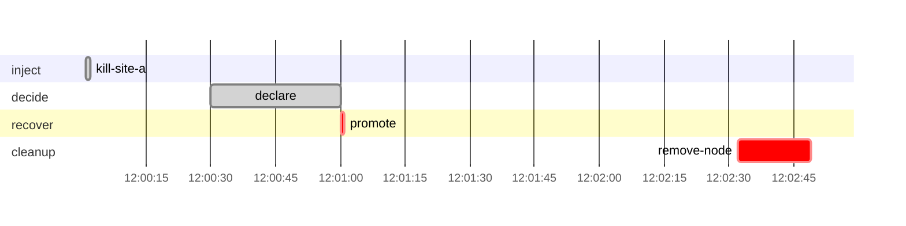

# Drill report: s1-site-loss

| Result | Tier | Environment | Started (UTC) | Duration | Seed |
|---|---|---|---|---|---|
| **FAILED** | warm-standby | drill | 2026-10-07 12:00:00 | 2m50s | 42 |

Run `20261007T120000Z-s1-site-loss-warm-standby` · incident at 2026-10-07 12:00:01 UTC

## Notes

- step promote failed; later phases did not run
- cleanup step remove-node failed; run `disavery env reset`

## Targets

No measurements: the drill did not get far enough to measure anything.

## Recovery phases

| Phase | Start (UTC) | Duration |
|---|---|---|
| inject | 12:00:01 | 1s |
| decide | 12:00:30 | 30s |
| recover | 12:01:00 | 1s |

## Verification

No check ran.

## Production availability during the drill

120 probes, 120 failed (0.00 % successful).

## Preflight

| Check | Status | Detail |
|---|---|---|
| app-ready | pass | https://docs.disavery.test/readyz answered 200 |
| backup-age | pass | newest backup per repository: repo1 12m ago, repo2 12m ago |

## Decisions

| Step | Prompt | Answer | At (UTC) |
|---|---|---|---|
| `declare` | Declare disaster? | continue (automatic) | 12:01:00 |

## Timeline

## Steps

| Phase | Step | Kind | Status | Attempts | Duration | Error |
|---|---|---|---|---|---|---|
| inject | `kill-site-a` | run | ok | 1 | 1s | — |
| decide | `declare` | manual | ok | 1 | 30s | — |
| recover | `promote` | ssh | failed | 1 | 1s | ssh db-b "pg_ctl promote": exit status 1 \| no such cluster |
| cleanup | `remove-node` | run | failed | 1 | 17s | exit status 1 |

Logs: `steps/<step>.log` next to this report.
