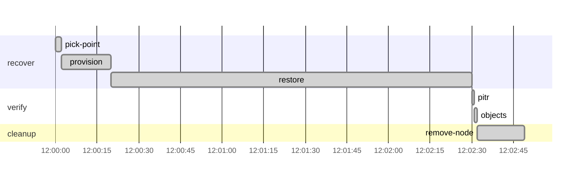

# Drill report: s6-restore-test

Restore a random backup to a random point in time and verify it.

| Result | Tier | Environment | Started (UTC) | Duration | Seed |
|---|---|---|---|---|---|
| **PASS** | — | drill | 2026-10-07 12:00:00 | 2m50s | 42 |

Run `20261007T120000Z-s6-restore-test`

## Targets

| Measure | Target | Actual | Met |
|---|---|---|---|
| recovery_time | 15m0s | 2m32s | yes |

## Recovery phases

| Phase | Start (UTC) | Duration |
|---|---|---|
| recover | 12:00:00 | 2m30s |
| verify | 12:02:30 | 2s |

## Verification

| Step | Check | Status | Summary |
|---|---|---|---|
| `pitr` | pitr | pass | restore matches 2026-10-07T11:40:00Z: all 110 writes acknowledged before it are present, none of the 119 sent after it |
| `objects` | db-object-consistency | pass | all 3 documents have their attachment in vault; 1 orphan object(s) |

`objects`:

- orphan objects: [documents/x]

## Production availability during the drill

340 probes, 0 failed (100.00 % successful).

## Preflight

| Check | Status | Detail |
|---|---|---|
| app-ready | pass | https://docs.disavery.test/readyz answered 200 |
| backup-age | pass | newest backup per repository: repo1 12m ago, repo2 12m ago |

## Timeline

## Steps

| Phase | Step | Kind | Status | Attempts | Duration | Error |
|---|---|---|---|---|---|---|
| recover | `pick-point` | run | ok | 1 | 1.7s | — |
| recover | `provision` | run | ok | 1 | 18s | — |
| recover | `restore` | run | ok | 1 | 2m10s | — |
| verify | `pitr` | check | ok | 1 | 1.2s | — |
| verify | `objects` | check | ok | 1 | 800ms | — |
| cleanup | `remove-node` | run | ok | 1 | 17s | — |

Logs: `steps/<step>.log` next to this report.
