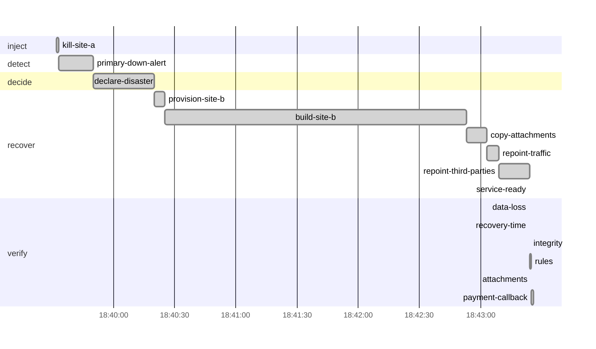

# Drill report: s1-site-loss

Lose the whole production site at once and recover in site b: from the vault (pilot light) or by promoting the streaming replica (warm standby), then move traffic and third parties to site b.

| Result | Tier | Environment | Started (UTC) | Duration | Seed |
|---|---|---|---|---|---|
| **PASS** | pilot-light | drill | 2026-10-07 18:39:32 | 3m55s | 1791398372054458783 |

Run `20261007T183932Z-s1-site-loss-pilot-light` · incident at 2026-10-07 18:39:32 UTC

## Targets

| Measure | Target | Actual | Met |
|---|---|---|---|
| rpo | 1m0s | 10s | yes |
| rto | 15m0s | 3m36s | yes |

## Recovery phases

| Phase | Start (UTC) | Duration |
|---|---|---|
| inject | 18:39:32 | 920ms |
| detect | 18:39:33 | 17s |
| decide | 18:39:50 | 30s |
| recover | 18:40:20 | 3m4s |
| verify | 18:43:24 | 2.22s |

## Verification

| Step | Check | Status | Summary |
|---|---|---|---|
| `data-loss` | canary | pass | actual RPO 10.356s (target 1m0s); 10 of 837 acknowledged writes lost |
| `recovery-time` | prober | pass | actual RTO 3m35.503s (target 15m0s) |
| `integrity` | amcheck | pass | pg_amcheck found no corruption in docsvc (heap and all indexes) |
| `rules` | business-rules | pass | 3615 documents and 14139 canary writes; every business rule holds |
| `attachments` | db-object-consistency | pass | all 3615 documents have their attachment in obj-b; 0 orphan object(s) |
| `payment-callback` | webhook-roundtrip | pass | document aa5b0670-caa0-4067-a5f5-6361076dc816 marked paid by the provider's callback after 1.01s |

`data-loss`:

- lost writes (seq): [1791397673979 1791397673980 1791397673981 1791397673982 1791397673983 1791397673984 1791397673985 1791397673986 1791397673987 1791397673988]

## Production availability during the drill

461 probes, 425 failed (7.81 % successful).

## Preflight

| Check | Status | Detail |
|---|---|---|
| app-ready | pass | https://docs.disavery.test/readyz answered 200 |
| backups-fresh | pass | newest backups: repo1 incr 39m30s ago, repo2 incr 39m29s ago |
| wal-archive | pass | last WAL segment archived 10s ago |
| canary-writing | pass | last acknowledged canary write 342ms ago (seq 1791397673988) |
| vault-reachable | pass | https://vault:9000/minio/health/live answered 200 |
| escrow-present | pass | /escrow/age-keys.txt matches the current age key |
| no-firing-alerts | pass | Alertmanager reports no active alert |
| topology-pilot-light | pass | site a active, no standby |
| topology-warm-standby | pass | skipped (condition false) |
| replica-healthy | pass | skipped (condition false) |
| standby-store-in-sync | pass | skipped (condition false) |

## Decisions

| Step | Prompt | Answer | At (UTC) |
|---|---|---|---|
| `declare-disaster` | Site a is down. Declare a disaster and fail over to site b? | continue (automatic) | 18:40:20 |

## Timeline

## Steps

| Phase | Step | Kind | Status | Attempts | Duration | Error |
|---|---|---|---|---|---|---|
| inject | `kill-site-a` | run | ok | 1 | 920ms | — |
| detect | `primary-down-alert` | wait_alert | ok | 1 | 17s | — |
| decide | `declare-disaster` | manual | ok | 1 | 30s | — |
| recover | `provision-site-b` | run | ok | 1 | 5.1s | — |
| recover | `build-site-b` | run | ok | 1 | 2m28s | — |
| recover | `copy-attachments` | run | ok | 1 | 9.84s | — |
| recover | `promote-db-b` | ssh | skipped | 0 | 0s | — |
| recover | `archive-from-b` | ssh | skipped | 0 | 0s | — |
| recover | `start-app-b` | ssh | skipped | 0 | 0s | — |
| recover | `repoint-traffic` | run | ok | 1 | 6.72s | — |
| recover | `repoint-third-parties` | run | ok | 1 | 15s | — |
| recover | `service-ready` | wait_http | ok | 1 | 10ms | — |
| recover | `first-backup-on-b` | ssh | skipped | 0 | 0s | — |
| verify | `data-loss` | check | ok | 1 | 30ms | — |
| verify | `recovery-time` | check | ok | 1 | 0s | — |
| verify | `integrity` | check | ok | 1 | 330ms | — |
| verify | `rules` | check | ok | 1 | 240ms | — |
| verify | `attachments` | check | ok | 1 | 560ms | — |
| verify | `payment-callback` | check | ok | 1 | 1.05s | — |

Logs: `steps/<step>.log` next to this report.
