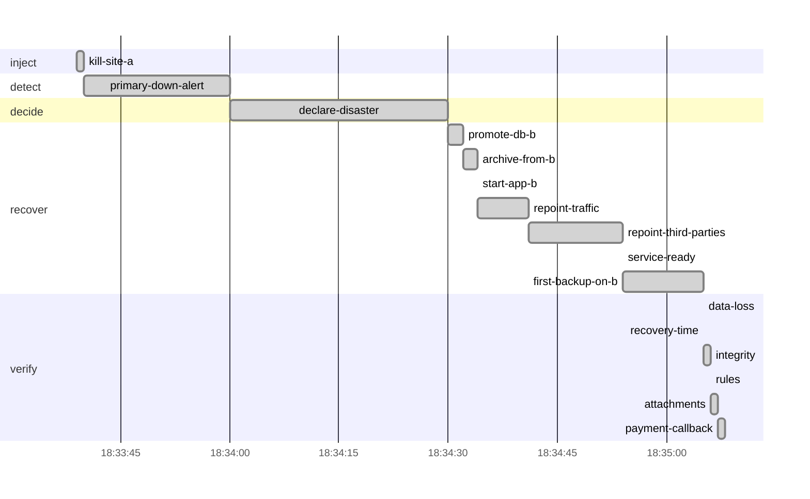

# Drill report: s1-site-loss

Lose the whole production site at once and recover in site b: from the vault (pilot light) or by promoting the streaming replica (warm standby), then move traffic and third parties to site b.

| Result | Tier | Environment | Started (UTC) | Duration | Seed |
|---|---|---|---|---|---|
| **PASS** | warm-standby | drill | 2026-10-07 18:33:37 | 1m31s | 1791398017490121402 |

Run `20261007T183337Z-s1-site-loss-warm-standby` · incident at 2026-10-07 18:33:39 UTC

## Targets

| Measure | Target | Actual | Met |
|---|---|---|---|
| rpo | 5s | 380ms | yes |
| rto | 2m0s | 1m2s | yes |

## Recovery phases

| Phase | Start (UTC) | Duration |
|---|---|---|
| inject | 18:33:39 | 900ms |
| detect | 18:33:40 | 20s |
| decide | 18:34:00 | 30s |
| recover | 18:34:30 | 35s |
| verify | 18:35:05 | 2.78s |

## Verification

| Step | Check | Status | Summary |
|---|---|---|---|
| `data-loss` | canary | pass | actual RPO 381ms (target 5s); 0 of 915 acknowledged writes lost |
| `recovery-time` | prober | pass | actual RTO 1m2.004s (target 2m0s) |
| `integrity` | amcheck | pass | pg_amcheck found no corruption in docsvc (heap and all indexes) |
| `rules` | business-rules | pass | 3192 documents and 13875 canary writes; every business rule holds |
| `attachments` | db-object-consistency | pass | all 3192 documents have their attachment in obj-b; 3 orphan object(s) |
| `payment-callback` | webhook-roundtrip | pass | document b22d62c3-ad01-4c95-8b45-f90d52133a27 marked paid by the provider's callback after 1.51s |

`attachments`:

- orphan objects: [documents/abf94494-e359-41e0-9dd7-da29955fd7fc documents/16073691-39c0-4901-ba3f-76bd5f792ca8 documents/59d5db9b-766b-48ff-bac7-f1a118670355]

## Production availability during the drill

170 probes, 115 failed (32.35 % successful).

## Preflight

| Check | Status | Detail |
|---|---|---|
| app-ready | pass | https://docs.disavery.test/readyz answered 200 |
| backups-fresh | pass | newest backups: repo1 incr 33m36s ago, repo2 incr 33m35s ago |
| wal-archive | pass | last WAL segment archived 8s ago |
| canary-writing | pass | last acknowledged canary write 791ms ago (seq 1791397673633) |
| vault-reachable | pass | https://vault:9000/minio/health/live answered 200 |
| escrow-present | pass | /escrow/age-keys.txt matches the current age key |
| no-firing-alerts | pass | Alertmanager reports no active alert |
| topology-pilot-light | pass | skipped (condition false) |
| topology-warm-standby | pass | site a active, site b standby |
| replica-healthy | pass | db-b streams from db-a, replay lag 3ms |
| standby-store-in-sync | pass | obj-b holds all 3144 attachments of obj-a |

## Decisions

| Step | Prompt | Answer | At (UTC) |
|---|---|---|---|
| `declare-disaster` | Site a is down. Declare a disaster and fail over to site b? | continue (automatic) | 18:34:30 |

## Timeline

## Steps

| Phase | Step | Kind | Status | Attempts | Duration | Error |
|---|---|---|---|---|---|---|
| inject | `kill-site-a` | run | ok | 1 | 890ms | — |
| detect | `primary-down-alert` | wait_alert | ok | 1 | 20s | — |
| decide | `declare-disaster` | manual | ok | 1 | 30s | — |
| recover | `provision-site-b` | run | skipped | 0 | 0s | — |
| recover | `build-site-b` | run | skipped | 0 | 0s | — |
| recover | `copy-attachments` | run | skipped | 0 | 0s | — |
| recover | `promote-db-b` | ssh | ok | 1 | 1.77s | — |
| recover | `archive-from-b` | ssh | ok | 1 | 2.31s | — |
| recover | `start-app-b` | ssh | ok | 1 | 280ms | — |
| recover | `repoint-traffic` | run | ok | 1 | 6.54s | — |
| recover | `repoint-third-parties` | run | ok | 1 | 13s | — |
| recover | `service-ready` | wait_http | ok | 1 | 10ms | — |
| recover | `first-backup-on-b` | ssh | ok | 1 | 11s | — |
| verify | `data-loss` | check | ok | 1 | 30ms | — |
| verify | `recovery-time` | check | ok | 1 | 0s | — |
| verify | `integrity` | check | ok | 1 | 300ms | — |
| verify | `rules` | check | ok | 1 | 230ms | — |
| verify | `attachments` | check | ok | 1 | 680ms | — |
| verify | `payment-callback` | check | ok | 1 | 1.54s | — |

Logs: `steps/<step>.log` next to this report.
