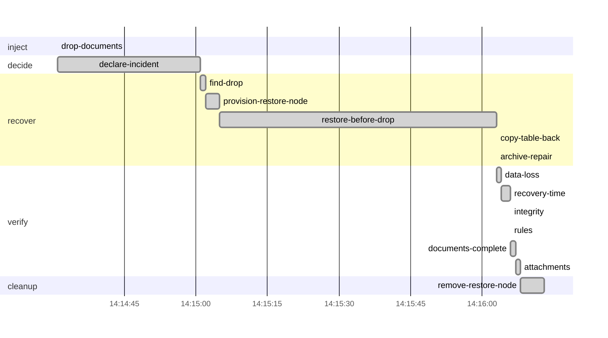

# Drill report: s2-drop-table

Drop the documents table while traffic continues, then repair it surgically: restore the database to just before the DROP on an isolated node and copy only that table back, so no unrelated write is lost.

| Result | Tier | Environment | Started (UTC) | Duration | Seed |
|---|---|---|---|---|---|
| **PASS** | — | drill | 2026-10-08 14:14:31 | 1m42s | 1791468871160739654 |

Run `20261008T141431Z-s2-drop-table` · incident at 2026-10-08 14:14:31 UTC

## Targets

| Measure | Target | Actual | Met |
|---|---|---|---|
| rpo | 5s | 930ms | yes |
| rto | 15m0s | 1m32s | yes |

## Recovery phases

| Phase | Start (UTC) | Duration |
|---|---|---|
| inject | 14:14:31 | 240ms |
| decide | 14:14:31 | 30s |
| recover | 14:15:01 | 1m2s |
| verify | 14:16:03 | 4.43s |

## Verification

| Step | Check | Status | Summary |
|---|---|---|---|
| `data-loss` | canary | pass | actual RPO 928ms (target 5s); 0 of 993 acknowledged writes lost |
| `recovery-time` | prober | pass | actual RTO 1m32.001s (target 15m0s) |
| `integrity` | amcheck | pass | pg_amcheck found no corruption in docsvc (heap and all indexes) |
| `rules` | business-rules | pass | 3574 documents and 7729 canary writes; every business rule holds |
| `documents-complete` | business-rules | pass | 3568 documents and 7635 canary writes; every business rule holds; document counts match production at the target |
| `attachments` | db-object-consistency | pass | all 3576 documents have their attachment in obj-a; 2308 orphan object(s) |

`attachments`:

- orphan objects: [documents/ef3f86c1-f808-456c-8032-d2740ab13029 documents/fa9b546e-e3f1-4b2e-9865-21a49b19e96f documents/5696ef25-18b9-4c1e-a079-e507ef8a27df documents/7b193669-dfa7-47bb-aa0c-185a34ef416a documents/88c22b5a-e1d8-4deb-b0d7-8814a9514707 documents/b71ab3d2-9f5a-405c-8725-696a92d0e392 documents/0e38fb81-64f7-4b75-89ae-aa7477e40fc3 documents/64217e10-5315-4d24-87cf-8a50e68fd9c8 documents/95129b9b-abb1-45c2-8f5d-51f529ad2af6 documents/b471c3f1-f7bb-4d0a-98f7-50ff582bb6b5] (and 2298 more)

## Production availability during the drill

203 probes, 183 failed (9.85 % successful).

## Preflight

| Check | Status | Detail |
|---|---|---|
| app-ready | pass | https://docs.disavery.test/readyz answered 200 |
| backups-fresh | pass | newest backups: repo1 incr 14m22s ago, repo2 incr 14m21s ago |
| wal-archive | pass | last WAL segment archived 7s ago |
| canary-writing | pass | last acknowledged canary write 909ms ago (seq 1791468772924); 60 writes in the last 1m0s, all in production |
| vault-reachable | pass | https://vault:9000/minio/health/live answered 200 |
| escrow-present | pass | /escrow/age-keys.txt matches the current age key |
| no-firing-alerts | pass | Alertmanager reports no active alert |
| topology | pass | site a active, no standby |

## Decisions

| Step | Prompt | Answer | At (UTC) |
|---|---|---|---|
| `declare-incident` | The documents table is gone. Repair it from a point-in-time restore? | continue (automatic) | 14:15:01 |

## Timeline

## Steps

| Phase | Step | Kind | Status | Attempts | Duration | Error |
|---|---|---|---|---|---|---|
| inject | `drop-documents` | ssh | ok | 1 | 240ms | — |
| decide | `declare-incident` | manual | ok | 1 | 30s | — |
| recover | `find-drop` | ssh | ok | 1 | 210ms | — |
| recover | `provision-restore-node` | run | ok | 1 | 3.67s | — |
| recover | `restore-before-drop` | run | ok | 1 | 57s | — |
| recover | `copy-table-back` | run | ok | 1 | 330ms | — |
| recover | `archive-repair` | ssh | ok | 1 | 340ms | — |
| verify | `data-loss` | check | ok | 1 | 40ms | — |
| verify | `recovery-time` | check | ok | 1 | 2.01s | — |
| verify | `integrity` | check | ok | 1 | 300ms | — |
| verify | `rules` | check | ok | 1 | 220ms | — |
| verify | `documents-complete` | check | ok | 1 | 670ms | — |
| verify | `attachments` | check | ok | 1 | 1.18s | — |
| cleanup | `remove-restore-node` | run | ok | 1 | 4.6s | — |

Logs: `steps/<step>.log` next to this report.
