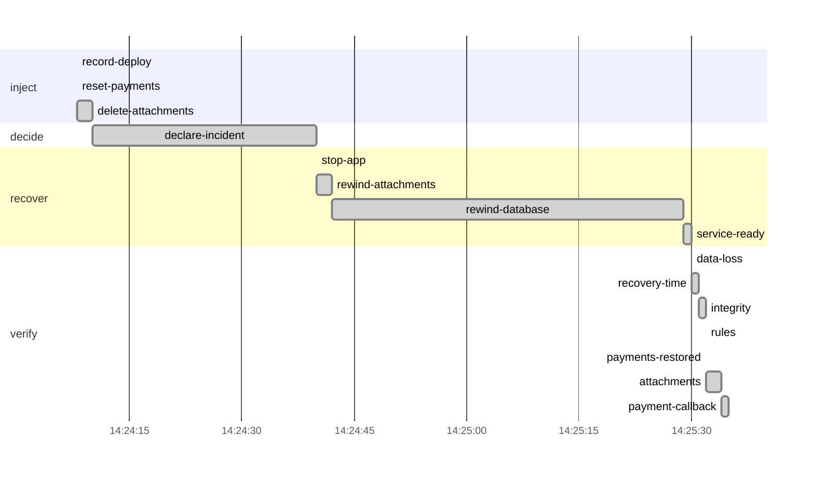

# Drill report: s3-bad-migration

A bad migration resets every payment status and deletes attachments. Rewind the whole database to just before it (point-in-time restore in place), restore the attachments from their object versions, and prove the database and the object store agree again.

| Result | Tier | Environment | Started (UTC) | Duration | Seed |
|---|---|---|---|---|---|
| **PASS** | — | drill | 2026-10-08 14:24:07 | 1m28s | 1791469447838129396 |

Run `20261008T142407Z-s3-bad-migration` · incident at 2026-10-08 14:24:08 UTC

## Targets

| Measure | Target | Actual | Met |
|---|---|---|---|
| rpo | 1m0s | 32s | yes |
| rto | 15m0s | 1m22s | yes |

## Recovery phases

| Phase | Start (UTC) | Duration |
|---|---|---|
| inject | 14:24:08 | 1.97s |
| decide | 14:24:10 | 30s |
| recover | 14:24:40 | 50s |
| verify | 14:25:30 | 5.52s |

## Verification

| Step | Check | Status | Summary |
|---|---|---|---|
| `data-loss` | canary | pass | actual RPO 31.998s (target 1m0s); 32 of 697 acknowledged writes lost |
| `recovery-time` | prober | pass | actual RTO 1m21.5s (target 15m0s) |
| `integrity` | amcheck | pass | pg_amcheck found no corruption in docsvc (heap and all indexes) |
| `rules` | business-rules | pass | 3952 documents and 7968 canary writes; every business rule holds |
| `payments-restored` | query | pass | query on db-a returned "3665" as expected |
| `attachments` | db-object-consistency | pass | all 3953 documents have their attachment in obj-a; 2488 orphan object(s) |
| `payment-callback` | webhook-roundtrip | pass | document 7b9f914b-c21b-46b5-9376-892638386490 marked paid by the provider's callback after 1.01s |

`data-loss`:

- lost writes (seq): [1791468773502 1791468773503 1791468773504 1791468773505 1791468773506 1791468773507 1791468773508 1791468773509 1791468773510 1791468773511] (and 22 more)

`payments-restored`:

- SELECT count(*) FROM documents WHERE payment_status = 'paid' AND created_at < TIMESTAMPTZ '2026-10-08 14:24:08.648434+00' - interval '1 minute'

`attachments`:

- orphan objects: [documents/20f43735-f569-4028-a307-a53c39670108 documents/8e69dddf-02fc-4e13-9435-a655a1f54a10 documents/261f8ea1-3a74-463f-9863-e18f6b9eae7d documents/3e43983e-5490-49f5-b220-cc85f8c13e6d documents/02a2a8d1-f932-48ae-8fb5-0d60f6ed9271 documents/70525abd-6ed1-4453-821a-7f7a7561cfcb documents/913a1b12-fffa-40d1-8e01-728ebc02a2a9 documents/92e0b035-e7a2-4c37-9d6d-ff01e43a9873 documents/b4f36a35-5573-4024-919c-df98e159f360 documents/c228bd58-0922-4c19-908c-6eb72dd3e3e1] (and 2478 more)

## Production availability during the drill

176 probes, 99 failed (43.75 % successful).

## Preflight

| Check | Status | Detail |
|---|---|---|
| app-ready | pass | https://docs.disavery.test/readyz answered 200 |
| backups-fresh | pass | newest backups: repo1 incr 23m59s ago, repo2 full 2m49s ago |
| wal-archive | pass | last WAL segment archived 14s ago |
| canary-writing | pass | last acknowledged canary write 607ms ago (seq 1791468773501); 60 writes in the last 1m0s, all in production |
| vault-reachable | pass | https://vault:9000/minio/health/live answered 200 |
| escrow-present | pass | /escrow/age-keys.txt matches the current age key |
| no-firing-alerts | pass | Alertmanager reports no active alert |
| topology | pass | site a active, no standby |

## Decisions

| Step | Prompt | Answer | At (UTC) |
|---|---|---|---|
| `declare-incident` | The migration broke payments and attachments. Rewind production to before the deploy? | continue (automatic) | 14:24:40 |

## Timeline

## Steps

| Phase | Step | Kind | Status | Attempts | Duration | Error |
|---|---|---|---|---|---|---|
| inject | `record-deploy` | ssh | ok | 1 | 230ms | — |
| inject | `reset-payments` | ssh | ok | 1 | 270ms | — |
| inject | `delete-attachments` | run | ok | 1 | 1.47s | — |
| decide | `declare-incident` | manual | ok | 1 | 30s | — |
| recover | `stop-app` | ssh | ok | 1 | 220ms | — |
| recover | `rewind-attachments` | run | ok | 1 | 1.85s | — |
| recover | `rewind-database` | run | ok | 1 | 47s | — |
| recover | `service-ready` | wait_http | ok | 1 | 1.01s | — |
| verify | `data-loss` | check | ok | 1 | 40ms | — |
| verify | `recovery-time` | check | ok | 1 | 1.51s | — |
| verify | `integrity` | check | ok | 1 | 300ms | — |
| verify | `rules` | check | ok | 1 | 230ms | — |
| verify | `payments-restored` | check | ok | 1 | 230ms | — |
| verify | `attachments` | check | ok | 1 | 2.19s | — |
| verify | `payment-callback` | check | ok | 1 | 1.02s | — |

Logs: `steps/<step>.log` next to this report.
