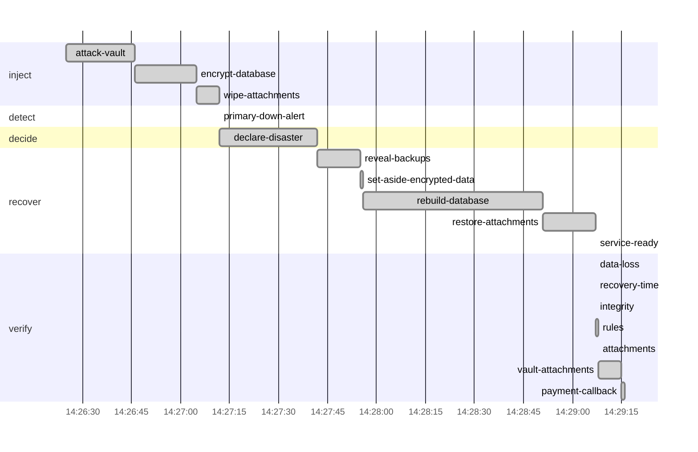

# Drill report: s4-ransomware

Ransomware holding the production writer's vault key tries to destroy the immutable backups, hides them behind delete markers, encrypts the database and wipes the local backups and attachments. The vault refuses every destructive request; the vault administrator removes the markers and site a is rebuilt from the vault, restoring through the read-only vault user.

| Result | Tier | Environment | Started (UTC) | Duration | Seed |
|---|---|---|---|---|---|
| **PASS** | — | drill | 2026-10-08 14:26:24 | 2m52s | 1791469584615525424 |

Run `20261008T142624Z-s4-ransomware` · incident at 2026-10-08 14:26:25 UTC

## Targets

| Measure | Target | Actual | Met |
|---|---|---|---|
| rpo | 1m0s | 24s | yes |
| rto | 30m0s | 2m1s | yes |

## Recovery phases

| Phase | Start (UTC) | Duration |
|---|---|---|
| inject | 14:26:25 | 47s |
| detect | 14:27:12 | 0s |
| decide | 14:27:12 | 30s |
| recover | 14:27:42 | 1m25s |
| verify | 14:29:07 | 8.76s |

## Verification

| Step | Check | Status | Summary |
|---|---|---|---|
| `data-loss` | canary | pass | actual RPO 24.001s (target 1m0s); 24 of 678 acknowledged writes lost |
| `recovery-time` | prober | pass | actual RTO 2m0.501s (target 30m0s) |
| `integrity` | amcheck | pass | pg_amcheck found no corruption in docsvc (heap and all indexes) |
| `rules` | business-rules | pass | 4044 documents and 8061 canary writes; every business rule holds |
| `attachments` | db-object-consistency | pass | all 4045 documents have their attachment in obj-a; 0 orphan object(s) |
| `vault-attachments` | db-object-consistency | pass | all 4046 documents have their attachment in vault; 2548 orphan object(s) |
| `payment-callback` | webhook-roundtrip | pass | document b0e1abc3-a02c-4679-bcf0-fae5a94c7e0e marked paid by the provider's callback after 1.01s |

`data-loss`:

- lost writes (seq): [1791468773636 1791468773637 1791468773638 1791468773639 1791468773640 1791468773641 1791468773642 1791468773643 1791468773644 1791468773645] (and 14 more)
- ordering anomalies: older write lost while a newer one survived (seq): [1791468773515 1791468773516 1791468773517 1791468773518 1791468773519 1791468773520 1791468773521 1791468773522 1791468773523 1791468773524] (and 9 more)

`vault-attachments`:

- orphan objects: [documents/7401bbb7-311e-4366-8f22-638235efdea7 documents/97f972d6-8ecf-4b9c-bbec-88a3f422e444 documents/4d3f3daa-1f82-45b4-a993-6417d287ee86 documents/51d21d7a-3bfb-4f7b-8a7c-dd563c54e907 documents/dca64274-069c-4b49-a7d1-0a2cc64b0b98 documents/f042725d-bbce-4ba9-a542-f5a02601bc3a documents/0a265cf1-9cbd-4658-9a1c-27697436f3fb documents/9497bbe3-02ae-4af8-95f0-384ef0076147 documents/a246dd2b-01f3-4327-ad30-ea8d7eadc237 documents/b0d08a63-28e7-4e55-b30d-e697cfa941bb] (and 2538 more)

## Production availability during the drill

343 probes, 197 failed (42.57 % successful).

## Preflight

| Check | Status | Detail |
|---|---|---|
| app-ready | pass | https://docs.disavery.test/readyz answered 200 |
| backups-fresh | pass | newest backups: repo1 incr 26m16s ago, repo2 full 5m6s ago |
| wal-archive | pass | last WAL segment archived 2s ago |
| canary-writing | pass | last acknowledged canary write 378ms ago (seq 1791468773638); 56 writes in the last 1m0s, all in production |
| vault-reachable | pass | https://vault:9000/minio/health/live answered 200 |
| escrow-present | pass | /escrow/age-keys.txt matches the current age key |
| no-firing-alerts | pass | Alertmanager reports no active alert |
| topology | pass | site a active, no standby |

## Decisions

| Step | Prompt | Answer | At (UTC) |
|---|---|---|---|
| `declare-disaster` | The database is encrypted and the local backups are gone. Rebuild site a from the vault? | continue (automatic) | 14:27:42 |

## Timeline

## Steps

| Phase | Step | Kind | Status | Attempts | Duration | Error |
|---|---|---|---|---|---|---|
| inject | `attack-vault` | run | ok | 1 | 21s | — |
| inject | `encrypt-database` | ssh | ok | 1 | 19s | — |
| inject | `wipe-attachments` | ssh | ok | 1 | 6.4s | — |
| detect | `primary-down-alert` | wait_alert | ok | 1 | 0s | — |
| decide | `declare-disaster` | manual | ok | 1 | 30s | — |
| recover | `reveal-backups` | run | ok | 1 | 14s | — |
| recover | `set-aside-encrypted-data` | ssh | ok | 1 | 260ms | — |
| recover | `rebuild-database` | run | ok | 1 | 56s | — |
| recover | `restore-attachments` | run | ok | 1 | 16s | — |
| recover | `service-ready` | wait_http | ok | 1 | 10ms | — |
| verify | `data-loss` | check | ok | 1 | 40ms | — |
| verify | `recovery-time` | check | ok | 1 | 0s | — |
| verify | `integrity` | check | ok | 1 | 290ms | — |
| verify | `rules` | check | ok | 1 | 220ms | — |
| verify | `attachments` | check | ok | 1 | 530ms | — |
| verify | `vault-attachments` | check | ok | 1 | 6.65s | — |
| verify | `payment-callback` | check | ok | 1 | 1.02s | — |

Logs: `steps/<step>.log` next to this report.
