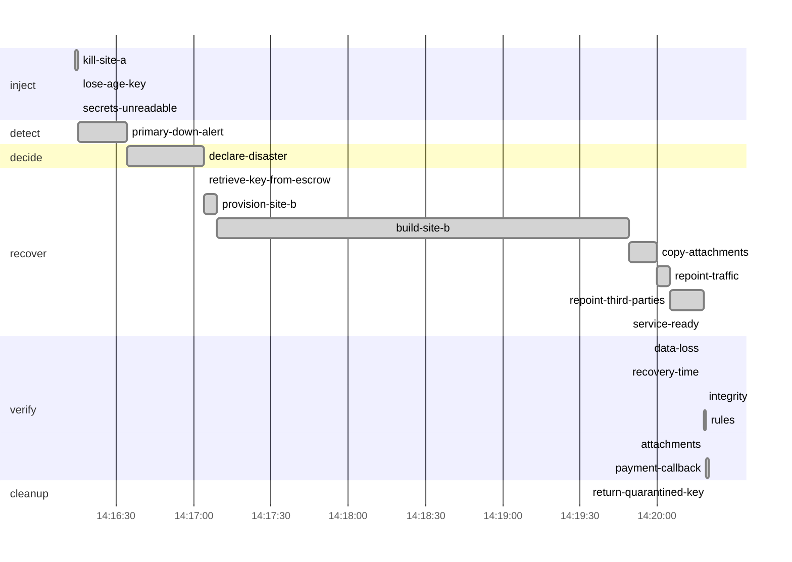

# Drill report: s5-secret-loss

Lose the production site and, with it, the age key that decrypts every secret. Recovery starts by retrieving the key from escrow; only then can the pilot-light rebuild of site b decrypt the secrets it needs.

| Result | Tier | Environment | Started (UTC) | Duration | Seed |
|---|---|---|---|---|---|
| **PASS** | — | drill | 2026-10-08 14:16:13 | 4m7s | 1791468973626310481 |

Run `20261008T141613Z-s5-secret-loss` · incident at 2026-10-08 14:16:14 UTC

## Targets

| Measure | Target | Actual | Met |
|---|---|---|---|
| rpo | 1m0s | 10s | yes |
| rto | 20m0s | 3m52s | yes |

## Recovery phases

| Phase | Start (UTC) | Duration |
|---|---|---|
| inject | 14:16:14 | 1.12s |
| detect | 14:16:15 | 19s |
| decide | 14:16:34 | 30s |
| recover | 14:17:04 | 3m14s |
| verify | 14:20:18 | 2.39s |

## Verification

| Step | Check | Status | Summary |
|---|---|---|---|
| `data-loss` | canary | pass | actual RPO 10.371s (target 1m0s); 10 of 913 acknowledged writes lost |
| `recovery-time` | prober | pass | actual RTO 3m51.501s (target 20m0s) |
| `integrity` | amcheck | pass | pg_amcheck found no corruption in docsvc (heap and all indexes) |
| `rules` | business-rules | pass | 3596 documents and 7741 canary writes; every business rule holds |
| `attachments` | db-object-consistency | pass | all 3597 documents have their attachment in obj-b; 0 orphan object(s) |
| `payment-callback` | webhook-roundtrip | pass | document d1bb2190-7da8-46e5-a884-8cb8f1c0beb4 marked paid by the provider's callback after 1.01s |

`data-loss`:

- lost writes (seq): [1791468773018 1791468773019 1791468773020 1791468773021 1791468773022 1791468773023 1791468773024 1791468773025 1791468773026 1791468773027]

## Production availability during the drill

489 probes, 457 failed (6.54 % successful).

## Preflight

| Check | Status | Detail |
|---|---|---|
| app-ready | pass | https://docs.disavery.test/readyz answered 200 |
| backups-fresh | pass | newest backups: repo1 incr 16m5s ago, repo2 incr 16m4s ago |
| wal-archive | pass | last WAL segment archived 10s ago |
| canary-writing | pass | last acknowledged canary write 355ms ago (seq 1791468773027); 60 writes in the last 1m0s, all in production |
| vault-reachable | pass | https://vault:9000/minio/health/live answered 200 |
| escrow-present | pass | /escrow/age-keys.txt matches the current age key |
| no-firing-alerts | pass | Alertmanager reports no active alert |
| topology | pass | site a active, no standby |

## Decisions

| Step | Prompt | Answer | At (UTC) |
|---|---|---|---|
| `declare-disaster` | Site a and the age key are gone. Retrieve the key from escrow and fail over to site b? | continue (automatic) | 14:17:04 |

## Timeline

## Steps

| Phase | Step | Kind | Status | Attempts | Duration | Error |
|---|---|---|---|---|---|---|
| inject | `kill-site-a` | run | ok | 1 | 1.1s | — |
| inject | `lose-age-key` | run | ok | 1 | 10ms | — |
| inject | `secrets-unreadable` | run | ok | 1 | 20ms | — |
| detect | `primary-down-alert` | wait_alert | ok | 1 | 19s | — |
| decide | `declare-disaster` | manual | ok | 1 | 30s | — |
| recover | `retrieve-key-from-escrow` | run | ok | 1 | 30ms | — |
| recover | `provision-site-b` | run | ok | 1 | 4.81s | — |
| recover | `build-site-b` | run | ok | 1 | 2m41s | — |
| recover | `copy-attachments` | run | ok | 1 | 10s | — |
| recover | `repoint-traffic` | run | ok | 1 | 5.35s | — |
| recover | `repoint-third-parties` | run | ok | 1 | 13s | — |
| recover | `service-ready` | wait_http | ok | 1 | 10ms | — |
| verify | `data-loss` | check | ok | 1 | 40ms | — |
| verify | `recovery-time` | check | ok | 1 | 0s | — |
| verify | `integrity` | check | ok | 1 | 300ms | — |
| verify | `rules` | check | ok | 1 | 240ms | — |
| verify | `attachments` | check | ok | 1 | 770ms | — |
| verify | `payment-callback` | check | ok | 1 | 1.03s | — |
| cleanup | `return-quarantined-key` | run | ok | 1 | 10ms | — |

Logs: `steps/<step>.log` next to this report.
