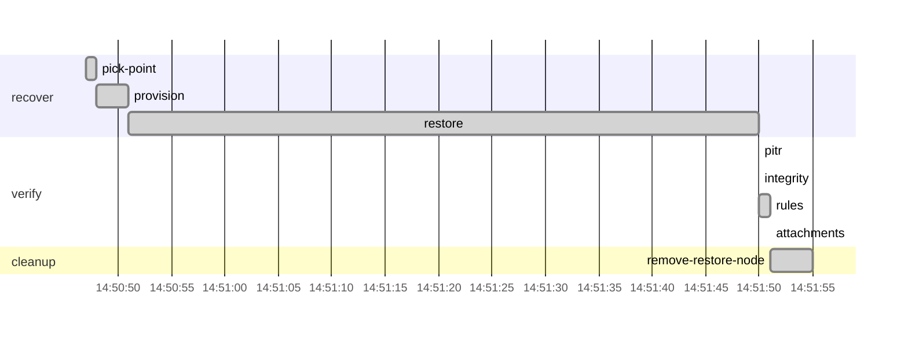

# Drill report: s6-restore-test

Restore a random backup set from the immutable vault to a random point in time on an isolated node, then prove the restore is exact and consistent.

| Result | Tier | Environment | Started (UTC) | Duration | Seed |
|---|---|---|---|---|---|
| **PASS** | — | drill | 2026-10-07 14:50:47 | 1m8s | 1791384647025434729 |

Run `20261007T145047Z-s6-restore-test`

## Targets

| Measure | Target | Actual | Met |
|---|---|---|---|
| recovery_time | 15m0s | 1m4s | yes |

## Recovery phases

| Phase | Start (UTC) | Duration |
|---|---|---|
| recover | 14:50:47 | 1m3s |
| verify | 14:51:50 | 1.42s |

## Verification

| Step | Check | Status | Summary |
|---|---|---|---|
| `pitr` | pitr | pass | restore matches 2026-10-07T14:50:10.933Z: all 119 writes acknowledged before it are present, none of the 98 sent after it |
| `integrity` | amcheck | pass | pg_amcheck found no corruption in docsvc (heap and all indexes) |
| `rules` | business-rules | pass | 531 documents and 1736 canary writes; every business rule holds; document counts match production at the target |
| `attachments` | db-object-consistency | pass | all 531 documents have their attachment in vault; 0 orphan object(s) |

## Production availability during the drill

136 probes, 0 failed (100.00 % successful).

## Preflight

| Check | Status | Detail |
|---|---|---|
| app-ready | pass | https://docs.disavery.test/readyz answered 200 |
| backups-fresh | pass | newest backups: repo1 incr 30m35s ago, repo2 incr 30m34s ago |
| wal-archive | pass | last WAL segment archived 16s ago |
| canary-writing | pass | last acknowledged canary write 370ms ago (seq 1791384609234) |
| vault-reachable | pass | https://vault:9000/minio/health/live answered 200 |
| escrow-present | pass | /escrow/age-keys.txt matches the current age key |

## Timeline

## Steps

| Phase | Step | Kind | Status | Attempts | Duration | Error |
|---|---|---|---|---|---|---|
| recover | `pick-point` | run | ok | 1 | 480ms | — |
| recover | `provision` | run | ok | 1 | 3.58s | — |
| recover | `restore` | run | ok | 1 | 58s | — |
| verify | `pitr` | check | ok | 1 | 230ms | — |
| verify | `integrity` | check | ok | 1 | 280ms | — |
| verify | `rules` | check | ok | 1 | 660ms | — |
| verify | `attachments` | check | ok | 1 | 250ms | — |
| cleanup | `remove-restore-node` | run | ok | 1 | 3.76s | — |

Logs: `steps/<step>.log` next to this report.
