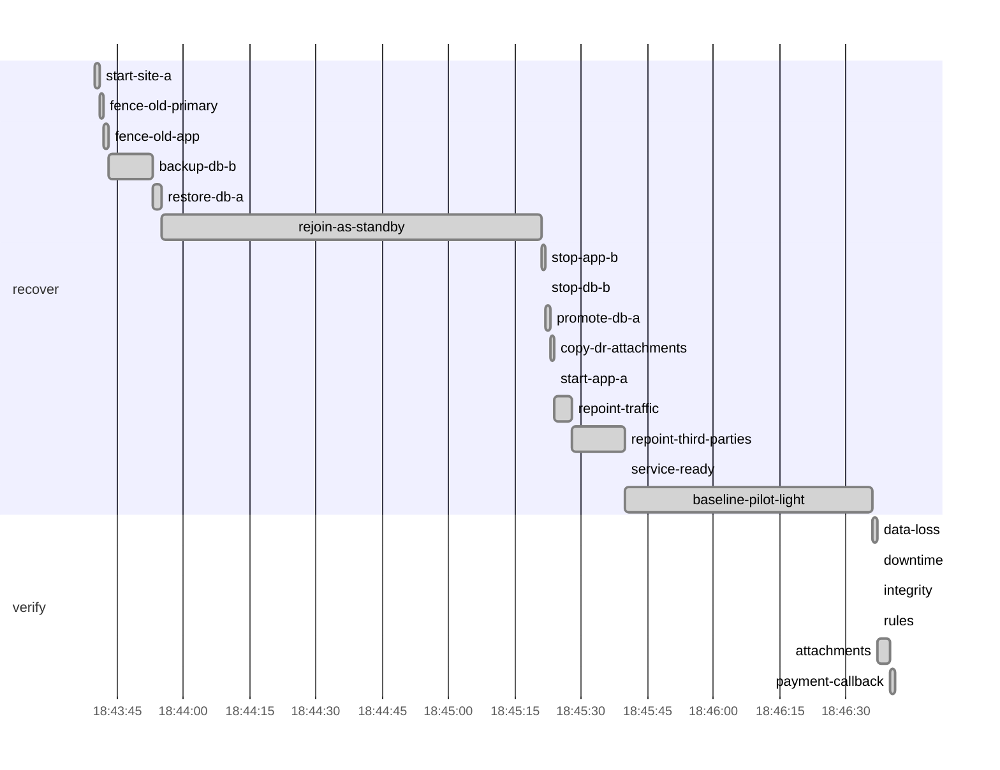

# Drill report: s7-failback

After a site loss, bring site a back and move service home without losing a write made in the DR site: rewind (warm standby) or restore (pilot light) site a as a replica of site b, then a controlled switchover.

| Result | Tier | Environment | Started (UTC) | Duration | Seed |
|---|---|---|---|---|---|
| **PASS** | pilot-light | drill | 2026-10-07 18:43:39 | 3m1s | 1791398619638360379 |

Run `20261007T184339Z-s7-failback-pilot-light`

## Targets

| Measure | Target | Actual | Met |
|---|---|---|---|
| rpo | 1m0s | 0s | yes |
| downtime | 15m0s | 4.5s | yes |

## Recovery phases

| Phase | Start (UTC) | Duration |
|---|---|---|
| recover | 18:43:40 | 2m57s |
| verify | 18:46:36 | 4.16s |

## Verification

| Step | Check | Status | Summary |
|---|---|---|---|
| `data-loss` | canary | pass | all 171 writes acknowledged since the drill started survived |
| `downtime` | prober | pass | longest outage 4.5s (target 15m0s) |
| `integrity` | amcheck | pass | pg_amcheck found no corruption in docsvc (heap and all indexes) |
| `rules` | business-rules | pass | 3962 documents and 14326 canary writes; every business rule holds |
| `attachments` | db-object-consistency | pass | all 3962 documents have their attachment in obj-a; 4 orphan object(s) |
| `payment-callback` | webhook-roundtrip | pass | document 0d54f568-540c-48e3-94fb-cc8e46178ca2 marked paid by the provider's callback after 1.01s |

`attachments`:

- orphan objects: [documents/16073691-39c0-4901-ba3f-76bd5f792ca8 documents/1da7d3cb-0a65-4fa3-b81b-bf306a1cb1da documents/59d5db9b-766b-48ff-bac7-f1a118670355 documents/abf94494-e359-41e0-9dd7-da29955fd7fc]

## Production availability during the drill

359 probes, 9 failed (97.49 % successful).

## Preflight

| Check | Status | Detail |
|---|---|---|
| app-ready | pass | https://docs.disavery.test/readyz answered 200 |
| backups-fresh | pass | newest backups: repo1 full 1m2s ago, repo2 incr 43m37s ago |
| wal-archive | pass | last WAL segment archived 1s ago |
| canary-writing | pass | last acknowledged canary write 92ms ago (seq 1791397674236) |
| vault-reachable | pass | https://vault:9000/minio/health/live answered 200 |
| escrow-present | pass | /escrow/age-keys.txt matches the current age key |
| no-firing-alerts | pass | Alertmanager reports no active alert |
| running-in-dr | pass | site b active, no standby |

## Timeline

## Steps

| Phase | Step | Kind | Status | Attempts | Duration | Error |
|---|---|---|---|---|---|---|
| recover | `start-site-a` | run | ok | 1 | 1.22s | — |
| recover | `fence-old-primary` | ssh | ok | 1 | 1.22s | — |
| recover | `fence-old-app` | ssh | ok | 1 | 290ms | — |
| recover | `rewind-db-a` | ssh | skipped | 0 | 0s | — |
| recover | `backup-db-b` | ssh | ok | 1 | 11s | — |
| recover | `restore-db-a` | ssh | ok | 1 | 1.58s | — |
| recover | `rejoin-as-standby` | run | ok | 1 | 1m26s | — |
| recover | `stop-app-b` | ssh | ok | 1 | 310ms | — |
| recover | `stop-db-b` | ssh | ok | 1 | 690ms | — |
| recover | `promote-db-a` | ssh | ok | 1 | 680ms | — |
| recover | `copy-dr-attachments` | run | ok | 1 | 720ms | — |
| recover | `start-app-a` | ssh | ok | 1 | 310ms | — |
| recover | `repoint-traffic` | run | ok | 1 | 3.73s | — |
| recover | `repoint-third-parties` | run | ok | 1 | 13s | — |
| recover | `service-ready` | wait_http | ok | 1 | 10ms | — |
| recover | `rewind-db-b` | ssh | skipped | 0 | 0s | — |
| recover | `baseline-warm-standby` | run | skipped | 0 | 0s | — |
| recover | `baseline-pilot-light` | run | ok | 1 | 56s | — |
| verify | `data-loss` | check | ok | 1 | 30ms | — |
| verify | `downtime` | check | ok | 1 | 0s | — |
| verify | `integrity` | check | ok | 1 | 300ms | — |
| verify | `rules` | check | ok | 1 | 240ms | — |
| verify | `attachments` | check | ok | 1 | 2.56s | — |
| verify | `payment-callback` | check | ok | 1 | 1.03s | — |
| verify | `replica-healthy` | check | skipped | 0 | 0s | — |

Logs: `steps/<step>.log` next to this report.
