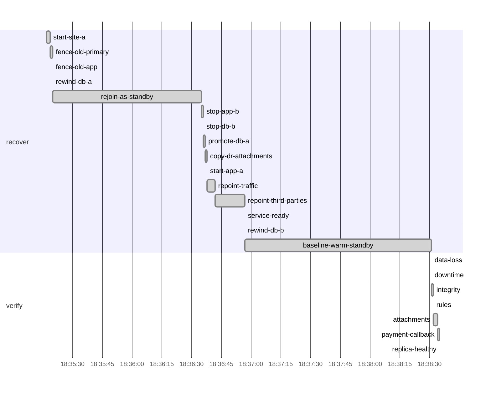

# Drill report: s7-failback

After a site loss, bring site a back and move service home without losing a write made in the DR site: rewind (warm standby) or restore (pilot light) site a as a replica of site b, then a controlled switchover.

| Result | Tier | Environment | Started (UTC) | Duration | Seed |
|---|---|---|---|---|---|
| **PASS** | warm-standby | drill | 2026-10-07 18:35:17 | 3m18s | 1791398117315695499 |

Run `20261007T183517Z-s7-failback-warm-standby`

## Targets

| Measure | Target | Actual | Met |
|---|---|---|---|
| rpo | 5s | 0s | yes |
| downtime | 2m0s | 5s | yes |

## Recovery phases

| Phase | Start (UTC) | Duration |
|---|---|---|
| recover | 18:35:17 | 3m14s |
| verify | 18:38:31 | 3.64s |

## Verification

| Step | Check | Status | Summary |
|---|---|---|---|
| `data-loss` | canary | pass | all 187 writes acknowledged since the drill started survived |
| `downtime` | prober | pass | longest outage 5.001s (target 2m0s) |
| `integrity` | amcheck | pass | pg_amcheck found no corruption in docsvc (heap and all indexes) |
| `rules` | business-rules | pass | 3576 documents and 14074 canary writes; every business rule holds |
| `attachments` | db-object-consistency | pass | all 3576 documents have their attachment in obj-a; 3 orphan object(s) |
| `payment-callback` | webhook-roundtrip | pass | document f134cb6b-2f79-4ae8-a0f9-addef5e2c1ba marked paid by the provider's callback after 1.01s |
| `replica-healthy` | replication | pass | db-b streams from db-a, replay lag 5ms |

`attachments`:

- orphan objects: [documents/59d5db9b-766b-48ff-bac7-f1a118670355 documents/abf94494-e359-41e0-9dd7-da29955fd7fc documents/16073691-39c0-4901-ba3f-76bd5f792ca8]

## Production availability during the drill

395 probes, 10 failed (97.47 % successful).

## Preflight

| Check | Status | Detail |
|---|---|---|
| app-ready | pass | https://docs.disavery.test/readyz answered 200 |
| backups-fresh | pass | newest backups: repo1 full 13s ago, repo2 incr 35m15s ago |
| wal-archive | pass | last WAL segment archived 12s ago |
| canary-writing | pass | last acknowledged canary write 626ms ago (seq 1791397673733) |
| vault-reachable | pass | https://vault:9000/minio/health/live answered 200 |
| escrow-present | pass | /escrow/age-keys.txt matches the current age key |
| no-firing-alerts | pass | Alertmanager reports no active alert |
| running-in-dr | pass | site b active, no standby |

## Timeline

## Steps

| Phase | Step | Kind | Status | Attempts | Duration | Error |
|---|---|---|---|---|---|---|
| recover | `start-site-a` | run | ok | 1 | 1.13s | — |
| recover | `fence-old-primary` | ssh | ok | 1 | 1.21s | — |
| recover | `fence-old-app` | ssh | ok | 1 | 290ms | — |
| recover | `rewind-db-a` | ssh | ok | 1 | 240ms | — |
| recover | `backup-db-b` | ssh | skipped | 0 | 0s | — |
| recover | `restore-db-a` | ssh | skipped | 0 | 0s | — |
| recover | `rejoin-as-standby` | run | ok | 1 | 1m15s | — |
| recover | `stop-app-b` | ssh | ok | 1 | 290ms | — |
| recover | `stop-db-b` | ssh | ok | 1 | 720ms | — |
| recover | `promote-db-a` | ssh | ok | 1 | 790ms | — |
| recover | `copy-dr-attachments` | run | ok | 1 | 790ms | — |
| recover | `start-app-a` | ssh | ok | 1 | 330ms | — |
| recover | `repoint-traffic` | run | ok | 1 | 3.78s | — |
| recover | `repoint-third-parties` | run | ok | 1 | 15s | — |
| recover | `service-ready` | wait_http | ok | 1 | 10ms | — |
| recover | `rewind-db-b` | ssh | ok | 1 | 270ms | — |
| recover | `baseline-warm-standby` | run | ok | 1 | 1m34s | — |
| recover | `baseline-pilot-light` | run | skipped | 0 | 0s | — |
| verify | `data-loss` | check | ok | 1 | 30ms | — |
| verify | `downtime` | check | ok | 1 | 0s | — |
| verify | `integrity` | check | ok | 1 | 340ms | — |
| verify | `rules` | check | ok | 1 | 240ms | — |
| verify | `attachments` | check | ok | 1 | 1.77s | — |
| verify | `payment-callback` | check | ok | 1 | 1.03s | — |
| verify | `replica-healthy` | check | ok | 1 | 240ms | — |

Logs: `steps/<step>.log` next to this report.
